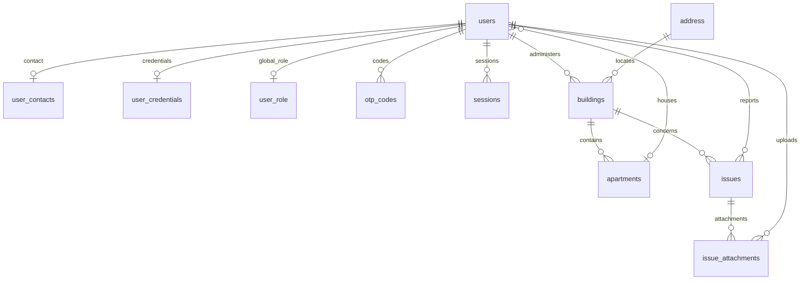

# Implemented PostgreSQL schema

EF Core migrations in `backend/src/Locatarius.Infrastructure/Persistence/Migrations/`
are the executable schema source of truth. Entity configurations and the model
snapshot describe the current .NET mapping. [schema.sql](schema.sql) is generated
from the two committed migrations, through `20260917091807_AddSessionsAndLoginLockout`,
using EF Core 10.0.0. It contains **11 application tables**, plus
`__EFMigrationsHistory`. It is not the previously proposed association-based schema.

## Tables and relationships

All application primary keys are UUIDs without database-generated defaults.
Dependent contact, credential and role rows use their user's UUID as both PK and FK.
The generated SQL lists every column, SQL type, nullability, default, constraint
name and index; it is linked rather than duplicated here.

| Table / .NET entity | Primary key | Columns other than the primary key |
| --- | --- | --- |
| `users` / User | `user_id` | `first_name`, `last_name`, nullable `date_of_birth`, nullable `apartment_id` |
| `user_contacts` / UserContact | `user_id` | `phone_number` (unique) |
| `user_credentials` / UserCredential | `user_id` | `email` (unique), `password_hash`, `must_change_password`, nullable `password_changed_at`, `failed_login_attempts`, nullable `locked_until` |
| `user_role` / UserRole | `user_id` | `role` |
| `otp_codes` / OtpCode | `otp_id` | `user_id`, `code_hash`, `purpose`, `expires_at`, nullable `used_at`, `attempts`, `created_at` |
| `address` / Address | `address_id` | `locality`, `district`, `street` |
| `buildings` / Building | `building_id` | `admin_id`, `building_nr`, `number_of_floors`, `address_id` |
| `apartments` / Apartment | `apartment_id` | `building_id`, `apartment_nr`, `floor` |
| `issues` / Issue | `issue_id` | `reported_by`, `building_id`, `title`, `description`, `status`, `priority`, `created_at`, nullable `updated_at`, nullable `resolved_at` |
| `issue_attachments` / IssueAttachment | `attachment_id` | `issue_id`, `uploaded_by`, `file_url`, `file_type`, `created_at` |
| `sessions` / Session | `session_id` | `user_id`, `token_hash` (unique), `session_type`, `created_at`, `expires_at`, nullable `last_seen_at`, nullable `revoked_at` |



Deleting a user cascades to contact, credentials, role, OTP codes and sessions.
Buildings referencing an admin, issues referencing a reporter, and attachments
referencing an uploader restrict user deletion. Building-to-address,
apartment-to-building and issue-to-building relationships also use `RESTRICT`.
Deleting an issue cascades to its attachments. Deleting an apartment sets its
residents' `users.apartment_id` to null.

Unique indexes cover email, phone number, session token hash and
`(building_id, apartment_nr)`. Other indexes cover foreign keys, with
`otp_codes(user_id, purpose)` indexing OTP lookup. Email normalization is an
application rule; the database unique index does not enforce lowercase/trimmed
email. These migrations define no CHECK constraints for enum ranges, lockout
counters or session lifetime rules.

Timestamps use `timestamp with time zone`; date of birth uses `date`. Creation
timestamps default to `CURRENT_TIMESTAMP` on OTP codes, issues, attachments and
sessions. `must_change_password` defaults to true; OTP attempts and failed login
attempts default to zero. Other application columns have no SQL default.
Session digests are hex-encoded SHA-256 in `varchar(64)`, not `bytea` primary keys.
The API stores password hashes separately in `user_credentials.password_hash`.

Enums are stored as PostgreSQL integers, not PostgreSQL enum types:

| Column | .NET values |
| --- | --- |
| `user_role.role` | Resident=1, Admin=2 |
| `otp_codes.purpose` | PasswordReset=1, EmailVerification=2, LoginVerification=3 |
| `issues.status` | Open=1, InProgress=2, Resolved=3 |
| `issues.priority` | Low=1, Medium=2, High=3, Critical=4 |
| `sessions.session_type` | Full=1, PasswordChange=2 |

## Regenerate the SQL

With .NET 10 installed, install a matching EF CLI once (or use an existing 10.0.0
installation):

```sh
dotnet tool install --global dotnet-ef --version 10.0.0
```

From the repository root:

```sh
dotnet ef migrations has-pending-model-changes \
  --project backend/src/Locatarius.Infrastructure \
  --startup-project backend/src/Locatarius.Api \
  --context LocatariusDbContext

dotnet ef migrations script 0 20260917091807_AddSessionsAndLoginLockout \
  --project backend/src/Locatarius.Infrastructure \
  --startup-project backend/src/Locatarius.Api \
  --context LocatariusDbContext \
  --output docs/schema.sql

# Normalize the generated BOM/trailing blank line for repository formatting.
python3 -c "from pathlib import Path; p=Path('docs/schema.sql'); p.write_text(p.read_text(encoding='utf-8-sig').rstrip()+'\n')"
```

After adding migrations, update the ending migration above and regenerate the
file. Do not hand-edit generated SQL. Generation needs no live database or seed
password. The script initializes an **empty database once**, including EF migration
history; it is not an idempotent upgrade script for an existing database and does
not seed application accounts. Use reviewed EF migration updates for existing data.

The dedicated migrator (`RUN_MIGRATIONS=true`, `EXIT_AFTER_MIGRATIONS=true`)
applies migrations and seeds the administrator using
`ConnectionStrings__DefaultConnection` and `SeedAdmin__Email`, `SeedAdmin__Password`,
`SeedAdmin__FirstName`, `SeedAdmin__LastName`. The merged #90 work implements seed validation,
repeat-startup checks and optional demo fixtures. Migration SQL contains no
seed credentials. See [backend integration](backend-auth-integration.md) and
[operations](operations-and-testing.md) for the remaining runtime/deployment work.

## Outstanding requirements

#73 still requires associations, association-scoped memberships and their seed
fixtures. This schema has a single global role per user, a single optional apartment
reference, and no account/membership active flag. It has no OIDC/MFA user fields,
unit-membership join table or comments table. Those requirements remain outstanding;
documenting the implementation does not remove them or prove tenant isolation.

This update aligns the SQL and its database reference with the current migrations.
It does not mark all of #89 or the authentication/deployment work complete.
