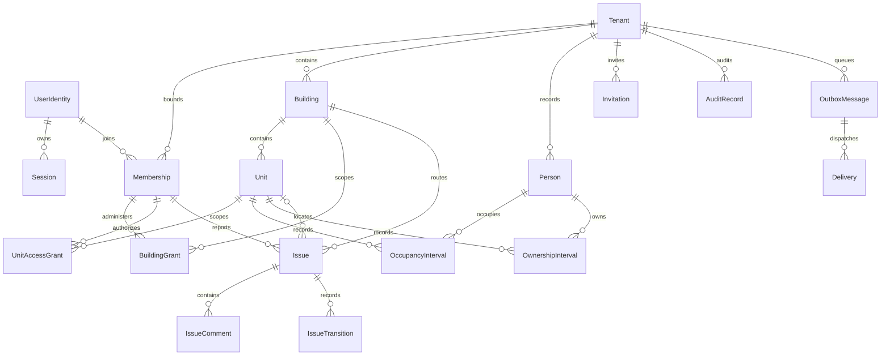
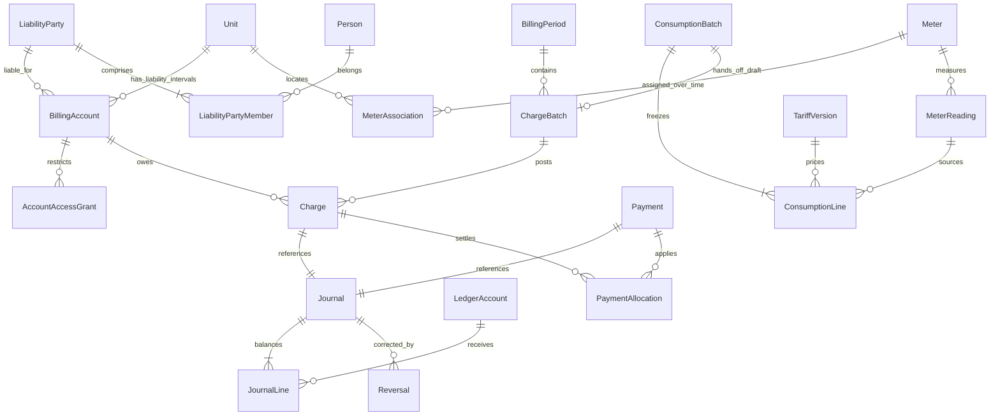

# Data model and integrity rules

[Architecture](solution-design.md) · [Shared contracts](shared-patterns.md) · [API catalogue](api-catalog.md)

## Isolation decision

| Pattern | Benefit | Cost and limitation | Decision |
| --- | --- | --- | --- |
| Shared database, shared schema, tenant keys and RLS | One migration stream, efficient small-tenant hosting | Shared blast radius; careful RLS/runtime roles; tenant restoration needs extraction | Selected MVP1 and baseline target |
| Schema per tenant | Namespace separation | Many migrations/catalog objects; shared server remains; schema search-path risk | Reject for this scale |
| Database per tenant | Stronger operational isolation and individual restore/move | Provisioning, connections, migrations and cost per small tenant | Revisit for regulated/large premium tenants with proven need |

RLS is defense in depth with explicit backend predicates and composite keys. Table-owner and privileged roles can bypass ordinary RLS; referential-integrity checks can expose information if errors are not normalized. FORCE RLS and least-privilege runtime roles are therefore required. These behaviors are documented in [PostgreSQL row security](https://www.postgresql.org/docs/current/ddl-rowsecurity.html). Do not claim RLS alone protects against a compromised database administrator or arbitrary SQL execution as a privileged role.

## Common physical conventions

Every tenant-owned row carries non-null `tenant_id`, stable UUID `id`, `created_at` UTC, actor reference where applicable, and integer `version` for mutable aggregates. Key `(tenant_id,id)` is unique; all tenant-to-tenant foreign keys include tenant_id, including join tables, event/resource references and parent attachment bindings. Building child keys additionally validate the intended building relationship. Do not let a global UUID primary key replace tenant-aware referential integrity. UUID opacity reduces guessing but is not authorization.

For an actor reference, store global identity ID only as immutable attribution; API projection is tenant-local display metadata. Tenant Person is a local record and can exist without an app identity; optional mapping to UserIdentity must be verified and consent/authority documented. This prevents accidental sharing of contacts between independent tenants. No cascade delete from Person/UserIdentity to issue history or financial journal.

Use database checks for nonnegative quantities where applicable, `valid_to > valid_from`, allowed states, positive journal-line magnitude and exactly one debit/credit direction. Cross-row invariants use locks/constraints or a controlled posting routine: a row check alone cannot guarantee balanced journals or last-administrator coverage. Membership/grant intervals use half-open timestamps `[from,to)`; open end is infinity. Person ownership and occupancy may be recorded as local legal dates, with access grants translated to explicit UTC instants using tenant zone. Do not infer midnight offset across DST without conversion.

Tenant-aware natural uniqueness: `(tenant_id, building_code_norm)`, `(tenant_id, building_id, unit_label_norm)`, `(tenant_id,user_id)` membership, `(tenant_id,channel,source_reference)` financial receipt, `(tenant_id,rule_version_id,occurrence_date)` recurring draft, `(tenant_id,poll_id,membership_id)` ballot. Avoid global email uniqueness on Person. Global identity uniqueness is `(issuer,subject)` only. Mutable email changes do not change journal actors or reassign access.

Indexes: tenant first on routine lists: `(tenant_id,building_id,state,updated_at,id)` Issue; `(tenant_id,issue_id,created_at,id)` comments; `(user_id,tenant_id,state,valid_to)` own membership gateway; `(tenant_id,user_id,unit_id,valid_from,valid_to)` grants; `(tenant_id,account_id,posting_at,id)` journal projections; `(status,next_attempt_at,id)` outbox metadata claim plus `(tenant_id,status,next_attempt_at)` fairness. Add measured indexes only; no full-text engine initially. Support case-insensitive labels through normalized columns under a declared normalization policy, preserving original display text.

## MVP1 ER view

Every relationship between tenant-owned entities includes tenant_id even when the diagram omits key fields for readability. A unit association on an issue is optional for common-area reports. Reporter membership is retained as historical reference even after removal. Operational registry entities are deliberately outside the business relationship view.

## Entity catalogue — implemented in MVP1

| Entity; owner | Key attributes and relationships | Lifecycle / constraints |
| --- | --- | --- |
| Tenant; tenancy module | organization names, controller contact, locale, IANA zone, state, control_version | Provisioning, Active, Suspended, Archived, PurgePending, Purged tombstone; protected state transition |
| UserIdentity; identity/global | issuer, subject, verified contact reference, display name, disabled_at | Global minimal profile; no global business role |
| Session; identity/global | hashed opaque ID, user, active tenant, context version, assurance, idle/absolute expiry | Active, Revoked, Expired; server-side secrets encrypted |
| AuthTransaction; identity/global | hashed state, nonce, PKCE verifier encrypted, return route, expiry | One-use; delete after 10-minute expiry |
| Membership; access/tenant | user ID, state, effective interval, role flags, steward/finance/privacy permissions | Invited/Active/Suspended/Removed; Removed retained; one per identity/tenant |
| BuildingGrant; access/tenant | membership, building, administrator permission, interval | Effective grants; protect last administrator per active building |
| UnitAccessGrant; access/tenant | membership, unit, basis occupancy/ownership/explicit, source interval reference, interval | Independent application permission; expiry checked on request |
| Invitation; access/tenant | email encrypted, token hash, role/grant plan, expiry, accepted identity, bootstrap flag | Pending/Accepted/Revoked/Expired; lock consumption |
| AdministratorTransfer; access/tenant | predecessor, candidate invite/membership, intended scopes, acceptance, version | Pending, Ready, Completed, Cancelled; no uncovered handover |
| Building; register/tenant | code, address, name, archive timestamp | Active/Archived; must have admin coverage |
| Unit; register/tenant | building, label, entrance/floor labels, active dates | Stable ID, no moving referenced unit by ordinary edit |
| Person; register/tenant | local name, optional contact, verified optional user link | Current/Archived/Pseudonymized; no cross-tenant contact reuse |
| OwnershipInterval; register/tenant | person, unit, legal date interval, source, optional share description | Versioned corrections; co-ownership allowed |
| OccupancyInterval; register/tenant | person, unit, date interval, move reason/source | Co-occupants allowed; duplicate same-person overlap rejected |
| Issue; issues/tenant | building, optional unit, reporter membership, category, priority, assignee, state, title/body, resolved_at, version | Open/InProgress/Waiting/Resolved/Closed; private reporter scope |
| IssueComment; issues/tenant | issue, author, plain text, posted_at, client key, redaction marker | Append-only; redaction uses reasoned privacy procedure |
| IssueTransition; issues/tenant | issue, from/to state, actor, reason/summary reference, timestamp | Append-only history |
| AuditRecord; audit/tenant or explicit operator partition | actor/service, action, target, safe changes, reason ref, correlation | Append-only runtime permission; no secret/content payload |
| OutboxMessage; integration/tenant | envelope, aggregate, type/version, occurrence, lease and status | Pending/Leased/Completed/Failed/Quarantined |
| Delivery; integration/tenant | event, recipient identity/invitation, channel, template, dedupe key, provider ref, attempts | Queued/Accepted/Delivered if verified/Failed/Unknown/Suppressed |
| Job; integration/tenant | job type, validated scope, request identity, lease, occurrence key, result ref | Due/Leased/Done/Failed/Paused; MVP1 maintenance of access/outbox only |
| CommandReceipt; persistence/tenant or own-session scope | actor, operation, key, payload hash, result ref, expiry | Atomic deduplication; sensitive responses reconstructed after authorization |
| OperatorAssignment; operations/global | operator identity, allowed metadata commands, validity, assurance | No default tenant-content scope |
| SupportAuthorization; operations/target tenant | ticket, verified requester, command/resource bounds, approvers, expiry | One-use/Expired; 1-hour maximum for recovery |
| RetentionHold; governance/tenant | record groups, basis reference, reviewer, review date | Active/Released; includes manual MVP1 privacy handling |
| DeletionTombstone; operations/tenant registry | tenant/subject pseudonymous identifiers, approved erase scope, effective time | Replay before restored data becomes accessible; no erased content |
| OffboardingRecord; tenancy/tenant | request, export receipt/waiver, retention schedule, approvals, status | Requested/Archived/PurgeApproved/Completed/Blocked |

No Attachment, Asset, Charge, Meter, Poll or Reservation table is required in MVP1. Email body is generated transiently from authorized data; outbox retains references only. Tenant export is streamed and its attempt/receipt is stored in audit/offboarding metadata, without a future ExportJob entity.

## Target entity additions

| Release | Entities; owning module | Important attributes, relationships and constraints |
| --- | --- | --- |
| MVP2 | MembershipPreference; identity | membership, optional event preferences, locale override; no disabling mandatory access/security messages |
| MVP2 | Attachment; files | tenant, immutable object/version key, parent type/ID, creator, declared/detected media, bytes/checksum, scan state/version, retention; parent scope checked |
| MVP2 | Announcement, AnnouncementVersion, AudienceSnapshot, AnnouncementReceipt; communication | versioned body/audience/effective dates; receipt unique version/membership; visibility intersects current grants |
| MVP2 | Document, DocumentVersion; communication | category, audience, clean attachment, published/retired state; immutable file versions |
| MVP2 | ImportBatch; register | source hash, source ID, mapping, preview result, touched versions, commit state; no auto-grants |
| MVP2 | PrivacyCase, PrivacyAction; privacy | subject, controller tenant, type, verification reference, decision, status, reviewed response attachment, limited response grant |
| MVP3 | BillingAccount, AccountAccessGrant; finance | unit, liability_party_id, currency, liability interval, Open/Closed; account visibility explicitly granted and dated |
| MVP3 | LiabilityParty, LiabilityPartyMember; finance | individual or approved joint party, effective member/person links, approved liability-policy reference; no automatic equal debt shares or extra account access |
| MVP3 | LedgerAccount, Journal, JournalLine; finance | tenant control/debtor ledger accounts, debit/credit minor-unit magnitude, currency, posting/effective dates, source, journal hash/reference; balanced posting operation |
| MVP3 | BillingPeriod, ChargeRuleVersion, AllocationBasis; finance | Open/Closed, dates, due dates, effective rule, weights, proration and rounding version; no mutable posted source |
| MVP3 | ChargeBatch, Charge, ChargeSource; finance | Draft/Posted/Cancelled, preview digest, source snapshot, account/period, amount, due date, immutable posting; unique source/account/period |
| MVP3 | Payment, PaymentAllocation, AllocationReversal; finance | source reference, bank/cash, account or suspense, received/posting times, amount, remainder; allocated total bounded |
| MVP3 | Adjustment, Reversal, RefundRecord, ApprovalRecord; finance | original posting, amount, reason, reviewer, external evidence; linked compensating journal, cumulative cap |
| MVP3 | Statement, Reminder; finance | account, as-of/journal cutoff, snapshot hash, reminder interval and audience; immutable statement version |
| MVP3 | ReconciliationBatch, ReconciliationItem; finance | source hash, matched receipt, discrepancy status, totals, approver; no automatic bank postings |
| MVP3 | ExportJob; reporting | requester, immutable filters/scope, snapshot cutoff, Ready/Failed/Suppressed, private attachment, 24-hour expiry |
| MVP4 | CommonArea, Asset; maintenance | building, location/tag/serial, installation/retirement; asset tag unique in building |
| MVP4 | Contractor, WorkOrder, MaintenanceSchedule; maintenance | tenant-local contact; issue/asset, approved scope/status; effective recurrence/zone, unique schedule occurrence |
| MVP4 | Expense, ExpenseCorrection; maintenance | approved actual amount, vendor reference, evidence, correction chain, remaining cost source; no duplicate charge handoff |
| MVP4 | Meter, MeterAssociation, ReadingWindow; utilities | serial/type/unit/precision, effective unit/common-area association, open reading dates; nonoverlap |
| MVP4 | MeterReading, ReadingDecision; utilities | exact decimal value, measured_at, source/evidence, Pending/Accepted/Rejected/Superseded, previous version |
| MVP4 | TariffVersion, SharedAllocationRule; utilities | unit rate, effective interval, shared residual rule, approved weights; flat-rate baseline only |
| MVP4 | ConsumptionBatch, ConsumptionLine; utilities | accepted reading and tariff versions, derived usage, residual allocation, handoff source key; frozen evidence |
| MVP5 | Meeting, MeetingVersion; community | audience, agenda, local/UTC time, Published/Held/MinutesPublished/Cancelled, approved minutes version |
| MVP5 | Poll, PollOption, PollEligibility, Ballot; community | advisory rule, open/close, snapshot membership, selected option, restricted actor link; one ballot per poll/member |
| MVP5 | SharedResource, AvailabilityRule, ResourceBlock, Reservation; reservations | building, IANA zone, exclusive interval, creator membership, Confirmed/Cancelled; no overlap of active reservations |

## Finance and utility relationships

Journal-to-charge/payment link represents the original posting; later adjustment/reversal journals are separately linked, never overwritten. Suspense payments may lack a debtor account initially. Target ER is logical; each foreign key remains tenant-bound.

## Financial invariants and worked example

Store money as signed 64-bit integer minor units at API/domain boundaries (transport as decimal string to avoid JavaScript integer loss); database amount magnitude is integer minor units with a separate debit/credit side. One immutable currency and exponent per tenant/account after first posting; no cross-currency journal or floating-point arithmetic. Reject out-of-range values and sums. Rate and measurement calculation uses exact decimal (proposed numeric(20,8), verify needed precision); round final monetary allocations to currency minor unit only. Select half-up for standalone amounts; allocate pools by largest remainder with stable account-ID tie break. These are product policy recommendations, not universal legal rules.

Example in a two-decimal currency: opening debtor amount 10000; charge 3000; payment receipt 5000; credit adjustment 1000 gives account receivable 7000. Allocation of the 5000 changes which charges are outstanding, not the total balance again. A 5000 payment reversal adds 5000 back to receivable and reverses its allocations; new balance 12000. Posting and allocation must never subtract the same receipt twice.

Each Journal has at least two lines, same currency, sum debits equals sum credits, nonzero positive line magnitudes, immutable source and posting sequence. A single controlled transaction validates balance before marking Posted; readers exclude Draft. Control accounts (cash/bank, suspense, dues, opening/adjustment) make the receivables subledger internally balanced; this is not a complete statutory general ledger, tax engine or certified accounting system. External accountant validates cutover totals and reporting requirements before finance release.

Liability account belongs to an explicitly recorded party or approved joint party during effective dates, not automatically to whoever currently occupies the unit. Changing ownership closes old liability interval and creates new account/approved liability basis. No automatic debt transfer. Previous account grants end at agreed access date; former party obtains personal history through controlled privacy/export procedure. Proration uses stated day-count policy and effective liability dates; allocation snapshot persists the actual inputs.

Close periods only after reconciliation under FIN-009; later correction uses a current-period compensating journal referencing original economic date. Do not reopen via generic PATCH, hard-delete, renumber or edit posted money. An approved charge rule or tariff change applies prospectively; historical sources stay frozen. Financial projections are rebuildable from journals and allocation history and must reconcile before being served as statements.

## Retention, archival and migrations

Proposed operational defaults requiring controller approval: authentication transactions 10 minutes; sessions through expiry plus 7 days minimal security metadata; pending invitations 7 days plus 30 days minimal failure metadata; operational logs 30 days; issue/relationship records active service plus 24 months; audit 24 months; rejected uploads/unbound files 24 hours; CSV import sources 7 days; generated export/privacy packages 24 hours; backups 35 days; financial records use jurisdiction-approved duration before MVP3, never guessed as compliant. Legal holds override deletion schedule. Minimize content in backups by minimizing collection; backup rotation cannot instantly erase every historical copy.

Archive preserves relational references while denying normal access. Redact eligible content via auditable action; retain pseudonymous actor IDs where necessary. Purge jobs are tenant-scoped, reviewed, resumable and create tombstones. Restores replay tombstones before re-enabling access. A retention policy change never silently removes legal holds.

Use forward versioned migrations, reviewed under restricted owner credential separate from runtime. Test from previous released schema with representative multi-tenant data. Expand/backfill/validate/switch/contract across releases; never drop old columns in the same release that first stops using them. New tenant tables cannot ship without RLS, composite keys, indexes and isolation tests. No MVP3 tables in MVP1 migrations. Roll back app only within declared schema compatibility; destructive migrations require restore/roll-forward plan and maintenance approval.

Database range exclusion can prevent overlapping reservation intervals; see [PostgreSQL range constraints](https://www.postgresql.org/docs/current/rangetypes.html). The selected provider must support the required operator classes; verify in EN-012 migration tests.
