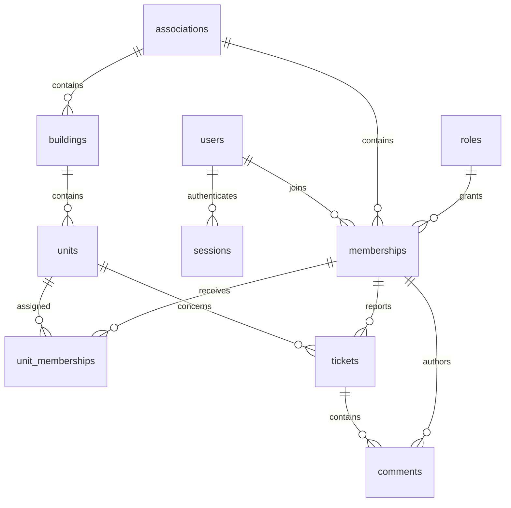

# Exact final PostgreSQL schema

The complete application database has **10 tables**. [schema.sql](schema.sql) is the authoritative executable DDL: it lists every column, data type, default, nullability, primary/foreign key, uniqueness rule and index. No ORM-created extra business tables are intended. EF's migration bookkeeping table is infrastructure only.

| Table | Primary key | Purpose / foreign keys |
| --- | --- | --- |
| `users` | `id uuid` | Global login/profile; password hash, optional single OIDC identity and MFA configuration |
| `associations` | `id uuid` | Independent association name |
| `roles` | `id smallint` | Exactly `1=admin`, `2=resident` |
| `memberships` | `(association_id, user_id)` | FKs to association, user and role; current access via `is_active` |
| `sessions` | `token_hash bytea` | FK to user; hashed random session token and expiry; restricted authentication steps |
| `buildings` | `id uuid` | FK to association; name/address |
| `units` | `id uuid` | Composite FK to building within association; unit number and optional floor |
| `unit_memberships` | `(association_id, unit_id, user_id)` | Composite FKs to unit and membership; current assignments only |
| `tickets` | `id uuid` | Composite FKs to unit and reporter membership within association |
| `comments` | `id uuid` | Composite FKs to ticket and author membership within association |

## Relationships



`association_id` is repeated in child keys deliberately so PostgreSQL rejects relationships crossing association boundaries. No lists of role names, resident IDs or comments are stored in a column. A user can have multiple current unit assignments; changing an assignment inserts/deletes a join row. Assignments accept active members with either role, including an admin who lives in the building. The existing `unit_memberships` foreign key references the association membership independently of its role; no extra role, account or schema column is needed. Ticket visibility uses reporter identity, not current assignment.

## Phase allocation and story coverage

**Phase 1:** `users`, `associations`, `roles`, `memberships`, `sessions`. #62 verifies `password_hash`, creates a session, reads current memberships; #63 atomically creates a resident user and membership; #64 uses the shared login flow, reads the caller’s identity/memberships and enforces role boundaries. Profile editing is delivered in Sprint 2. No unit prerequisite.

**Phase 2:** add the five register/ticket tables and enable user MFA/OIDC fields and restricted session kinds. The final DDL includes all of them now to define the complete application data model. `oidc_issuer` + `oidc_subject` identify one pre-linked external account; email is never used for automatic linking. Provider-owned internal databases are outside the application's schema. No access/refresh tokens are stored here.

## Integrity versus authorization

DDL enforces same-association references and unique records. API checks enforce active membership, role, ticket ownership and assignment before inserts/reads. A FK alone does not authorize a caller. Global users are never listed outside a scoped membership query. `ON DELETE RESTRICT` preserves ticket authorship; disable accounts/memberships instead of deleting them. Removing a unit assignment is permitted because historical tickets do not reference that assignment.

The API generates cryptographically random UUIDs. Timestamps are UTC `timestamptz`; creation/session timestamps do not implement property history. Update membership and authorization-sensitive writes in transactions locking the relevant membership row: revocation waits for already-authorized writes; no write beginning after revocation commits may succeed. Lock the assignment row during ticket creation. Catch only known uniqueness/FK failures and map them to the API contract.

`password_hash` contains the framework's salted/versioned hash. MFA secret ciphertext uses ASP.NET Data Protection with keys outside the database. Session tokens are random 32-byte values; only their SHA-256 digest is stored. High-entropy token hashing does not replace slow password hashing.

The executable DDL is a specification artifact, not a migration already applied to a database. See [validation](validation.md) for actual checks and [security](operations-and-testing.md) for required integration tests.

## Full DDL

This block matches the downloadable [schema.sql](schema.sql). Apply through reviewed migrations; do not run it against an existing populated database.

```sql
-- Locatarius final application schema, PostgreSQL 18.
-- Run once against an empty database. IDs are supplied by the application.
BEGIN;
CREATE TABLE users (
    id uuid PRIMARY KEY,
    email varchar(254) NOT NULL UNIQUE,
    display_name varchar(100) NOT NULL CHECK (char_length(btrim(display_name)) BETWEEN 1 AND 100),
    password_hash text NOT NULL,
    must_change_password boolean NOT NULL DEFAULT true,
    is_active boolean NOT NULL DEFAULT true,
    failed_login_count integer NOT NULL DEFAULT 0 CHECK (failed_login_count >= 0),
    locked_until timestamptz,
    oidc_issuer text,
    oidc_subject text,
    mfa_secret_ciphertext text,
    mfa_enabled boolean NOT NULL DEFAULT false,
    mfa_last_used_step bigint,
    created_at timestamptz NOT NULL DEFAULT now(),
    CHECK (email = lower(btrim(email))),
    CHECK ((oidc_issuer IS NULL) = (oidc_subject IS NULL)),
    CHECK (NOT mfa_enabled OR mfa_secret_ciphertext IS NOT NULL),
    UNIQUE (oidc_issuer, oidc_subject)
);
CREATE TABLE associations (
    id uuid PRIMARY KEY,
    name varchar(100) NOT NULL CHECK (char_length(btrim(name)) BETWEEN 1 AND 100)
);
CREATE TABLE roles (
    id smallint PRIMARY KEY,
    name varchar(20) NOT NULL UNIQUE,
    CHECK ((id = 1 AND name = 'admin') OR (id = 2 AND name = 'resident'))
);
INSERT INTO roles (id, name) VALUES (1, 'admin'), (2, 'resident');
CREATE TABLE memberships (
    association_id uuid NOT NULL REFERENCES associations(id) ON DELETE RESTRICT,
    user_id uuid NOT NULL REFERENCES users(id) ON DELETE RESTRICT,
    role_id smallint NOT NULL REFERENCES roles(id) ON DELETE RESTRICT,
    is_active boolean NOT NULL DEFAULT true,
    PRIMARY KEY (association_id, user_id)
);
CREATE INDEX memberships_user_idx ON memberships(user_id);
CREATE TABLE sessions (
    token_hash bytea PRIMARY KEY CHECK (octet_length(token_hash) = 32),
    user_id uuid NOT NULL REFERENCES users(id) ON DELETE RESTRICT,
    kind varchar(20) NOT NULL CHECK (kind IN ('full', 'password_change', 'mfa_setup', 'mfa_challenge')),
    created_at timestamptz NOT NULL DEFAULT now(),
    last_seen_at timestamptz NOT NULL DEFAULT now(),
    expires_at timestamptz NOT NULL,
    CHECK (expires_at > created_at),
    CHECK (last_seen_at >= created_at)
);
CREATE INDEX sessions_user_idx ON sessions(user_id);
CREATE TABLE buildings (
    id uuid PRIMARY KEY,
    association_id uuid NOT NULL REFERENCES associations(id) ON DELETE RESTRICT,
    name varchar(100) NOT NULL CHECK (char_length(btrim(name)) BETWEEN 1 AND 100),
    address varchar(200) NOT NULL CHECK (char_length(btrim(address)) BETWEEN 1 AND 200),
    UNIQUE (association_id, id)
);
CREATE TABLE units (
    id uuid PRIMARY KEY,
    association_id uuid NOT NULL,
    building_id uuid NOT NULL,
    number varchar(20) NOT NULL CHECK (char_length(btrim(number)) BETWEEN 1 AND 20),
    floor smallint CHECK (floor BETWEEN -5 AND 200),
    FOREIGN KEY (association_id, building_id) REFERENCES buildings(association_id, id) ON DELETE RESTRICT,
    UNIQUE (association_id, id),
    UNIQUE (building_id, number)
);
CREATE TABLE unit_memberships (
    association_id uuid NOT NULL,
    unit_id uuid NOT NULL,
    user_id uuid NOT NULL,
    PRIMARY KEY (association_id, unit_id, user_id),
    FOREIGN KEY (association_id, unit_id) REFERENCES units(association_id, id) ON DELETE RESTRICT,
    FOREIGN KEY (association_id, user_id) REFERENCES memberships(association_id, user_id) ON DELETE RESTRICT
);
CREATE INDEX unit_memberships_user_idx ON unit_memberships(association_id, user_id);
CREATE TABLE tickets (
    id uuid PRIMARY KEY,
    association_id uuid NOT NULL,
    unit_id uuid NOT NULL,
    reporter_user_id uuid NOT NULL,
    title varchar(120) NOT NULL CHECK (char_length(btrim(title)) BETWEEN 5 AND 120),
    description varchar(2000) NOT NULL CHECK (char_length(btrim(description)) BETWEEN 10 AND 2000),
    status varchar(20) NOT NULL DEFAULT 'open' CHECK (status IN ('open', 'in_progress', 'resolved')),
    created_at timestamptz NOT NULL DEFAULT now(),
    FOREIGN KEY (association_id, unit_id) REFERENCES units(association_id, id) ON DELETE RESTRICT,
    FOREIGN KEY (association_id, reporter_user_id) REFERENCES memberships(association_id, user_id) ON DELETE RESTRICT,
    UNIQUE (association_id, id)
);
CREATE INDEX tickets_reporter_idx ON tickets(association_id, reporter_user_id, created_at, id);
CREATE INDEX tickets_queue_idx ON tickets(association_id, created_at, id);
CREATE TABLE comments (
    id uuid PRIMARY KEY,
    association_id uuid NOT NULL,
    ticket_id uuid NOT NULL,
    author_user_id uuid NOT NULL,
    body varchar(2000) NOT NULL CHECK (char_length(btrim(body)) BETWEEN 1 AND 2000),
    created_at timestamptz NOT NULL DEFAULT now(),
    FOREIGN KEY (association_id, ticket_id) REFERENCES tickets(association_id, id) ON DELETE RESTRICT,
    FOREIGN KEY (association_id, author_user_id) REFERENCES memberships(association_id, user_id) ON DELETE RESTRICT
);
CREATE INDEX comments_ticket_idx ON comments(association_id, ticket_id, created_at, id);
COMMIT;
```
