# Screen mockups and frontend handoff

[Open the interactive mockups](mockups/index.html) · [HTML](mockups/index.html) · [CSS](mockups/mockups.css) · [JavaScript](mockups/mockups.js)

Seventeen screens share one visual system, with desktop and mobile PNG references. Use the prototype toolbar to choose a screen, administrator/resident role and visual state. The delivery label separates Sprint 1, Sprint 2 and semester work. S-01 retains the login screen ID used in task #76; the remaining screen IDs are local design references.

The prototype runs directly in a browser or through MkDocs, requires no package installation and makes no network requests. It uses synthetic data. Buttons simulate navigation and outcomes; forms are not a validation or authentication implementation. Do not enter real passwords. The [API contract](api-catalog.md), [acceptance criteria](sprint-1.md) and server authorization remain authoritative. The visual reference does not settle the JWT/cookie implementation decision.

## Start with Sprint 1

Implement **S-01 sign in, S-02 first-login password change, S-03 association selection and S-06 add resident**. Use shared input, button, banner and loading components. The September login has no provider button. User lists/profile editing belong to Sprint 2; the full app navigation illustrates the semester target and must be restricted to implemented screens in each release.

| Screen | Delivery | Work package / use case |
| --- | --- | --- |
| [S-01 — Sign in](#s-01) | Sprint 1 | UC-01 · #76/#77 |
| [S-02 — Change password](#s-02) | Sprint 1; reused in Sprint 2 | UC-03 · S1-A2 / S2-T5 |
| [S-03 — Choose association](#s-03) | Sprint 1 | UC-01 · #77/#84 |
| [S-04 — My profile](#s-04) | Sprint 2 | UC-03 · S2-T5 |
| [S-05 — Users](#s-05) | Sprint 2 | UC-02 · S2-T2 |
| [S-06 — Add resident](#s-06) | Sprint 1 | UC-02 · #81/#82 |
| [S-07 — Buildings](#s-07) | October | UC-04 |
| [S-08 — Building form](#s-08) | October | UC-04 |
| [S-09 — Units](#s-09) | October | UC-04 |
| [S-10 — Unit form](#s-10) | October | UC-04 |
| [S-11 — Unit occupants](#s-11) | October | UC-04 |
| [S-12 — My units](#s-12) | October | UC-04 |
| [S-13 — Tickets](#s-13) | October | UC-05 |
| [S-14 — Report issue](#s-14) | October | UC-05 |
| [S-15 — Ticket detail](#s-15) | October | UC-06 |
| [S-16 — Set up MFA](#s-16) | November | UC-07 |
| [S-17 — Verify MFA](#s-17) | November | UC-07 |

## Layout and component rules

| Element | Design reference |
| --- | --- |
| Color | Primary teal `#12685e`, text `#182d37`, secondary text `#526670`, page `#f5f7f7`, borders `#dce5e6`, error `#a33232` |
| Typography | System sans-serif; 15px body, 13px labels, 28–32px page headings |
| Spacing | 8px base rhythm; cards use 20px mobile / 26px desktop padding |
| Controls | Inputs at least 46px high; primary buttons 44px; visible gold keyboard focus |
| Corners | Inputs/buttons 8px, cards 14px |
| Desktop | 236px application sidebar, 78px header, restrained content width |
| Mobile | At 600px and below, sidebar becomes horizontal navigation, fields stack, decorative login panel hides |
| Tables | Horizontal overflow stays inside the table card; page itself must not overflow |
| Forms | Visible labels, errors associated with inputs, first-invalid-field focus and one pending submission |
| Errors | Field errors for validation; safe alert banner for request failures; no server details |

Create React components for AppShell, AuthLayout, FormField, PasswordField, AlertBanner, StatusBadge, DataTable, Pagination and EmptyState. Reuse create/edit forms; do not create separate admin/resident login implementations. This package uses plain HTML/CSS so it can inform either CSS modules or Tailwind without requiring another framework.

## Visual states and role variants

The toolbar provides default, validation, request-error, submitting, empty, access-denied and success states. Apply these where relevant: empty states belong to lists/association selection; form validation belongs to editable forms. For resolved tickets use the linked variant below. For error text and protocol behavior use the exact acceptance criteria.

| Reference | Preview |
| --- | --- |
| Login field validation | [Image](mockups/images/s-01-validation.png) |
| Incorrect credentials | [Image](mockups/images/s-01-error.png) |
| Pending sign-in | [Image](mockups/images/s-01-loading.png) |
| November provider sign-in option | [Image](mockups/images/s-01-provider.png) · [Interactive](mockups/index.html?screen=S-01&phase=semester) |
| No active associations | [Image](mockups/images/s-03-empty.png) |
| Resident denied Users page | [Image](mockups/images/s-05-denied.png) |
| Resident created | [Image](mockups/images/s-06-success.png) |
| Edit building | [Image](mockups/images/s-08-edit.png) |
| Edit unit | [Image](mockups/images/s-10-edit.png) |
| Administrator ticket list | [Image](mockups/images/s-13-admin.png) |
| Empty ticket list | [Image](mockups/images/s-13-empty.png) |
| Administrator ticket controls | [Image](mockups/images/s-15-admin.png) |
| Resolved, read-only ticket | [Image](mockups/images/s-15-resolved.png) · [Interactive](mockups/index.html?screen=S-15&role=resident&status=resolved) |

## Screen gallery

Desktop images are 1440px wide; mobile references are 390px wide. Full-page images may be taller than the viewport. These are implementation references, not separate desktop/mobile applications.

### S-01 — Sign in {#s-01}

**Sprint 1 · UC-01 · #76/#77.** Shared login for both roles. No public registration, role picker or password-reset workflow. Provider button is a November variant.

[Interactive](mockups/index.html?screen=S-01&role=admin) · [Desktop PNG](mockups/images/s-01-desktop.png) · [Mobile PNG](mockups/images/s-01-mobile.png)

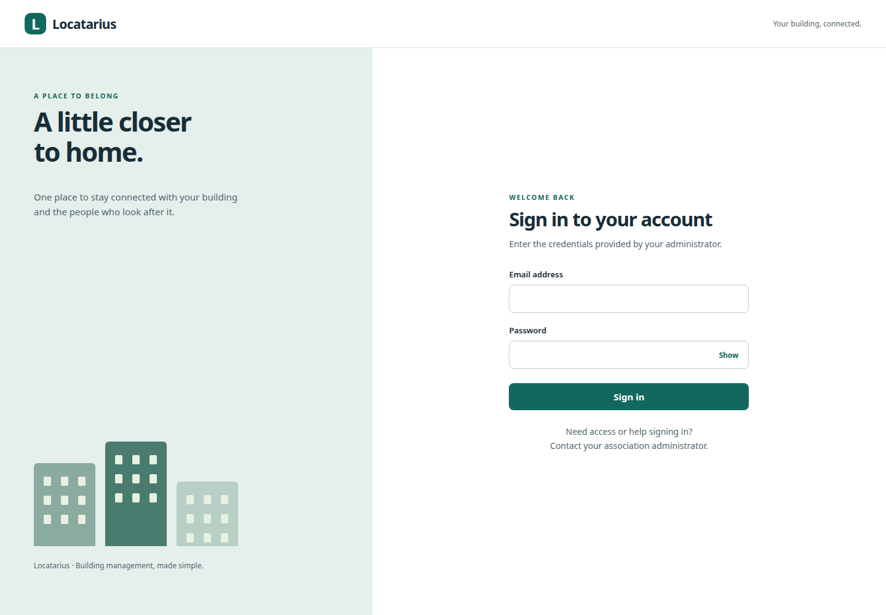

### S-02 — Change password {#s-02}

**Sprint 1; reused in Sprint 2 · UC-03 · S1-A2 / S2-T5.** First-login temporary password and account password change share the same component. Keep all three fields; never show the submitted password in a success notice.

[Interactive](mockups/index.html?screen=S-02&role=admin) · [Desktop PNG](mockups/images/s-02-desktop.png) · [Mobile PNG](mockups/images/s-02-mobile.png)

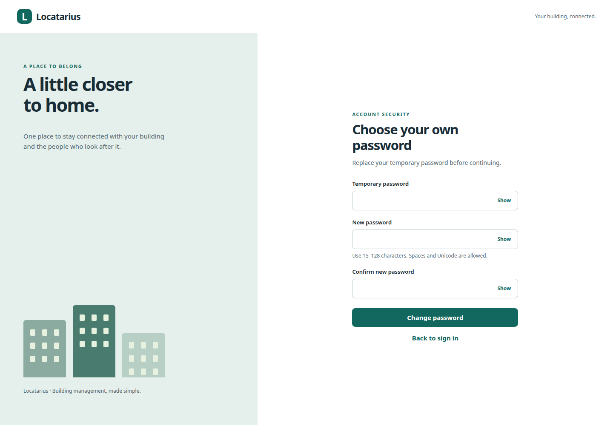

### S-03 — Choose association {#s-03}

**Sprint 1 · UC-01 · #77/#84.** Show active memberships only. Auto-select a single membership in the implementation. Zero memberships retains profile and sign-out access.

[Interactive](mockups/index.html?screen=S-03&role=admin) · [Desktop PNG](mockups/images/s-03-desktop.png) · [Mobile PNG](mockups/images/s-03-mobile.png)

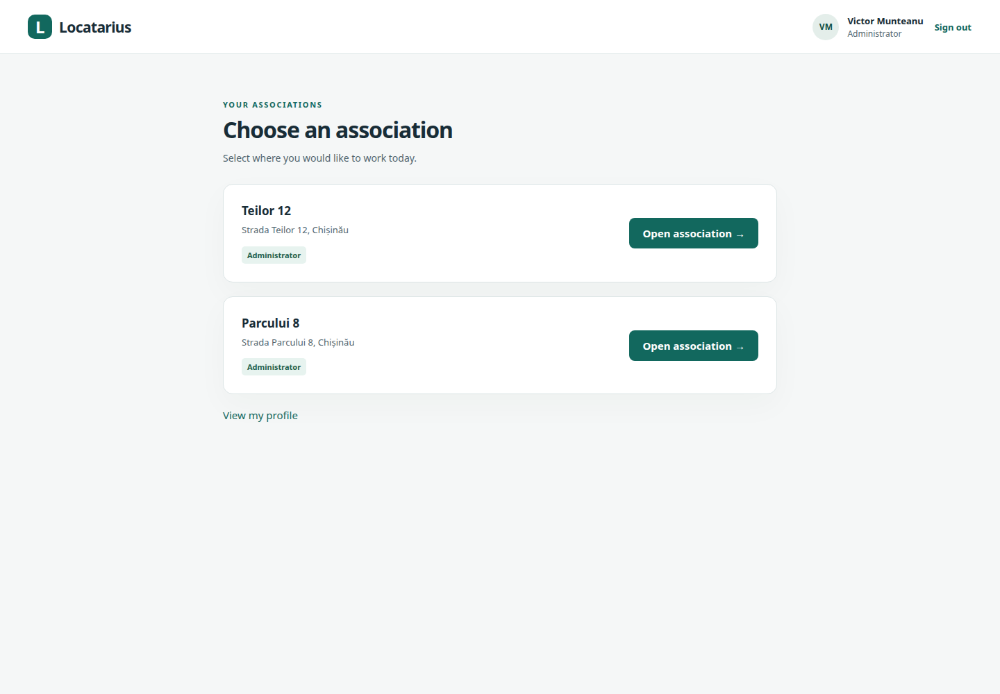

### S-04 — My profile {#s-04}

**Sprint 2 · UC-03 · S2-T5.** Editable display name, read-only email and password action. MFA settings are a November extension; identity reading in Sprint 1 does not require this edit form.

[Interactive](mockups/index.html?screen=S-04&role=admin) · [Desktop PNG](mockups/images/s-04-desktop.png) · [Mobile PNG](mockups/images/s-04-mobile.png)

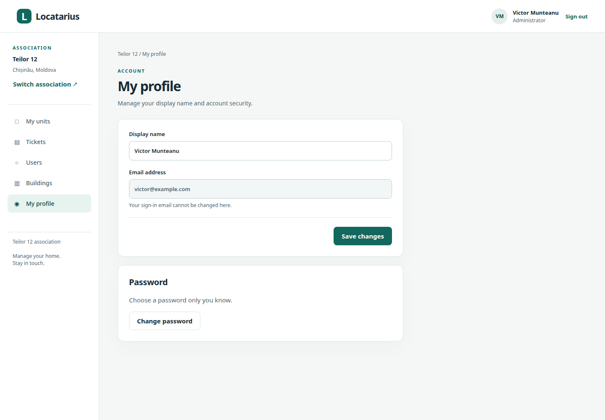

### S-05 — Users {#s-05}

**Sprint 2 · UC-02 · S2-T2.** Scoped paged list with enable/disable actions for resident memberships. Admin accounts have no role-change or deactivation control here.

[Interactive](mockups/index.html?screen=S-05&role=admin) · [Desktop PNG](mockups/images/s-05-desktop.png) · [Mobile PNG](mockups/images/s-05-mobile.png)

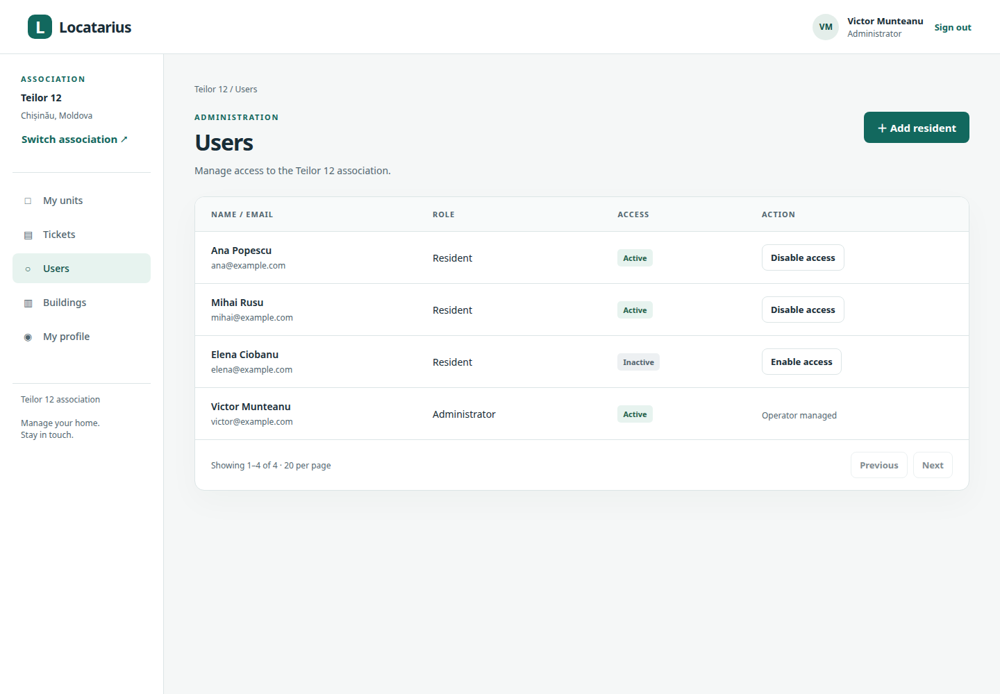

### S-06 — Add resident {#s-06}

**Sprint 1 · UC-02 · #81/#82.** Use displayName, email, temporaryPassword and confirmPassword. No role dropdown or building dependency. This can be a standalone page in Sprint 1.

[Interactive](mockups/index.html?screen=S-06&role=admin) · [Desktop PNG](mockups/images/s-06-desktop.png) · [Mobile PNG](mockups/images/s-06-mobile.png)

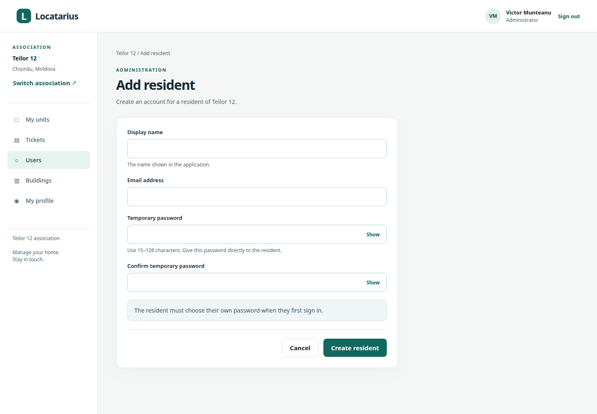

### S-07 — Buildings {#s-07}

**October · UC-04.** Create/list/edit building names and addresses. No financial dashboard or property-history controls.

[Interactive](mockups/index.html?screen=S-07&role=admin) · [Desktop PNG](mockups/images/s-07-desktop.png) · [Mobile PNG](mockups/images/s-07-mobile.png)

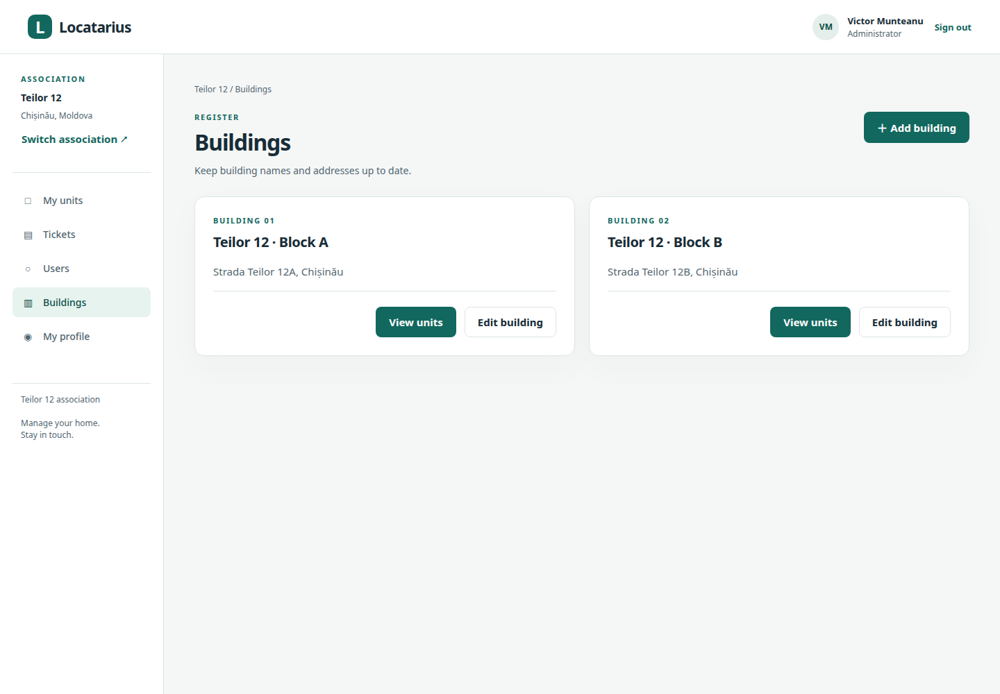

### S-08 — Building form {#s-08}

**October · UC-04.** One component supports add and edit. Association is derived from the verified context, not an editable form field.

[Interactive](mockups/index.html?screen=S-08&role=admin) · [Desktop PNG](mockups/images/s-08-desktop.png) · [Mobile PNG](mockups/images/s-08-mobile.png)

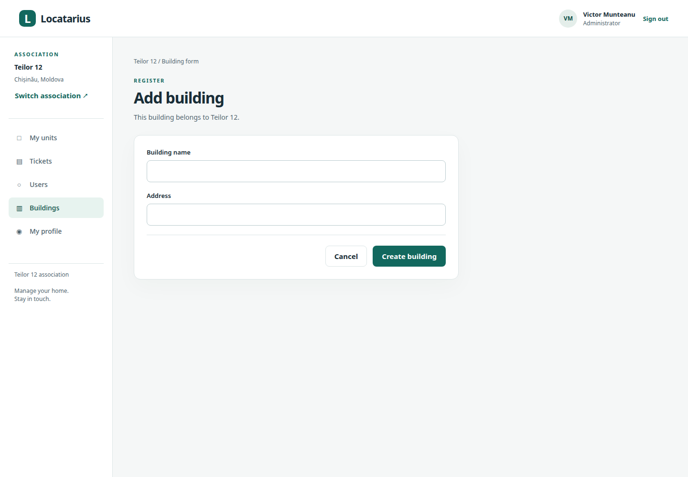

### S-09 — Units {#s-09}

**October · UC-04.** Building-specific unit list with edit and occupant actions. Mobile tables scroll within their card.

[Interactive](mockups/index.html?screen=S-09&role=admin) · [Desktop PNG](mockups/images/s-09-desktop.png) · [Mobile PNG](mockups/images/s-09-mobile.png)

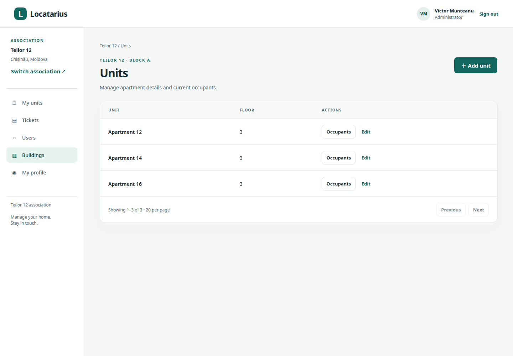

### S-10 — Unit form {#s-10}

**October · UC-04.** Required unit number, optional floor, building selection on create only. Edit does not move a unit between buildings.

[Interactive](mockups/index.html?screen=S-10&role=admin) · [Desktop PNG](mockups/images/s-10-desktop.png) · [Mobile PNG](mockups/images/s-10-mobile.png)

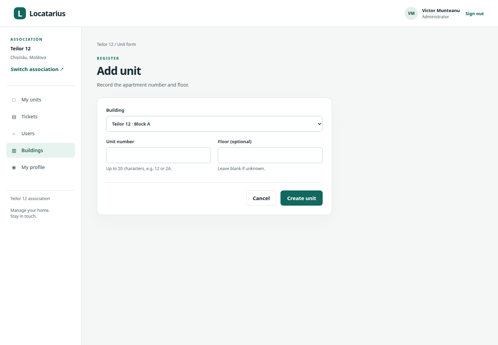

### S-11 — Unit occupants {#s-11}

**October · UC-04.** Active association members of either role are eligible, including the current admin. Unit occupancy does not change permission roles.

[Interactive](mockups/index.html?screen=S-11&role=admin) · [Desktop PNG](mockups/images/s-11-desktop.png) · [Mobile PNG](mockups/images/s-11-mobile.png)

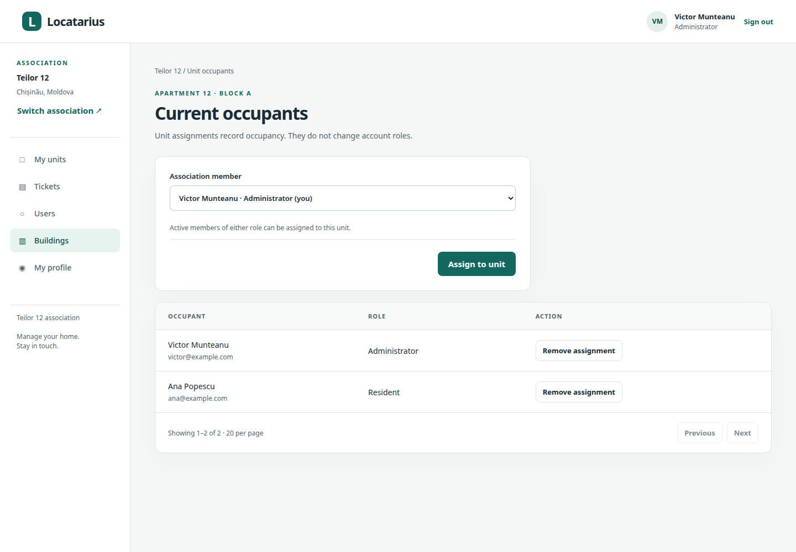

### S-12 — My units {#s-12}

**October · UC-04.** Both roles use the assignedToMe filter. An admin also has a separate full-register view. No assignments means no new ticket creation.

[Interactive](mockups/index.html?screen=S-12&role=resident) · [Desktop PNG](mockups/images/s-12-desktop.png) · [Mobile PNG](mockups/images/s-12-mobile.png)

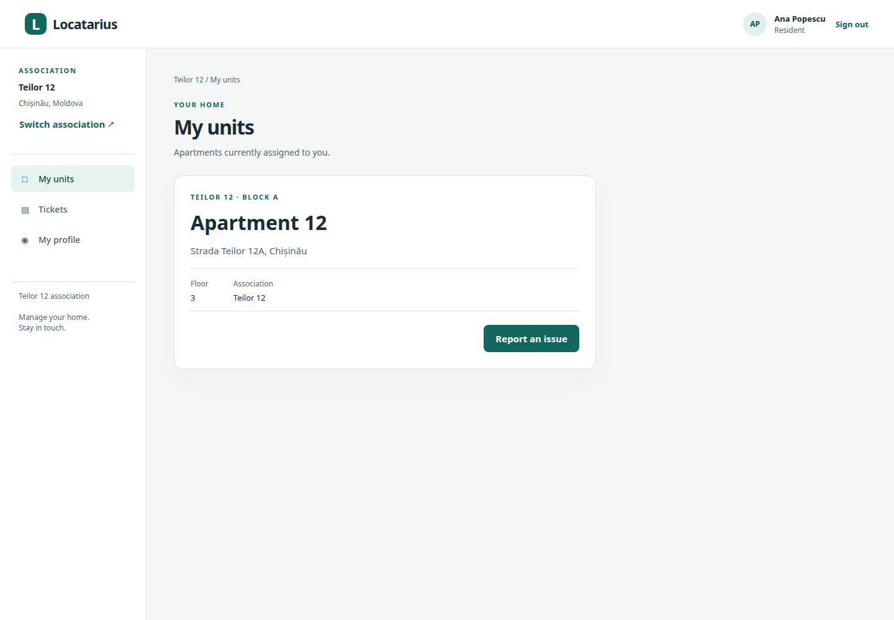

### S-13 — Tickets {#s-13}

**October · UC-05.** Resident sees their own tickets; administrator sees association tickets. Same list component, different server-authorized dataset.

[Interactive](mockups/index.html?screen=S-13&role=resident) · [Desktop PNG](mockups/images/s-13-desktop.png) · [Mobile PNG](mockups/images/s-13-mobile.png)

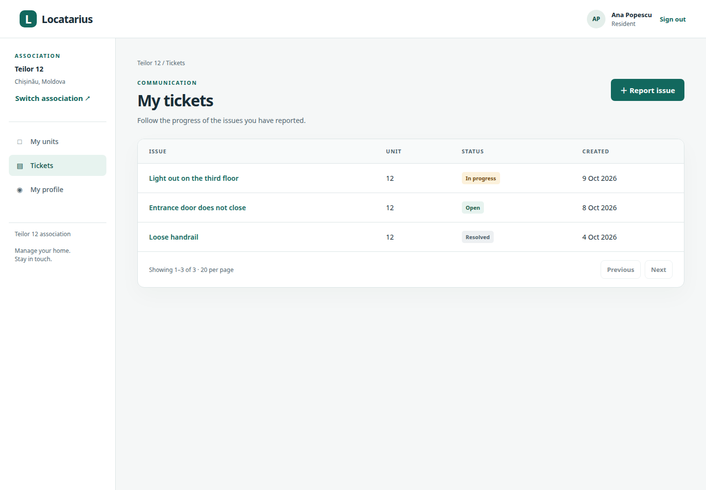

### S-14 — Report issue {#s-14}

**October · UC-05.** Unit picker contains only the caller’s assignments, even for admins. Title and description only; no reporter/role/priority/attachment fields.

[Interactive](mockups/index.html?screen=S-14&role=resident) · [Desktop PNG](mockups/images/s-14-desktop.png) · [Mobile PNG](mockups/images/s-14-mobile.png)

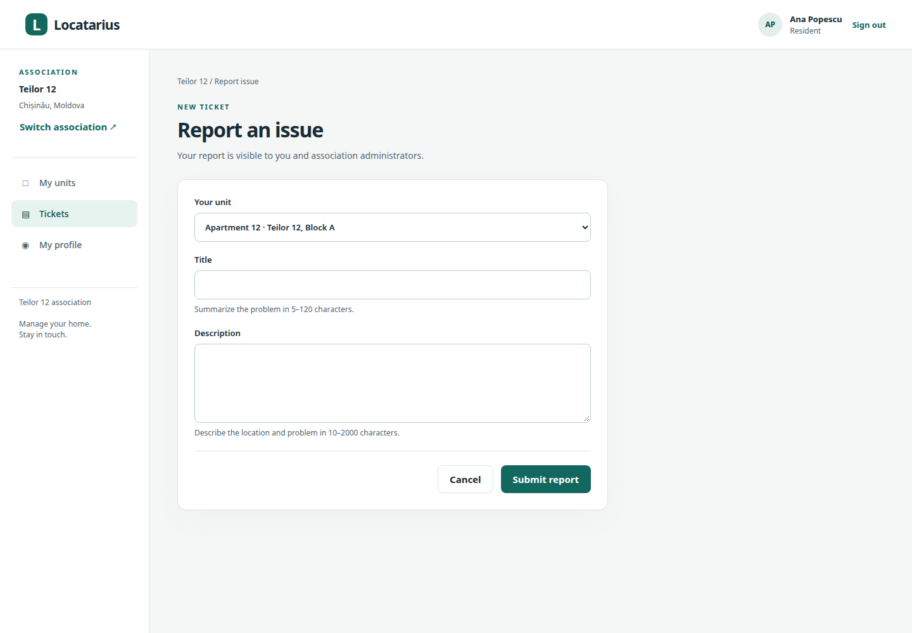

### S-15 — Ticket detail {#s-15}

**October · UC-06.** Reporter and admin can comment until resolved. Only admins can advance open → in_progress → resolved. Resolved tickets have no comment form. Author labels use IDs/context; no resident-directory lookup.

[Interactive](mockups/index.html?screen=S-15&role=resident) · [Desktop PNG](mockups/images/s-15-desktop.png) · [Mobile PNG](mockups/images/s-15-mobile.png)

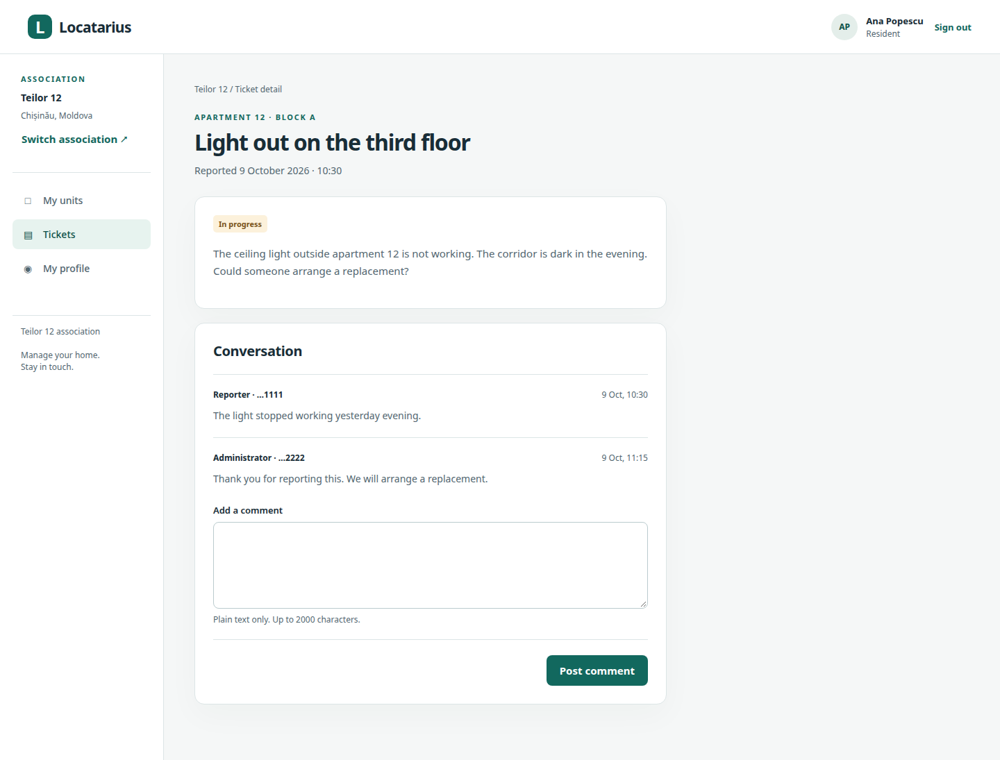

### S-16 — Set up MFA {#s-16}

**November · UC-07.** Manual authenticator enrollment using the server-provided key. The pictured key is a nonfunctional placeholder. A valid code is required before enabling MFA.

[Interactive](mockups/index.html?screen=S-16&role=admin) · [Desktop PNG](mockups/images/s-16-desktop.png) · [Mobile PNG](mockups/images/s-16-mobile.png)

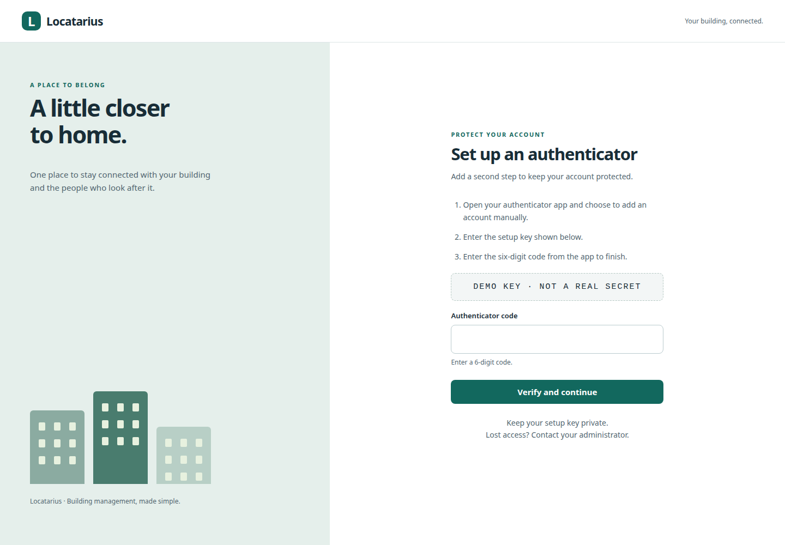

### S-17 — Verify MFA {#s-17}

**November · UC-07.** Six-digit code, pending/error state and supervised recovery guidance. Local and provider sign-in both complete this step before full access.

[Interactive](mockups/index.html?screen=S-17&role=admin) · [Desktop PNG](mockups/images/s-17-desktop.png) · [Mobile PNG](mockups/images/s-17-mobile.png)

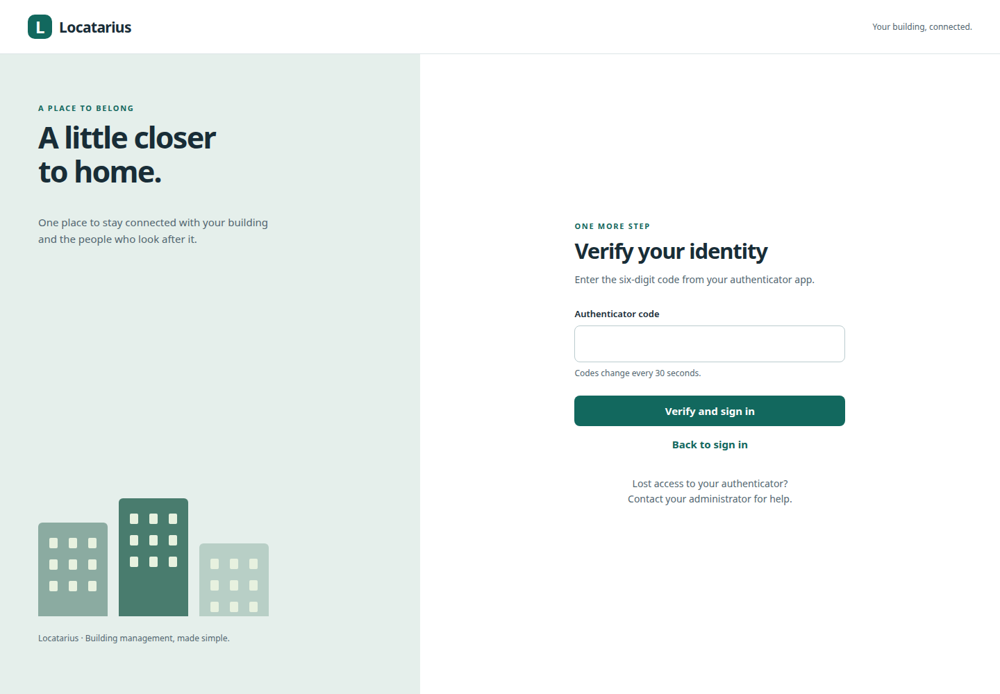

## Handoff limits

Prototype state is in memory and resets when reloaded. It does not store users or submit comments, and simulated success does not establish valid inputs. Provider sign-in simulates the next local MFA screen; the real provider's page is outside the application. The MFA enrollment key is deliberately nonfunctional. A real app must fetch an actual secret only through the protected enrollment flow.

Desktop/mobile layouts and the listed interactions were checked in a headless Chromium browser. Manual keyboard/screen-reader review, API integration and the full security acceptance suite remain implementation tasks.
