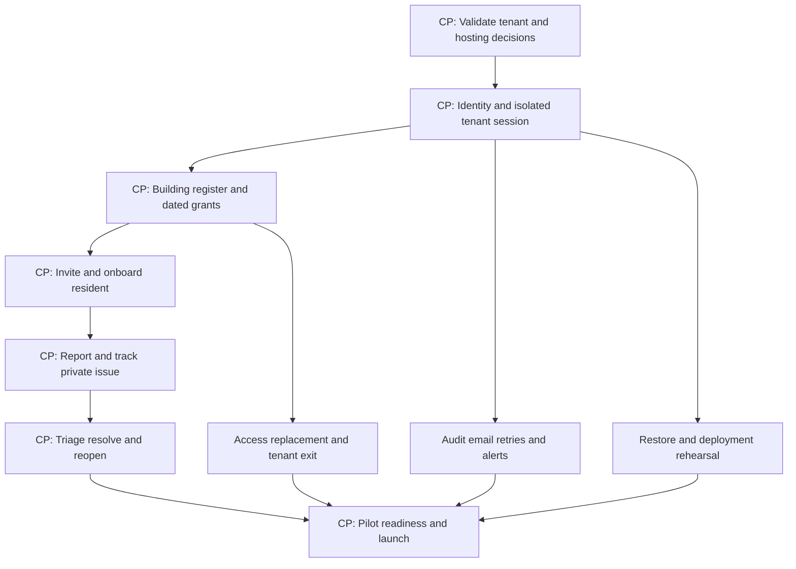

# MVP roadmap and delivery backlog

[Catalogue](use-case-catalog.md) · [Traceability](traceability.md) · [Operations](operations-and-testing.md)

## 1. Choose the first business slice

| Candidate | Closed-loop value | Minimum business prerequisites | Delivery assessment |
| --- | --- | --- | --- |
| Communication-only notices | Publish and acknowledge a notice | Audience/contact accuracy and accepted notice workflow | Small, but existing messenger/email already does much of it; acknowledgement has limited operational value |
| Private issue reporting through resolution | Resident reports, admin responds/assigns/resolves, resident confirms or reopens | Small unit/access register and an administrator committed to responding | Selected: useful to both roles, measurable outcome, no accounting migration prerequisite |
| Financial transparency | Reconciled opening balance, charges/receipts and resident statement | Liability/currency/rounding rules, trusted opening data, correction/reconciliation and accounting review | Valuable but materially larger and riskier; defer to MVP3 |

MVP1 is 19 goal-level use cases, many small access/lifecycle requirements, not 19 separate large modules. No “MVP0.” Foundation work is delivered inside testable vertical slices. A closed issue workflow that cannot revoke former residents or recover its database is not production-ready. A notice board does not need to be on the critical path for issue resolution.

## 2. Release scope matrix

| Capability | MVP1 | MVP2 | MVP3 | MVP4 | MVP5 |
| --- | --- | --- | --- | --- | --- |
| Organization tenancy, effective grants, global identity | Launch | Retain | Retain | Retain | Retain |
| Manual register and invitations, tenant lifecycle/export | Launch | CSV preview/import | Retain | Asset/common-area extensions | Retain |
| Issue reporting/conversation/triage/resolution/reopen | Launch, text only | Private evidence | Retain | Work-order linkage | Retain |
| Notices/documents/preferences/delivery review/privacy portal | Manual/limited issue email | Launch | Retain | Retain | Retain |
| Receivables, dues, receipts, correction/reconciliation | External existing process | External existing process | Launch | Utility/expense draft handoff | Retain |
| Operational dashboard / large reports | Issue queue, bounded exit export | Retain | Finance/report jobs | Maintenance/utilities views | Community views |
| Assets/work orders/prevention/expenses | Manual external | Manual external | Manual external | Launch | Retain |
| Meter readings/tariffs/shared consumption | External existing process | External | External | Launch | Retain |
| Meetings/advisory polls/reservations | Existing process | Existing process | Existing process | Existing process | Launch |
| Isolation/audit/MFA/backup/monitoring/deploy safety | Mandatory | Extend tests | Extend financial gates | Extend recurrence gates | Extend governance/concurrency gates |

“Designed now” = all 55 use-case contracts, ADRs and target relationships in this package. “Implemented now” = MVP1 entities/endpoints/screens plus EN-001–007 only. “Deferred implementation” = every MVP2–5 entity/module/job, private object storage/scanner (MVP2), financial posting/report engine (MVP3), recurrence domain engines (MVP4), poll/reservation state machines (MVP5). A documented future dependency cannot force a future service into MVP1.

## 3. Production increments

### MVP1 — Reliable issue resolution

**Users/objective:** one real association administrator team and residents can complete issue lifecycle with safe onboarding/offboarding. **Scope:** IAM-001–004, IAM-006–008; TEN-001–004; BLD-001–002; ISS-001–005; RPT-001. **Enablers:** EN-001–007. Full `UC-` IDs and links are in the generated scope table below. **Exclusions:** all later catalogue entries; no files, announcements, finance, meters, work orders or community modules.

**Prerequisites:** validate tenancy/controller boundary, pilot language, hosting/residency/identity/email procurement, ownership/occupancy access policy and pilot admin commitment. **Demonstration:** operator provisions A; steward accepts with MFA; administrator creates 60 units and explicit dated resident grant; resident accepts, switches to A, reports issue, exchanges comment; administrator triages/resolves; resident confirms and reopens a test issue; move-out immediately blocks access. Separately tenant B IDs, unit IDs and membership contexts are attacked and denied. Restore backup to isolated environment and show same issue history with revoked access still enforced.

**Business success:** pilot activation/use/response/closure metrics in solution design measured over 4 weeks. **Acceptance:** all 19 UC acceptance sets pass, no open critical auth/isolation or data-integrity defect; accepted accessibility checks and admin training. **Production gates:** G-01–07 below, including restore, not merely “backup configured.” **Risks:** administrator adoption, poor source register, identity procurement and unfamiliar RLS. **Effort:** 26–40 person-weeks total delivery effort; approximately 9–13 active calendar weeks under stated capacity, then 4-week pilot observation partly overlapping normal support. No promised launch date.

### MVP2 — Communication, evidence and safer administration

**Users/objective:** residents access notices/documents and attach evidence; administrators migrate/review contacts and handle privacy cases with tracked response. **Scope:** IAM-005, BLD-003, COM-001–005, ISS-006, PRV-001–002. **Enablers:** retain EN-001–007 and add EN-008. **Exclusions:** finance, maintenance/utilities and community modules; no SMS/push or public links.

**Prerequisites:** stable MVP1, selected private object store/scanner, approved personal-data policy and document audiences. **Demo:** import preview with bad tenant row fails; corrected batch commits without auto-invites; publish targeted notice with clean document; resident acknowledges; removed resident cannot open copied file URL; scanner outage leaves upload inaccessible; reviewed privacy package is released only to subject. **Metrics:** 80% of active pilot households can locate a current notice/document unaided; 95% routine notification attempts within 5 minutes; zero unsafe file releases. **Acceptance/gates:** all new UC cases, FILE-01 suite, restore with object versions, privacy-review procedure rehearsal, G-01–08. **Risk:** third-party data in uploads, mistaken bulk grants, notification confusion. **Effort:** 16–26 person-weeks, roughly 6–9 active weeks after prerequisites.

### MVP3 — Financial transparency and controlled receipts

**Users/objective:** finance administrator reconciles charges and externally received money; residents see their own liability accounts. **Scope:** FIN-001–011, RPT-002. **Enablers:** EN-009–010 plus retained gates. **Exclusions:** payment processing, automatic bank feeds, full statutory accounting, tax/penalty automation, utilities and expense automation.

**Prerequisites:** written jurisdiction/currency/liability/rounding/period/approval policy, signed opening reconciliation, named accountant, transaction examples, staged test data. **Demo:** create old and new owner accounts, post opening, preview/post monthly charge, record partial payment and excess credit, allocate, issue adjustment, reverse erroneous payment, reconcile bank file and close period; new owner cannot see predecessor debt. Replay posting/recurrence and race closure with posting; no duplicate or unbalanced journal. **Metrics:** 100% pilot openings reconciled; 100% posted journals balance; month-end unexplained difference zero; at least 80% pilot account holders can explain statement balance after onboarding. **Acceptance/gates:** finance acceptance/property suite and independently reviewed examples, parallel-run one full period, G-01–09. **Risks:** poor historical data, ambiguous liability and invalid allocation rules dominate engineering uncertainty. **Effort:** 36–56 person-weeks, approximately 12–19 active weeks; legal/accounting validation can lengthen elapsed time without adding implementation scope.

### MVP4 — Maintenance and utilities tied to billing evidence

**Users/objective:** administrator coordinates repairs and recurring maintenance; residents submit readings; finance receives reviewed consumption/expense inputs. **Scope:** MNT-001–004 and UTL-001–005. **Enablers:** EN-011 plus retained gates. **Exclusions:** contractor login, IoT, complex tariffs and automatic payment/provider processing.

**Prerequisites:** stable financial model, asset/meter baseline, contractor contact policy, accepted flat-tariff/shared-loss/proration policies and spending authority. **Demo:** recurring job makes one draft work order, administrator approves/completes and separately resolves issue; expense correction preserves original. Meter replacement segments consumption; anomaly blocked; accepted corrected reading produces reviewed correction draft; duplicate handoff never double-bills. **Metrics:** 95% scheduled maintenance drafts generated by due day; all billed utility amounts reproduce from frozen evidence; missing readings visibly block or follow approved exception. **Acceptance/gates:** end-to-end repair/utility evidence checks, DST and recurrence deduplication, G-01–10. **Risks:** missing meter boundaries and unreliable shared readings; human contractor process remains. **Effort:** 30–48 person-weeks, approximately 10–16 active weeks.

### MVP5 — Advisory governance and shared facilities

**Users/objective:** residents access meetings/minutes, express advisory preferences and reserve exclusive facilities. **Scope:** GOV-001–003, RES-001–002. **Enablers:** EN-012 plus retained gates. **Exclusions:** legally binding voting/quorum/proxies/secret ballots, paid booking or access-control integration.

**Prerequisites:** explicit advisory labeling and validated organization governance policy; resource hours/time-zone/cancellation rules. **Demo:** publish meeting/minutes, open eligibility-snapshotted advisory poll, cast one ballot per member, race closure; publish resource calendar and race overlapping reservations, then cancel with reason. **Metrics:** no duplicate ballot or overlapping active booking; participation reported honestly as advisory; at least 90% user-test bookings completed unaided. **Acceptance/gates:** poll/booking concurrency suite and accessibility on mobile calendar, G-01–07 and G-11. **Risks:** users mistake polls for legal decisions, ambiguous resource/time rules. **Effort:** 16–26 person-weeks, approximately 6–9 active weeks.

### Release gates

| Gate | Evidence required | Accountable owner |
| --- | --- | --- |
| G-01 | Included UC acceptance scenarios linked to passed executions; end-to-end user demo | Product owner + QA |
| G-02 | Tenant/building/unit authorization and negative suite, two independent tenants, no privileged runtime RLS bypass | Security architect |
| G-03 | NFR latency/capacity, accessibility and localization/time checks for shipped screens | Engineering lead + QA |
| G-04 | Audit/redaction, MFA/session/CSRF, dependency/SBOM review and vulnerability disposition | Security lead |
| G-05 | Timed backup restoration meeting RPO/RTO; deletion tombstones reapplied | Platform owner |
| G-06 | Staging deployment/migration/rollback rehearsal; alert receipt and on-call readiness | Release owner |
| G-07 | Controller/legal/privacy decisions appropriate for data/features, pilot owner/training and manual workload acceptance | Product/controller representative |
| G-08 | All uploaded/downloaded/private export paths pass scan, revocation, storage recovery and leak tests | File-feature lead |
| G-09 | Finance policy/accountant review, property/concurrency tests, reconciled parallel period | Finance owner |
| G-10 | Utility source evidence, recurrence/DST, handoff deduplication and correction tests | Maintenance/finance owner |
| G-11 | Advisory eligibility/closure and booking exclusivity/cancellation tests | Community feature owner |

## 4. MVP1 critical path and vertical backlog

CP labels identify the business sequence; security/recovery/access branches are mandatory merge gates before pilot. Later notices/finance/assets/polls are absent from this graph. Safety work begins in the first slice, not as a late hardening phase.

| Slice / epic | Vertical completion definition: frontend, backend, data, test and deployment | IDs | Effort person-weeks |
| --- | --- | --- | --- |
| VS-01 Identity and isolated organization | Login/tenant selector/operator onboarding screens; OIDC/BFF and provisioning commands; session/tenant/membership/RLS migration; two-tenant test; deploy to staging with secrets | IAM-001–004, TEN-001; EN-001–003 | 4–6 |
| VS-02 Current register and access | Unit/relationship/admin transfer views; dated grant and last-admin handlers; composite FKs/history; interval and race tests; migrate staging | BLD-001–002, IAM-008; EN-002 | 3–5 |
| VS-03 Invite and revoke safely | Invite/status/access UI; token gateway, resend/suspend/remove; outbox and delivery persistence; provider failure/move-out tests; configured sender in staging | IAM-006–007, IAM-003; EN-004 | 4–6 |
| VS-04 Report and follow private issues | Resident form/thread and scoped home; create/list/comment policies; Issue/comment/dedupe tables; cross-unit and retry E2E; staging mobile demo | ISS-001–002, RPT-001; EN-005 | 4–6 |
| VS-05 Complete the resolution loop | Admin queue/assignment/resolution and resident closure/reopen UI; state handlers/ETag/history; transition/concurrent update tests; complete demo deployment | ISS-003–005 | 3–4 |
| VS-06 Safe tenant lifecycle | Settings/export/metadata console; suspend/archive/purge approval and export streaming; holds/tombstones; last-admin/export isolation and exit rehearsal | TEN-002–004; OP-004/006/007 | 2–3 |
| VS-07 Operable release | Health/status and safe failure presentation; redacted telemetry, durable leases, limits; monitoring config; fault/alert/dependency/load verification | EN-004–005,007 | 2–4 |
| VS-08 Restore, cutover and acceptance | Final accessible user journey; tested migration and rollback artifacts; isolated restore with grant checks; trained pilot admin and cutover/incident drill | EN-006–007; OP-001–007 | 4–6 |
| Total | Includes analysis, engineering, testing and release effort; no separate hidden platform phase | MVP1 | 26–40 |

Slices are completion boundaries, not a mandate for serial staffing. QA/security fixture design and platform environments run alongside UI/domain work; after VS-01, register/access and outbox/monitoring can proceed in parallel. VS-04 requires real invitation/grant integration for acceptance even if UI uses a temporary local stub during development. VS-07/08 activities start earlier; their rows include final integrated evidence and acceptance, not permission to postpone safeguards.

### Team and estimate assumptions

| Profile | Planning allocation during active delivery | Accountability |
| --- | --- | --- |
| Technical lead/backend engineer | 1.0 FTE | Domain, tenant isolation, transactions and code review |
| Product/full-stack engineer | 1.0 FTE | End-to-end use cases and APIs/UI integration |
| Frontend/full-stack engineer | 1.0 FTE | Responsive flows, accessibility and client-state safety |
| QA engineer | 0.5 FTE | Risk-based automated/API/E2E suite and acceptance evidence |
| Platform/SRE engineer | 0.3 FTE | Hosting/CI, backups, restore, alerts and release |
| Architect/security reviewer | 0.2 FTE | Threat/tenancy decisions and high-risk review |
| Product owner/business analyst | 0.25 FTE | Scope decisions, pilot adoption and policy validation |

Total nominal 4.25 FTE; assume 75% focused project capacity (~3.2 person-weeks/week) after meetings, support and leave. Calendar estimates are rounded ranges plus dependency uncertainty; not a fixed-price bid. A two-engineer team should expect materially longer elapsed delivery, not the same schedule with more pressure. Obtain vendor prices only after region/identity MAU/backup requirements are known; no invented cost estimate. Later releases re-estimate against actual velocity and validated finance/utility complexity. Do not sum all release ranges into a promised long-term date.

## 5. Manual alternatives that preserve control

| ID / release | Procedure and owner | Safeguards and volume limit | Recurring effort / risk / automation trigger |
| --- | --- | --- | --- |
| MW-01 MVP1 tenant onboarding | Operator verifies association authority and uses bounded provision command; steward enters initial 60-unit register | Two-source authority check; no direct SQL; second review of admin identity; up to 5 new tenants/month | 1–2h/tenant operator plus 3–6h/60-unit register setup; automate import in MVP2 or >200 units/tenant |
| MW-02 MVP1 resident verification | Building admin checks residency/ownership evidence externally, records source reference and separate dated grant, sends invitation | No identity-document copy in issue text/email; second check for bulk grants; <=20 resident changes/week/admin | 5–10 min/change; stale register risk; adopt CSV preview/portal workflow when >2h/week |
| MW-03 MVP1 issue evidence/contractors | Administrator inspects physical problem and contacts verified contractor; records plain-text summary in private issue | No external public photo links or bypass uploads; minimize shared resident details; <=10 evidence-heavy issues/week | 10–20 min/issue coordination; add safe attachments in MVP2 when repeated clarification delays resolution |
| MW-04 MVP1–2 finance | Existing accountant/administrator keeps established ledger and bank reconciliation outside product | Platform shows no invented balance; reconcile in source of truth; no duplicate product postings | Existing workload retained; MVP3 when approved opening data and monthly demand justify migration |
| MW-05 MVP1 email failure | Admin checks invitation delivery state or restricted support queue; verify address and resend approved invitation; contact resident by existing verified channel | Never paste tenant data/token into shared chats; known retry can duplicate email; <=10 failures/week | 5–10 min/failure; automate richer delivery console MVP2 or >1h/week |
| MW-06 MVP1 privacy | Controller logs request in restricted ticket register, verifies identity, reviews scoped export/redaction and records hold/decision | Two-person review of disclosure; no normal former-member reactivation; <=5 cases/month | 1–3h/case; portal MVP2 improves tracking, cannot automate legal judgment |
| MW-07 all releases statutory governance | Association keeps formal notices, eligibility/quorum and signed resolutions in its approved process | Product polls explicitly advisory; publish reviewed minutes only | Existing meeting workload; formal voting remains excluded until jurisdiction-specific project |
| MW-08 MVP1 tenant exit | Steward requests bounded snapshot/export, validates manifest, operator archives and schedules approved retention purge | Step-up, export receipt/waiver, two-person purge, holds, no cross-tenant SQL dumps | 1–3h/exit up to 2/month; asynchronous export MVP3 or size cap routinely exceeded |
| MW-09 MVP4 contractor handoff | Administrator sends minimal work scope through existing verified contact and records handoff | No contractor portal access; spending approval separate from completion | 10–20 min/order; reconsider contractor portal above 50 active orders/admin |

Manual alternatives are explicit operational commitments. If their volume caps are exceeded, either accelerate the named capability or reduce onboarding rate; do not quietly bypass access checks or write directly to financial tables.

## 6. Exact release assignments

| Release | Included business use cases |
| --- | --- |
| MVP1 | [UC-IAM-001](use-cases/UC-IAM-001.md), [UC-IAM-002](use-cases/UC-IAM-002.md), [UC-IAM-003](use-cases/UC-IAM-003.md), [UC-IAM-004](use-cases/UC-IAM-004.md), [UC-IAM-006](use-cases/UC-IAM-006.md), [UC-IAM-007](use-cases/UC-IAM-007.md), [UC-IAM-008](use-cases/UC-IAM-008.md), [UC-TEN-001](use-cases/UC-TEN-001.md), [UC-TEN-002](use-cases/UC-TEN-002.md), [UC-TEN-003](use-cases/UC-TEN-003.md), [UC-TEN-004](use-cases/UC-TEN-004.md), [UC-BLD-001](use-cases/UC-BLD-001.md), [UC-BLD-002](use-cases/UC-BLD-002.md), [UC-ISS-001](use-cases/UC-ISS-001.md), [UC-ISS-002](use-cases/UC-ISS-002.md), [UC-ISS-003](use-cases/UC-ISS-003.md), [UC-ISS-004](use-cases/UC-ISS-004.md), [UC-ISS-005](use-cases/UC-ISS-005.md), [UC-RPT-001](use-cases/UC-RPT-001.md) |
| MVP2 | [UC-IAM-005](use-cases/UC-IAM-005.md), [UC-BLD-003](use-cases/UC-BLD-003.md), [UC-COM-001](use-cases/UC-COM-001.md), [UC-COM-002](use-cases/UC-COM-002.md), [UC-COM-003](use-cases/UC-COM-003.md), [UC-COM-004](use-cases/UC-COM-004.md), [UC-COM-005](use-cases/UC-COM-005.md), [UC-ISS-006](use-cases/UC-ISS-006.md), [UC-PRV-001](use-cases/UC-PRV-001.md), [UC-PRV-002](use-cases/UC-PRV-002.md) |
| MVP3 | [UC-FIN-001](use-cases/UC-FIN-001.md), [UC-FIN-002](use-cases/UC-FIN-002.md), [UC-FIN-003](use-cases/UC-FIN-003.md), [UC-FIN-004](use-cases/UC-FIN-004.md), [UC-FIN-005](use-cases/UC-FIN-005.md), [UC-FIN-006](use-cases/UC-FIN-006.md), [UC-FIN-007](use-cases/UC-FIN-007.md), [UC-FIN-008](use-cases/UC-FIN-008.md), [UC-FIN-009](use-cases/UC-FIN-009.md), [UC-FIN-010](use-cases/UC-FIN-010.md), [UC-FIN-011](use-cases/UC-FIN-011.md), [UC-RPT-002](use-cases/UC-RPT-002.md) |
| MVP4 | [UC-MNT-001](use-cases/UC-MNT-001.md), [UC-MNT-002](use-cases/UC-MNT-002.md), [UC-MNT-003](use-cases/UC-MNT-003.md), [UC-MNT-004](use-cases/UC-MNT-004.md), [UC-UTL-001](use-cases/UC-UTL-001.md), [UC-UTL-002](use-cases/UC-UTL-002.md), [UC-UTL-003](use-cases/UC-UTL-003.md), [UC-UTL-004](use-cases/UC-UTL-004.md), [UC-UTL-005](use-cases/UC-UTL-005.md) |
| MVP5 | [UC-GOV-001](use-cases/UC-GOV-001.md), [UC-GOV-002](use-cases/UC-GOV-002.md), [UC-GOV-003](use-cases/UC-GOV-003.md), [UC-RES-001](use-cases/UC-RES-001.md), [UC-RES-002](use-cases/UC-RES-002.md) |
