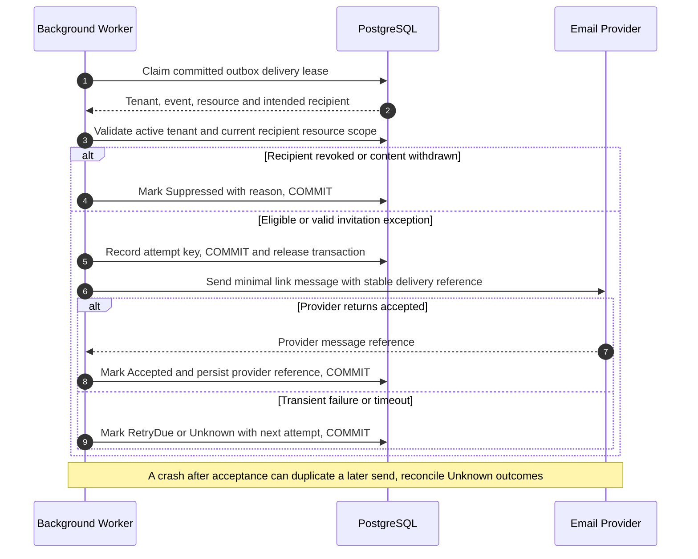
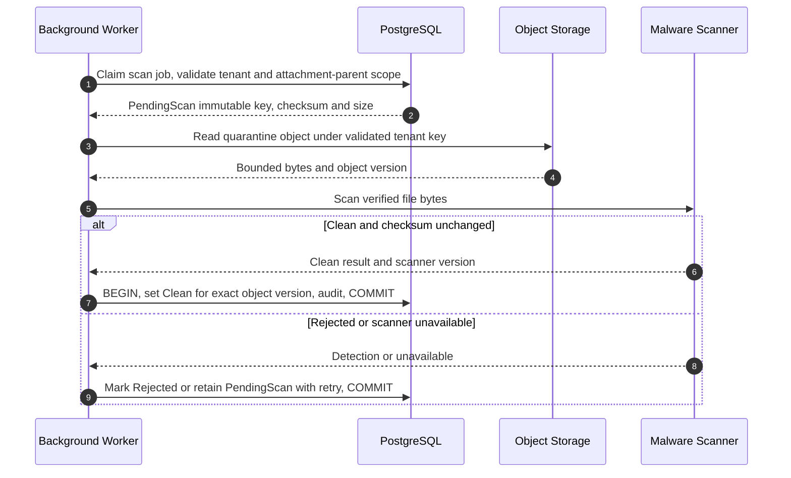

# Shared security, consistency and integration contracts

[Architecture](solution-design.md) · [Data](data-model.md) · [APIs](api-catalog.md)

## AUTH-01 — Ordinary application authorization

1. Terminate HTTPS at the managed ingress; trust forwarded headers only from that ingress. Resolve an opaque `__Host-` session cookie: Secure, HttpOnly, path `/`, no Domain, SameSite=Lax. Store only a hash of the random session token. Session data and OIDC tokens are server-side. Validate expiry/revocation on every protected request; never put bearer/refresh tokens in browser local storage.
2. The session holds global user ID, active tenant ID and monotonically increasing context version. A request path `/t/{t}` and `X-Tenant-Context-Version` must match that selection. These inputs are selectors, not evidence of membership. Tenant switching validates the requested membership independently of old active context.
3. Use the authenticated identity to read only its own session/membership directory through a narrowly scoped identity query. Check tenant Active, membership Active, `valid_from <= now < valid_to`, and current grants. Membership suspension/removal is enforced per request; no role claim in an old token overrides it.
4. Begin a database transaction; set the validated tenant context transaction-locally. Application runtime is neither table owner, superuser nor BYPASSRLS. FORCE ROW LEVEL SECURITY applies on tenant tables; policies fail closed if context is absent. Global identity/session tables have separate access routines; no global resident directory endpoint. A connection returned to the pool must not retain a usable tenant context. Test rollback and pool reuse explicitly.
5. Apply backend action policy and resource predicates before loading protected content. Building administrators require `BuildingGrant`; residents require effective `UnitAccessGrant` or derived current building access, then resource ownership/audience. Issue reporter identity, account access grant, document audience and poll eligibility are independent additional predicates. RLS provides the tenant boundary; it does not replace building/unit authorization.
6. Serialize writes with access changes where needed: obtain a shared membership/tenant-control lock while committing a protected mutation; revocation takes the incompatible lock. Recheck grants inside the write transaction. Reads authorize at request start; downloads recheck immediately before stream and every 5 seconds for streams longer than that. A response already delivered cannot be recalled. Deny subsequent access immediately after revocation commits.
7. Require antiforgery token and origin checks on cookie-authenticated unsafe methods; reject missing/mismatched context on writes. Enforce object ownership, allowlisted mutable fields and tenant-aware foreign keys server-side. Ignore client roles. Missing authentication gives 401, role failure 403, invisible object 404.

Session proposal: residents 12-hour idle and 7-day absolute limit; administrators 30-minute idle and 12-hour absolute limit; no persistent “remember me” for administrators. Require provider-backed MFA for all administrators and operators; step-up within 15 minutes for role grants, full exports, finance posting/corrections and tenant lifecycle. Provider must expose a reliable assurance signal through verified claims; absence blocks privileged actions. Account recovery is provider-managed and cannot recreate revoked local grants. Server-side sessions survive app replacement; encryption keys are externalized and versioned.

The secure OIDC choice is Authorization Code with PKCE S256, state, nonce, exact redirect allowlists and issuer/audience/signature/time validation, using established middleware. Identity key is `(issuer, subject)`; email is a verified contact attribute, not the identity key. See [OIDC Core](https://openid.net/specs/openid-connect-core-1_0.html) and [OAuth security BCP](https://www.rfc-editor.org/info/rfc9700/). Cookie requests need CSRF defenses; SameSite is not the sole control. See [ASP.NET Core antiforgery](https://learn.microsoft.com/en-us/aspnet/core/security/anti-request-forgery?view=aspnetcore-10.0).

## AUTH-02 — Operator boundary

Platform Operator is a separate permission set and console with MFA. It can provision, view tenant service metadata, suspend/resume, authorize bounded support commands and initiate approved archive/purge jobs. It has no normal permission to issue tenant business queries, view complaints, inspect financial accounts, read documents or download tenant exports.

Bootstrap reads operator assignment and unique onboarding reference before a tenant exists. Recovery commands require verified organization authority, ticket, named target, expiry (maximum 1 hour), permitted operation and second approver. Dedicated command handler writes a specific administrator invitation/grant under tenant context; there is no interactive “impersonate anyone” session. Infrastructure database administrators remain a powerful residual trust risk: emergency credentials, two-person use, access logging and review are organizational controls, not magically removed by RLS.

## AUTH-03 — Invitation gateway

The one-use token is hashed and looked up through a restricted function returning only invitation data required for acceptance. The query is not a general RLS bypass for tenant tables. Bind verified signed-in email, intended identity when known, tenant, role, scope, expiry and state. The bootstrap path may activate a Provisioning tenant only after accepted steward MFA and onboarding checks; ordinary invites require Active tenant. Accept and consume token under lock in one transaction. Multiple invitations for the same identity merge grants only after each authorized acceptance, never by email-domain matching.

## AUTH-04 — Privacy and former-member boundary

Former members may access their own identity and membership-history directory solely to file a privacy case and read their own case status. This does not select an active tenant or enable normal domain queries. A subject-only response grant can expose one reviewed privacy package for 24 hours. The normal tenant route remains denied. A designated controller representative decides corrections, redactions, legal holds and erasure eligibility; operators perform only approved bounded jobs.

## CON-01 — Writes, versions and durability

All aggregate edits have integer `version` exposed as a strong ETag. PATCH and state commands require `If-Match`; absent precondition is 428, stale version 412. Append-only comments allow concurrent appends but lock/check allowed issue state; unique client keys suppress duplicate append. For create/append/post operations require `Idempotency-Key` scoped to `(tenant, actor, operation)`, canonical request hash and stored result reference. Authorize before replaying the stored result. Session and protocol callback exceptions are specified per IAM case.

Keep short-lived request deduplication 7 days, except money: durable posting/source keys and occurrence constraints persist as long as financial records. Same key with different payload returns 409. Financial transaction never relies only on seven-day request cache. Admission limit: 2000-account charge batch, 2000-row register import, 100000-row/50 MiB synchronous tenant export. Imports and charge batches are atomic within these caps. A larger import is divided into independently reviewed batches with an explicit partial-batch ledger of completed batches.

Acquire locks in stable order: tenant control/membership, period, account, payment, charge. Last-administrator protection locks the tenant control row. Period closure and posting lock the same period. Payment allocation locks receipt and affected charges. Reservation exclusivity uses database exclusion constraint, with membership quota serialized separately. Bounded retry for serialization/deadlock failure: 3 attempts with jitter while retaining the original command key; then 409 RETRY_REQUIRED. Do not retry an unknown provider side effect as a new business command.

Audit is transactionally appended for changes with actor, resource, safe before/after fields, reason reference and correlation. Audit failure aborts critical domain changes. Operational logs can fail without rolling back business state, but telemetry loss alerts. Audit append-only is enforced for runtime permissions; it is not a cryptographic guarantee against a database superuser.

## ERR-01 — Errors and frontend behavior

Errors use `application/problem+json`: `type`, `title`, `status`, stable `code`, `correlationId`, safe `fieldErrors`; no SQL names, object keys, stack traces or hidden-object existence. Common codes: 400 malformed; 401 unauthenticated; 403 forbidden action; 404 invisible/not found; 409 invalid state/duplicate-payload/context changed; 412 stale ETag; 413 size cap; 422 business validation; 428 missing precondition; 429 rate limit with Retry-After; 503 dependency unavailable.

Frontend displays field errors inline, preserves non-sensitive unsaved text in memory, and never retries an unsafe write with a new key automatically. On 409 context change, discard old tenant queries, stop pending mutations, show the selected tenant and reload. On 412 fetch latest and ask user to review differences; never silently overwrite. Do not cache tenant data in a service worker. Loading, empty, permission denied, unavailable and partial external-delivery states are distinct. A success banner says “saved” independently from “email queued/failed.”

## REL-01 — Database outbox and background work

MVP1 contains a PostgreSQL outbox and a hosted worker loop within the same application deployment. No broker, distributed workflow engine, Redis or separate worker service is required. Each domain transaction appends its event and initial delivery intent atomically. A hosted scheduler polls due rows every 5 seconds and claims a lease using short transactions and locked-row skipping. Do not hold a database transaction open while calling an email provider. Lease duration 60 seconds, renewed for longer bounded work. Multiple app replicas can share the mechanism safely.

Event envelope: `eventId` UUID, `type` with `.v1`, `schemaVersion=1`, validated `tenantId`, aggregate type/ID/version, `occurredAt` UTC, `correlationId`, `causationId`, actor reference, payload containing IDs and minimal safe facts only. The catalogue lists all domain event names. Unknown major versions go to quarantine, never guessed. Payload contracts are internal versioned schemas; finance envelopes contain posting IDs and currency/control-total metadata, not complete debtor records. Notification payload resolves current authorized data at dispatch. Ballot events contain poll ID and ballot record ID only, not choice.

Recipient plan records tenant, resource, intended identity and message purpose at commit, then rechecks current membership, building/unit/account audience, resource state and preferences immediately before dispatch. Invitation delivery is the narrow exception: validate live invitation/expiry instead of an active membership. Security/access-end messages contain only access-change metadata and may go to the affected verified identity after removal. Never send a current-content notification to a former resident. Deduplicate `(eventId, recipientIdentityId, channel, templateVersion)`; send individuals separate messages, not shared To/CC recipient lists.

Email attempt timeout 10 seconds; retry transient failures after approximately 1 minute, 5 minutes, 30 minutes, 2 hours and 12 hours with jitter. Stop after 24 hours or permanent bounce, mark Failed, alert/queue admin follow-up. Provider acceptance is not delivery or reading. Use provider idempotency key if contract supports it, but do not assume it. Crash after provider accepted and before database acknowledgement creates an Unknown result: reconcile via provider status when available; otherwise manual retry may duplicate a message. Email content must tolerate duplicates. Outbox intent/delivery is at least once, not exactly once. Sensitive links always need login; email does not carry protected bodies.

Jobs use the same durable lease mechanism with `jobId`, `jobType`, `schemaVersion`, tenant, authorized resource/filter scope, requester identity where applicable, occurrence key, attempt and `notBefore`. Worker validates current tenant and requester/resource rights before data access. Global scheduler lists due metadata only, never assembles multi-tenant business payloads. Per-tenant concurrency limit 2 jobs and fair round-robin claiming prevent one large tenant starving others. Export jobs recheck scope at request, generation and download. Query/read snapshot captures `asOf` and manifest. Failed output never becomes Ready; deterministic output key and checksum make retries safe. Provider webhooks and payment initiation are excluded in baseline; if introduced, require signature validation, timestamp/replay window, durable event deduplication and reconciliation ADR before implementation.

## FILE-01 — Private attachments and exports (MVP2 onward)

Uploads pass through Backend API with strict size cap. Reserve metadata and server-generated immutable key before bounded object write. Store in quarantine; worker loads bytes under tenant-bound object metadata, verifies actual media signature and checksum and scans with an approved malware scanner. JPEG/PNG metadata is stripped where feasible, image decompression limits enforced; PDF is downloaded as attachment, never active inline content. Scanner availability is a required gate before uploads launch. Metadata state: PendingUpload → PendingScan → Clean or Rejected; detach → Retained/DeletionDue according to policy. Files never become readable because a client reports upload complete.

Object prefix is `tenantId/attachmentId/versionId`; prefix alone is not authorization. Private storage IAM permits only application/worker principals; no public bucket, browser listing or public CDN cache. Backend downloads recheck parent authorization and stream with no-store, safe filename, nosniff and content disposition. Limit streams to 60 seconds or chunked resumable requests that reauthorize. Already downloaded bytes cannot be revoked. Object cleanup and metadata commit are not atomic: reconcile 24-hour unbound orphans and preserve retryable tombstones for failed deletions.

We deliberately avoid presigned downloads because they remain usable by their holder until expiration and do not recheck current membership. This property is documented for [S3 presigned access](https://docs.aws.amazon.com/AmazonS3/latest/userguide/using-presigned-url.html). Upload allowlists, independent type validation and quarantine/scan controls follow [OWASP file upload guidance](https://cheatsheetseries.owasp.org/cheatsheets/File_Upload_Cheat_Sheet.html).

