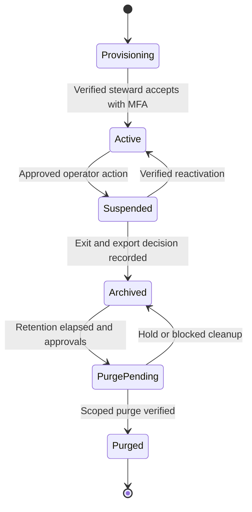
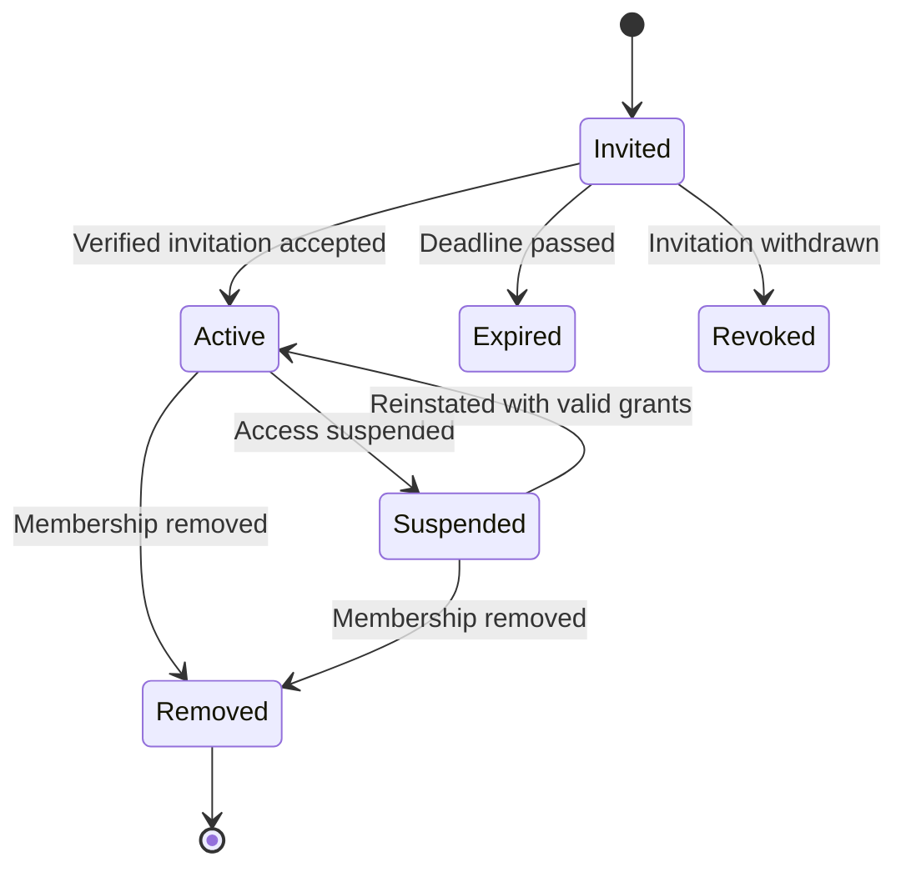
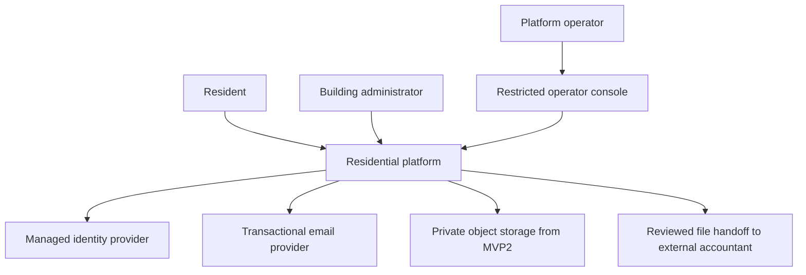
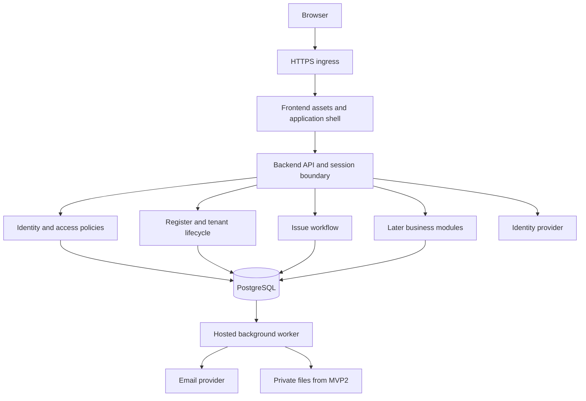
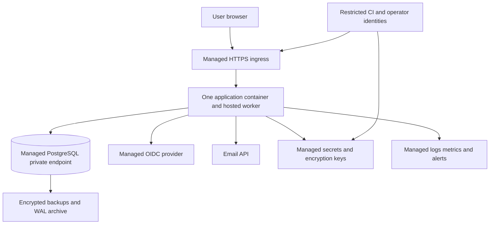
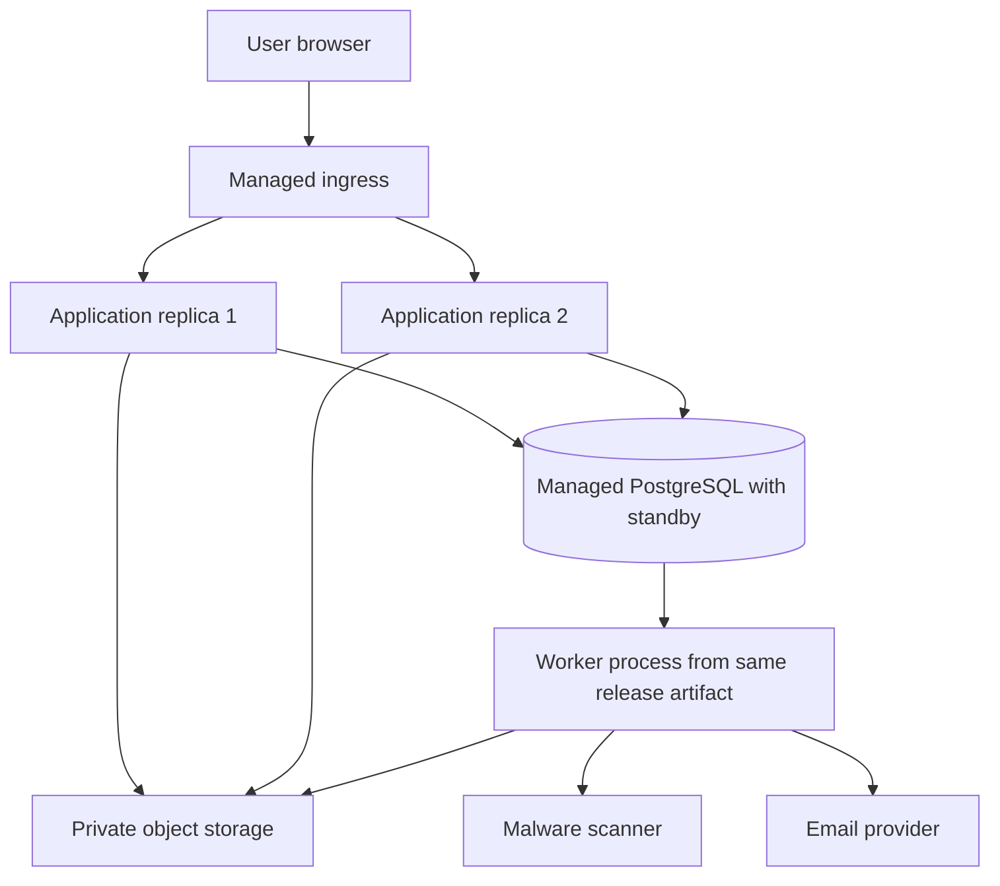
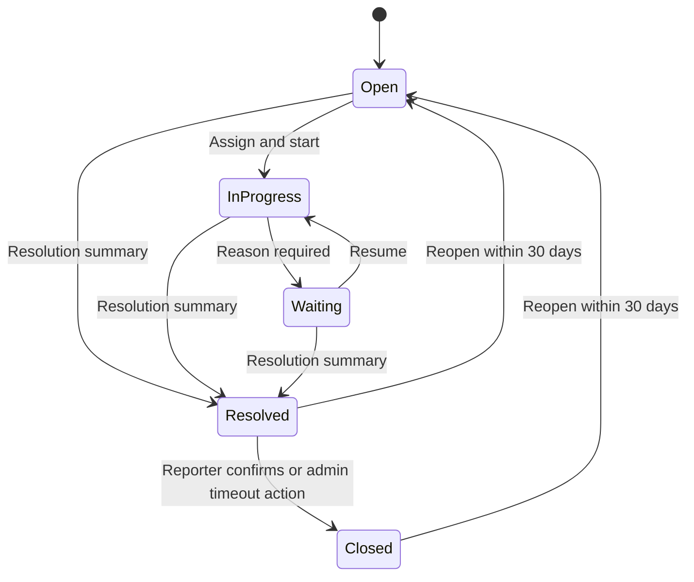
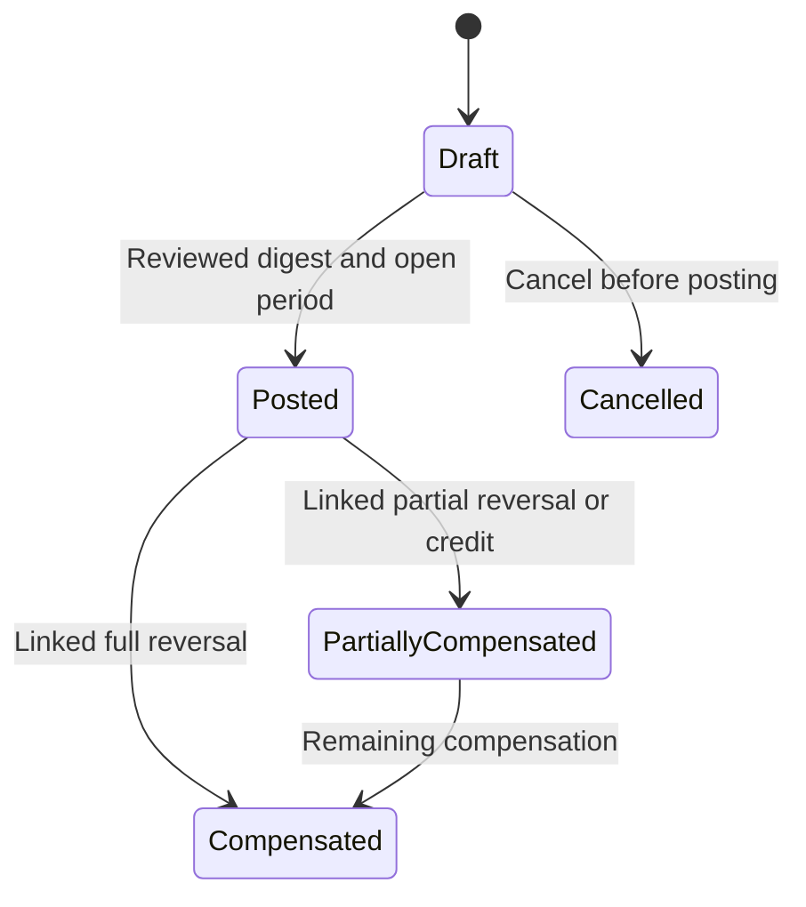

# Solution design

[Start here](index.md) · [Use cases](use-case-catalog.md) · [Roadmap](mvp-roadmap.md)

## 1. Business outcome and declared scope

MVP1 replaces a building administrator's fragmented phone calls, messenger threads and paper issue list with a private, traceable service-request loop. Residents currently repeat descriptions, ask for updates and cannot tell whether a problem is assigned or resolved. Administrators manually remember requests and cannot reliably hand work over. The product gives each request a reference, owner, conversation, status history and explicit closure/reopening path.

Stakeholders: residents (including owners and renters), building administrators, association board/tenant steward, management organization, privacy/controller representative, finance administrator/accountant in MVP3, maintenance coordinators in MVP4, Platform Operator and product/delivery team. “Tenant steward” is a permission of Building Administrator, not a third business role. Finance/privacy are restricted administrator permissions introduced when needed. Contractor is a tenant-local contact; no contractor portal role in baseline.

Resident journey: invitation → verified identity → tenant selection → accessible unit → private issue → follow conversation → review resolution → confirm or reopen. Administrator journey: onboard organization → create unit register → record relationships and explicit access → invite residents → triage queue → respond → resolve → review outstanding work. Administrator replacement and resident move-out preserve history while ending access.

Proposed pilot success: within 4 weeks of invitation, at least 60% of invited households have activated one resident account; at least 70% of non-emergency service requests from activated households use the portal; at least 90% of portal issues receive first administrator response within 2 business days; at least 80% of issues marked resolved have a recorded closure or reopening decision within 14 days. Baseline these measures before pilot. Track median first response, open-age distribution, reopened percentage and administrator minutes per request using consented operational data. Do not optimize closure count by hiding unclosed work. In-app metrics are not proof that a physical repair succeeded.

Administrators can keep contractor calls, repair purchasing, statutory meeting records and all money collection in their existing controlled process during MVP1. The product does not have to replace every association workflow before it is useful. It must not create an illusion that an email was delivered or a payment was collected.

### Business requirement register and capability assessment

C = confirmed by prompt; A = proposed included requirement; O+ = optional, explicitly included later; O−/X = excluded from baseline. Requirements below bound what “complete” means.

| Requirement | Discovery area and inclusion decision | Release and coverage |
| --- | --- | --- |
| BR-01 (C/A) | Secure sign-in/out, recovery, verified invitation, multi-membership identity; profile/preferences A | IAM-001–004,006–008 MVP1; IAM-005 MVP2 |
| BR-02 (C/R) | Multiple organizations/buildings, isolation, safe tenant switching, effective authorization, operator limits | IAM/TEN MVP1; EN-001–003 persist in every release |
| BR-03 (A) | Building/unit register, entrance/floor labels, owners/occupants distinct from access, dates, onboarding/offboarding, controlled import | BLD-001–002 and IAM lifecycle MVP1; BLD-003 MVP2; common-area entities MVP4 |
| BR-04 (A/O+) | Targeted announcements, explicit acknowledgements, private documents, email/preferences and delivery review | COM-001–005 MVP2; core issue/invitation email EN-004 MVP1; SMS/push O− |
| BR-05 (A) | Private requests/complaints/incidents, classification, comments, assignment, resolution/reopen | ISS-001–005 MVP1; evidence ISS-006 MVP2 |
| BR-06 (O+) | Work orders and contractor contacts, common assets, preventive schedules, expense records | MNT-001–004 MVP4; contractor portal and procurement system O− |
| BR-07 (A) | Liability accounts/openings, dues/rules/periods, immutable charges, statements, receipts/partial allocation/credit/adjustment/reversal/refund record, arrears/reconciliation | FIN-001–011 MVP3; online processing and SaaS billing O− |
| BR-08 (O+) | Manual meter registration/association, readings, review/correction, consumption, flat tariffs/shared allocation, finance draft handoff | UTL-001–005 MVP4; IoT and tariff engine X |
| BR-09 (O+) | Meeting/agenda/minutes, advisory polls with eligibility and participation count, exclusive facility availability/reservations | GOV-001–003 and RES-001–002 MVP5; legal quorum/formal binding voting X |
| BR-10 (A) | Role-scoped operational dashboard, finance views and management exports | RPT-001 MVP1; finance dashboard extensions and RPT-002 MVP3 |
| BR-11 (C/A) | Provisioning, suspension, handover export, archival/offboarding, monitoring/support, backups and recovery | TEN-001–004, EN-005–007, OP-001–006 MVP1 |
| BR-12 (A) | Privacy, audit, correction/retention, safe migration/export | MVP1 controls/manual OP-007; PRV-001–002 and import MVP2; EN-008 onward |

### Exclusions register

| ID | Capability excluded from baseline | Why / manual alternative / revisit trigger |
| --- | --- | --- |
| X-01 | Native mobile applications, offline writes | Responsive web supports pilot; revisit measured need for offline field use |
| X-02 | IoT, smart-meter ingestion, physical access control, emergency dispatch | No stated requirement; use existing specialist channels; separate security/safety design if justified |
| X-03 | Card/online payment initiation, direct debit, bank API automation | Payment recording/reconciliation meets assumed finance need; provider, disputes and webhook design require explicit business case |
| X-04 | SaaS subscription billing/self-service purchasing | Organizations onboard by operator; invoice SaaS contracts externally while fewer than 50 paying organizations |
| X-05 | Full statutory accounting, payroll, tax, interest/penalty engine, debt collection litigation | Finance baseline is a receivables subledger; accountant retains regulated books |
| X-06 | Formal binding votes, legal quorum validation, proxies, qualified signatures, secret elections | Jurisdiction, legal eligibility and evidentiary requirements unknown; record approved minutes externally |
| X-07 | SMS, native push, bidirectional email ingestion/chat | Email plus portal first; add channel only when delivery/adoption evidence warrants operating cost |
| X-08 | Contractor portal, vendor tendering, purchase orders, inventory procurement | Manual verified contact and simple work order suffice; reconsider sustained coordination workload |
| X-09 | Tiered/time-of-use tariffs and automatic estimation | Flat tariffs plus explicit approved assumptions; add only with meter/provider rules and testable examples |
| X-10 | Public resident directory, public arrears, public complaints feed, open registration to buildings | High privacy cost with no stated benefit; explicit invitation and private visibility |
| X-11 | Cross-tenant financial consolidation and shared person master | Independent association boundaries; administrator switches tenant; approved anonymized analytics would need new design |
| X-12 | Unrestricted support impersonation, arbitrary DB editing as a workaround | Bounded audited commands instead; no scope-expansion trigger without a new security review |
| X-13 | Visitor/parking permit systems, parcel logistics, AI triage/chatbots, marketplace | Speculative extensions; not catalogue gaps within this declared baseline |

## 2. Scale and workload assumptions

These are capacity proposals, not measured requirements. Validate pilot shape and budget before sizing procurement.

| Dimension | MVP1 pilot / test | First-year envelope | Peak / verification implication |
| --- | --- | --- | --- |
| Tenants / buildings / units | 1/1/60 real; at least 2 independent security test tenants | 50/100/10000 | One organization may span multiple buildings |
| Identities / memberships | 100 residents + 2 admins invited | 15000 identities, 20000 memberships | Multi-tenant users represented explicitly |
| Concurrency / API | Pilot 20 sessions; test 250 | 250 active sessions, 25 requests/s sustained | 100 requests/s for 5 min; no confidential CDN caching |
| Issues/comments | Pilot 10 issues/week assumed | 2000 issues/month, 10 comments/issue | 10000 retained issues per larger tenant test fixture |
| Attachments | None MVP1 | From MVP2: average 2 files/issue, 2 MiB each = about 8 GiB/month; 100 GiB initial logical allowance including docs | 10 MiB/file, 5 per issue; 20 simultaneous uploads benchmark |
| Notifications | Invitations and issue updates, up to 200/day pilot | 50000/month | 10000-recipient announcement staggered over up to 30 min, subject to provider quota |
| Jobs | 5-second outbox polling, daily housekeeping | 50 tenant daily jobs plus notification jobs; monthly billing drafts | 10000-account month-end work staggered by tenant; 2000-account transaction cap |
| Finance | Absent MVP1–2 | 10000 monthly account charges plus receipts | 24-month fixture, allocation races and period-close load |
| Reports/exports | Bounded steward export <=50 MiB | Up to 20 concurrent requested reports, 2 active jobs/tenant | 95% within 5 minutes for <=100000 rows |
| Growth headroom | No future systems preinstalled | Validate 2x data volume in staging | Revisit architecture when measured SLO misses persist after query tuning |

## 3. Tenant, role and lifecycle decisions

| Tenant interpretation | Strength | Limitation |
| --- | --- | --- |
| One tenant per building | Simple boundary for independent building association | Multi-building association administration and funds split awkwardly; repeated settings |
| One tenant per association/management organization | Matches controller/contract authority; shared administrator membership and multiple buildings | Requires building-scoped authorization inside tenant |

Select organization/association tenancy. Two buildings belong together only if the same organization has authority over their data and the shared administration is intentional. A management company serving independent associations gets memberships in separate tenants; employment alone does not merge customer data. Unit is always inside one building, building inside one tenant. Moving a building between tenants is excluded from routine edits; controlled new-tenant export/import migration requires separate approval and cutover plan.

Global user identity is distinct from tenant membership. An identity can be Administrator in A and Resident in B, with several building grants and multiple resident unit grants. Tenant switching updates server context and invalidates old-tab write context. Ownership, occupancy and app access are separate dated facts as defined in [data-model.md](data-model.md). Co-owner/co-occupant relationships do not share private issues automatically. Ownership transfer does not automatically transfer debtor accounts or expose predecessor history.

Lifecycle essentials: invitation has proposed scope and expiry, acceptance binds authenticated identity, move-in activates only approved effective grants, move-out ends selected grants at the effective instant, suspension denies subsequent requests, removal is terminal while history remains. Global identity survives tenant removal when used elsewhere. Administrator transfer is staged until candidate acceptance and MFA; serialize protected grants to retain a steward and administrator coverage. Provider password reset cannot override these application rules.

Dated UnitAccessGrant expiry is evaluated independently of membership state; an Active membership may have no currently accessible units. Tenant export/archival uses narrowly authorized routes even when normal access is suspended.

### Authorization matrix

| Actor / permission | Action | Scope and ownership | Sensitive visibility |
| --- | --- | --- | --- |
| Anonymous | Start sign-in/recovery | No tenant records | Generic outcomes only |
| Invited authenticated identity | Accept invite | Live token + verified intended contact | Only invitation-bound scope summary |
| Resident | Report/comment/resolve-confirm/reopen own issue | Current location grant plus original reporter | Own issue bodies; no same-unit peer complaints |
| Resident | Announcements/documents/meetings | Current building/unit grant intersected with audience | Published approved versions only |
| Resident | Meter reading | Effective meter-unit association and current grant | Own unit readings; no common meter detail by default |
| Resident | Statement/download | Explicit effective AccountAccessGrant | Only granted liability account, no neighbor arrears |
| Resident | Poll/booking | Current eligibility and resource building | Own ballot receipt/booking; aggregates after close, anonymous busy slots |
| Building Administrator | Register/invite/access-grant end | Managed buildings only; no granting admin power | Necessary person/contact history in scope |
| Building Administrator | Issue triage/resolve/work order | Managed building; assignee likewise scoped | Private scoped issues; contractor receives minimized manual handoff |
| Administrator + finance | Charge/receipt/reconcile/report | Managed buildings/accounts, MFA for protected postings | Scoped debt and evidence; no cross-tenant funds |
| Administrator + tenant steward | Tenant settings, cross-building grant, admin replacement/export | Whole tenant stewardship explicitly granted | Full handover export requires step-up and reason |
| Administrator + privacy | Case decisions/redaction | Explicit tenant case/subject scope, approved reviewer | Minimum reviewed subject and third-party data needed |
| Platform Operator | Provision/state/recovery/archive | Approved metadata command and tenant target | Service metadata; no routine resident content |
| Background Worker | Deliver/scan/export/generate due draft | Validated envelope tenant and current resource/requester rights | Minimum data for task; no user-session impersonation |

API policies are authoritative; hiding a button is not an access-control test. Cross-tenant denials cover IDs, batch rows, search counts, attachments, export jobs, notification recipients, cache keys and support tools. See [AUTH-01](shared-patterns.md#auth-01--ordinary-application-authorization).

## 4. Architecture and technology

Recommend a modular monolith: one application, one PostgreSQL database, explicit module interfaces and one independently deployable artifact containing frontend assets, backend/BFF and hosted worker. Module boundaries own writes; cross-module operations call application services inside one transaction where needed. No module writes another module table through its own repository. Use internal interfaces/DTOs, dependency direction tests and event contracts; do not add separate databases merely to draw boundaries.

### System context

### Logical/container view

“Later business modules” means communication/privacy in MVP2, finance/reporting in MVP3, maintenance/utilities in MVP4 and community/reservations in MVP5. It is a design placeholder, not a required MVP1 container or table.

### MVP1 deployment

MVP1 can run one always-on app instance with automatic restart and short planned deployment interruption under the 99.5% target. Prefer a managed database tier with automated failover if budget permits; validate restore/failover capability rather than assuming it from a vendor label. One app instance is not HA; database backup is not HA. Use minimum 2 vCPU/4 GiB application and 2 vCPU/4–8 GiB database as a benchmark starting hypothesis, not a production sizing guarantee. Hosted worker must not depend on scale-to-zero execution.

### Target topology when measured load warrants it

The target diagram shows only materially changed deployment responsibilities; identity, secrets, monitoring and backups remain as in MVP1. Separate worker process and second app replica are conditional deployment changes using the same codebase/schema, not microservices. Introduce them when exports/scans harm API latency or availability commitment increases. No broker/cache/search/workflow engine in this baseline. If sustained tenant-isolated search exceeds database capability, prove requirements and ADR before adding an engine. Extract a module only for independent team ownership/release cadence, sustained scaling mismatch, or a distinct regulatory isolation requirement; expect contracts, data ownership and operational costs then.

### Stack recommendation and decision limits

| Layer | Recommendation | Trade-off / verification required |
| --- | --- | --- |
| Frontend | React + TypeScript, Vite-built responsive SPA served same origin by backend | One deployable runtime, no SEO/SSR need; Next.js adds a server without current benefit. Use accessible component primitives after license review; no assumed OUDS dependency |
| Backend | ASP.NET Core on .NET 10 LTS, C#, established OIDC/cookie middleware, REST and BFF/session boundary | Strong typed domain/transaction tooling; assumes team .NET skills; Django or similar is viable if actual team skills differ |
| Persistence | Managed PostgreSQL on supported provider major; EF Core plus vetted Npgsql provider after compatibility spike | SQL transactions and RLS suit domain; pin/test exact ORM/provider/PG versions, no compatibility claim made here |
| Identity | Managed standards-based OIDC service with MFA, verified contacts, recovery, audit export and required assurance claims | Provider procurement and MAU cost; self-hosted Keycloak only if managed option fails residency/economics and operating owner exists |
| Notifications | One transactional email provider via small adapter | Quotas, sender DNS, bounce/status/idempotency support require verification; no SMS gateway in MVP1 |
| Files | Managed private S3-compatible or native cloud object store from MVP2 | “Compatible” does not guarantee versioning/IAM semantics; contract-test selected product; backend proxy supports revocation |
| Jobs | PostgreSQL outbox/lease + hosted worker | Low infrastructure count; fair scheduling and retry semantics must be implemented/tested |
| Configuration | Typed startup-validated config, environment separation, managed secrets/key store | Shared encryption keys required across replicas; no secrets in Git or database export |
| Observability | Structured redacted logs, OpenTelemetry-compatible instrumentation, managed metrics/alerts | Avoid standing up a full observability cluster; operational vendor costs and retention need review |

.NET 10 is documented as an LTS release; support lifecycle and latest security patch must be checked when implementation starts. See [Microsoft .NET support policy](https://dotnet.microsoft.com/en-us/platform/support/policy/dotnet-core). This design does not certify compatibility among every proposed package or select an unverified patch version.

Review license/SPDX, transitive licenses, SaaS terms, data processing terms, region availability, support SLA, exit/export support and actual costs for each dependency before selection. Open-source code does not imply free operations or provider support. Keep identity subject mapping, SQL migrations, canonical CSV export and provider adapters to limit lock-in; do not build speculative multi-cloud failover. Containers and PostgreSQL aid portability but managed IAM/backup operations still require a migration plan.

## 5. Trust boundaries and data flows

Browser is untrusted; sessions are opaque and backend owns all authorization. Ingress to app and app to private database are separately authenticated/encrypted boundaries. IdP authenticates global identity; application grants tenant access. Email is outside the protected portal: link-only messages minimize disclosure. Object storage is private and accessible only via backend/worker policy; logs never become a copy of resident content. CI migration role is more privileged than runtime and time-bounded; operator console has command-level limits.

Reads and domain mutations are synchronous HTTP; notifications, scans, recurring drafts and large reports are asynchronous durable jobs. Commit business state plus outbox before acknowledging a write; call providers after commit. [shared-patterns.md](shared-patterns.md) defines actual retry/deduplication and failure behavior. No claim of atomic database/email or database/object-store commit.

No shared application data cache in MVP1; browser query keys include tenant, context version and resource. Responses with tenant data use private/no-store; public frontend assets may be immutable-cacheable. Any later server cache must include tenant, resource scope, identity/audience version and projection version, with revocation invalidation and dedicated cross-tenant tests. Full-text searches remain scoped SQL filters first.

## 6. User experience and screens

| Screen | Navigation / primary actions | Use cases |
| --- | --- | --- |
| S-01 | Sign-in, recovery entry, sign-out | IAM-001–002 |
| S-02 | Invitation review and acceptance | IAM-003 |
| S-03 | Persistent tenant selector, role label | IAM-004 |
| S-04 | My profile and preferences | IAM-005 |
| S-05 | Administration → people, invites, access and administrators | IAM-006–008 |
| S-06 | Organization settings, handover export and exit request contact | TEN-002–003 |
| S-07 / S-08 | Buildings/units; dated ownership, occupancy and access | BLD-001–002 |
| S-09 | Register import preview/results | BLD-003 |
| S-10 / S-11 / S-12 | Notices; documents; notification status | COM-001–005 |
| S-13 / S-14 / S-15 | Report issue; private thread/status; admin queue and resident home | ISS-001–006, RPT-001 |
| S-16 / S-17 / S-18 | Work orders; assets/schedules; expenses | MNT-001–004 |
| S-19 / S-20 / S-21 | Accounts/openings; periods/rules; charge review | FIN-001–003,011 |
| S-22 / S-23 / S-24 | My statements; receipts/allocations; corrections | FIN-004–008 |
| S-25 / S-26 | Reconciliation/closure; private arrears follow-up | FIN-009–010 |
| S-27 / S-28 / S-29 | Meters; reading collection/review; tariffs/consumption handoff | UTL-001–005 |
| S-30 / S-31 / S-32 | Meetings/minutes; advisory polls; facility calendar | GOV-001–003, RES-001–002 |
| S-33 / S-34 | Reports; privacy requests and reviewed decisions | RPT-002, PRV-001–002 |
| S-OP | Separate restricted operator console | TEN-001,002,004 and bounded OP actions |

MVP1 navigation contains Home/My issues, Report issue, My tenant, and role-dependent Administration/Register/Access/Settings. Hidden later routes and schema do not exist until their release. One responsive shell covers 360px phones through desktop; convert wide tables to cards or scrollable labeled regions. Keyboard focus, visible labels, screen-reader announcements, meaningful error summaries, sufficient contrast, 200% zoom and target sizes are acceptance requirements. Use WCAG 2.2 AA as technical target, not a legal-compliance claim. The [W3C WCAG 2.2 recommendation](https://www.w3.org/TR/WCAG22/) is the authoritative criteria source.

Tenant name remains visible on all protected screens, confirmation dialogs and downloaded manifests. Destructive access/finance actions state exact person/scope/effective date and require review. Date entry shows tenant zone, stores UTC instants and distinguishes legal date from timestamp. Do not make color the only status signal. Do not expose stack traces, provider secrets, database versioning or internal architecture terms in product copy. “Saved; email pending” is useful; “outbox commit successful” is not.

## 7. Business state machines

Financial compensation states describe derived status of an immutable original; they do not mean the original journal is edited. Payment allocation status is derived separately. Detailed API/entity contracts are in [api-catalog.md](api-catalog.md) and [data-model.md](data-model.md).

## 8. Proposed non-functional requirements

Targets below require product acceptance and measured execution evidence. “All” means MVP1 onward, with feature-specific tests starting when the feature ships.

| ID | Requirement / rationale | Release | Proposed target | Verification |
| --- | --- | --- | --- | --- |
| NFR-01 | Availability sufficient for ordinary building workflow | All | 99.5% monthly user-facing availability; count deploy downtime, track provider-caused failures separately | Synthetic sign-in/authorized read, incident budget review |
| NFR-02 | Interactive latency | All | p95 <=700ms read API, <=1000ms domain write excluding provider redirect/file transfer; p95 usable first screen <=3s on agreed mobile network | 250-session load and browser trace |
| NFR-03 | Concurrency/capacity | All | 25 req/s 30 min, 100 req/s 5 min burst, <1% unexpected 5xx; no integrity failure | Representative fixtures/load test |
| NFR-04 | Tenant and unit isolation | All | Zero unauthorized records/bytes/counts/events in defined matrix | Real PostgreSQL RLS, API, worker and browser negative suites |
| NFR-05 | Revocation | All | Subsequent request denied immediately after committed revocation; long stream checked <=5s | Concurrent revocation/read/write/download test |
| NFR-06 | Financial/data integrity | All; finance MVP3 | No partial domain commit, duplicate financial posting or unbalanced posted journal | Fault injection, constraints, property/race tests |
| NFR-07 | Recovery point | All | Database RPO <=15 min; backup retention 35 days; file metadata/content recovery checkpoint <=15 min from MVP2 | Restore and intentional-loss measurement |
| NFR-08 | Recovery time | All | Full-service RTO <=4h, including validation and secrets/config recovery | Timed isolated restoration exercise before pilot and quarterly |
| NFR-09 | Security/session | All | MFA 100% admins/operators; no browser tokens; TLS; CSRF on unsafe cookie requests | Security integration and manual review |
| NFR-10 | Vulnerability management | All | No known exploitable critical/high dependency issue at release; critical triage <=24h, remediation target <=72h or disable affected feature | SBOM/dependency scan and documented assessment |
| NFR-11 | Abuse protection | All | Baseline 10 sign-in starts/min/IP; 60 writes/min/user; invite 3/day/invite plus 100/day/tenant; configurable fair limits | Rate-limit and multi-tenant denial tests |
| NFR-12 | Accessibility | All | WCAG 2.2 AA for shipped critical journeys; no blocking keyboard/screen-reader defects | Automated checks plus manual keyboard/screen-reader/zoom |
| NFR-13 | Localization/time | All | Unicode; English baseline; IANA tenant zone; UTC storage; no ambiguous scheduled occurrence | DST, Unicode, date-only and locale formatting cases |
| NFR-14 | Observability | All | >=99% API requests carry correlation ID; critical outage/job/backup alerts route within 5 min | Synthetic fault injection and alert receipt |
| NFR-15 | Notification reliability | All | 95% eligible queued messages attempted <=5 min normally; peak campaign <=30 min; failures/Unknown visible | Queue-age metrics and provider-failure rehearsal |
| NFR-16 | File safety | MVP2+ | 100% downloads require auth and Clean state; enforced 10 MiB cap and approved types | Spoofed-type/malware/URL/removed-member tests |
| NFR-17 | Maintainability | All | One reviewed migration path; module dependency checks; no later module required for MVP1 deploy | Fresh install and upgrade from previous release |
| NFR-18 | Reporting | MVP3+ | 95% <=100000-row exports ready <=5 min at assumed load; 24h TTL | Job/load/download revocation tests |
| NFR-19 | Privacy/retention | All | Every personal field has purpose/retention owner; approved deletion/hold workflow; zero sensitive payload in logs | Data inventory, telemetry sample audit, deletion/restore test |
| NFR-20 | Deployability | All | Staging evidence, immutable image, tested rollback-compatible migration; restore escape plan for irreversible change | Deployment rehearsal and release checklist |

Security baseline includes CSP, output encoding/plain text, parameterized database access, deny-by-default policies, secure headers, dependency pinning and restricted egress. Follow the principle of authorizing each request and object from [OWASP authorization guidance](https://cheatsheetseries.owasp.org/cheatsheets/Authorization_Cheat_Sheet.html). Later hardening may add independent penetration testing depth, two app replicas, dedicated worker isolation and stronger audit retention guarantees; tenant isolation/MFA/backup/CSRF are never deferred.

Jurisdiction determines legal basis, controller/processor contracts, breach notices, transfer/residency, retention, access rights, accessibility duties and formal governance validity. Technical safeguards help implement obligations; they do not establish legal compliance. Named specialist review and decision evidence are release gates, with finance and governance-specific validation before those increments.
