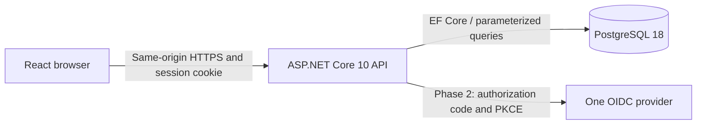

# Product scope and architecture

## Purpose and actors

Locatarius lets an association administrator manage resident access and a basic building register. A resident reports a private building problem and discusses it with the administrator. Security is the primary assessment outcome; breadth of condominium administration is not.

An **association** is the data isolation boundary (also called a SaaS tenancy). A **resident** is a user, not a database tenant. Application membership is an access permission, not evidence of legal property ownership. One user may belong to several associations, with one role in each. Only two roles exist: `admin` and `resident`. Roles determine application permissions; unit assignments record where a user lives. An active member of either role can be assigned to a unit. An administrator who lives in the building keeps the `admin` role and uses their existing account and membership. Initial associations/admins are provisioned by a trusted local operator command; there is no platform-admin website or public registration.

## Finished screens

See the [screen mockups](frontend-mockups.md) for layouts, component rules, role variants and delivery mapping.

| Screen | Visible behavior |
| --- | --- |
| Sign in | Email/password or the configured university/demo identity provider; MFA step in phase 2 |
| Association selector | Only current user's active associations; zero memberships shows “No association access. Contact your administrator.” |
| My profile | View email, edit display name, change password, set up MFA; email changes excluded |
| Users (admin) | Paged list, create resident with temporary password, disable/re-enable resident membership |
| Buildings and units (admin) | List/create/edit building name/address and unit number/floor; assign/remove current occupants of either role |
| My units (all users) | Read own assigned units and their building details; admins also have the full register view |
| Tickets | Admin sees association tickets; resident sees only their own; create ticket, read detail and plain-text comments |
| Ticket detail | Admin changes `open → in_progress → resolved`; reporter/admin comments until resolved |

No dashboard charts, attachments, categories, priorities, assignees, reopening, hard deletion or bulk import. Resolved tickets remain readable. Mistaken register names can be edited; mistaken assignments can be removed. A resident losing a unit assignment cannot file new tickets for it, but retains their own past tickets while association membership stays active.

## Architecture

One React application, one API deployment, one application database. Organize API code by Auth, Users, Register and Tickets; avoid microservices, CQRS, event sourcing and generic workflow engines. EF Core migrations implement [schema.sql](schema.sql). React does not connect to PostgreSQL. Serve React/API under one origin; no cross-origin production CORS allowance.

Use the framework password hasher, antiforgery and OIDC middleware. A small server-side session store provides immediate logout. Do not install default Identity entity migrations alongside this schema: use the password-hashing component directly; application users and membership roles are explicitly modeled here.

## Authorization matrix

All association routes first require an authenticated user and active membership of that association.

| Action | Resident | Admin |
| --- | --- | --- |
| Read/edit own profile; change own password | Yes | Yes |
| List/create residents; activate/deactivate resident membership | No | Yes, own association only |
| Create admins or change role | No | No; trusted operator only |
| Create/edit buildings, units, assignments | No | Yes, own association only; can assign self or another active member of either role |
| Read unit information | Assigned units only | All in association |
| Create ticket | Assigned unit only, reporter is caller | Assigned unit only; same rule |
| List/read ticket and comments | Own tickets only | All in association |
| Comment on unresolved ticket | Own tickets only | All in association |
| Change ticket status | No | Yes |

An admin has no authority over another association or a resident's global credentials. Disabled membership blocks that association on the next request; another active membership still works. There is no implicit access from knowing a UUID or living in the same unit.

## Practical quality targets

Support the demonstration dataset: two associations, two buildings each, ten units each and twenty users. Core screens must work at 360px width and with keyboard only. Lists use a fixed page size of 20. Record response-time observations on demo hardware; do not invent production throughput/availability guarantees. No unresolved authentication bypass, cross-association leak, plaintext credential storage or reproducible stored XSS may remain at submission.
