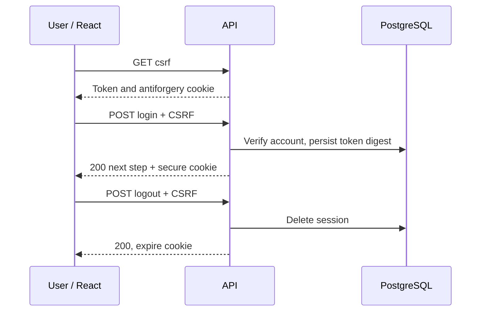

# UC-01 — Sign in and sign out

[All use cases](../use-case-catalog.md) · [API](../api-catalog.md) · [Security rules](../shared-patterns.md)

## Story and scope

**Delivery:** Phase 1; #62 and #64.

**Actor:** Existing user.

As an existing user, I want to sign in and end my session so only I can use my account.

## Preconditions

An operator or association admin has created the account. Browser uses HTTPS and can fetch an antiforgery token.

## Main flow

1. User opens sign-in screen; email receives focus.
2. React fetches CSRF token, validates email/password and submits once.
3. API enforces throttle/CSRF, canonicalizes email, verifies password and account activity/lockout.
4. API creates a new restricted password-change session for temporary credentials, otherwise a full session in phase 1.
5. React fetches own profile using full session and displays only active associations; zero associations still permits profile/logout.
6. User chooses Sign out; API validates CSRF, deletes current session and expires cookie; React clears data and goes to login.

## Alternatives and failures

- Wrong password, unknown/disabled/locked user: identical 401; show generic banner and focus cleared password.
- Fifth failed password attempt locks 15 minutes; eleventh IP attempt per minute gets 429.
- Temporary credential: change password first using UC-03; no business access.
- Expiry/logout/replayed cookie: 401; clear local account/association data.
- In phase 2, successful first factor goes through UC-07 before full access.

## Postconditions and data

Only hashed tokens and password hashes exist in DB. Logout invalidates this session; password change invalidates all. No session is created on rejected credentials.

`users`, `sessions`, `memberships`, `associations`; POST login/logout, GET csrf/me. [Sprint criteria](../sprint-1.md): S1-62-01–11.

## UI and acceptance

Apply the shared [focus, validation and pending-state criteria](../sprint-1.md#ui-acceptance-shared-across-these-stories). For phase 2 forms, focus the first field on create, first invalid field on validation error, and the safe error banner for non-field failures. Keep controls disabled only during pending work or a documented resolved/rate-limited state. Render all domain text literally.

- Check exact 200/400/401/403/429 bodies and cookie flags.
- Test idle and absolute boundaries, two concurrent sessions, revoked cookie replay and simultaneous failed attempts.
- Verify browser loading/focus rules and no token in storage.

## Sequence

