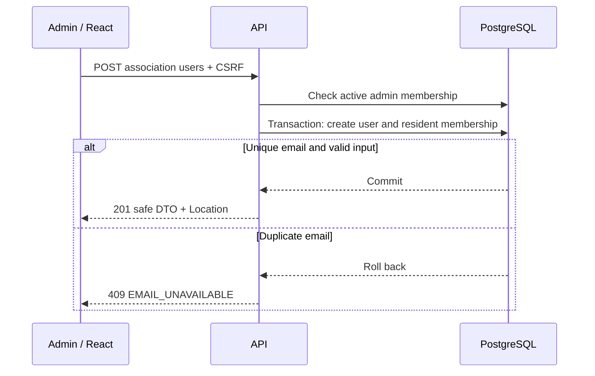

# UC-02 — Manage resident accounts

[All use cases](../use-case-catalog.md) · [API](../api-catalog.md) · [Security rules](../shared-patterns.md)

## Story and scope

**Delivery:** Sprint 1 account creation (#63); Sprint 2 listing and activation/deactivation.

**Actor:** Association admin.

As an admin, I want to create residents and disable their association access so entry is limited to approved people.

## Preconditions

Caller has full session and active admin membership. Association exists; no building or unit is required.

## Main flow

1. Admin opens Add resident. In Sprint 2, the Users screen also includes a scoped list of accounts.
2. Admin opens Add resident and enters email, display name, temporary password and confirmation.
3. React validates, disables pending controls and submits to selected association route with CSRF.
4. API checks current membership/role, validates DTO and atomically inserts user with must-change flag and resident membership.
5. API returns 201 with safe DTO and Location; UI clears secrets, closes the form and announces success. In Sprint 2 it also refreshes the list.
6. Admin hands temporary credentials to intended demo user out of band.
7. Admin may disable/re-enable resident membership; server updates only association membership and returns refreshed DTO.

## Alternatives and failures

- Any existing canonical email: identical 409, no automatic cross-association linking or password reset.
- Invalid fields or extra role/scope properties: 400, no writes.
- Resident caller: 403; inaccessible association or user: 404; anonymous caller: 401.
- Target admin: 403, including self; no role changes in UI/API.
- Network error: preserve non-secret form values for deliberate retry; duplicate conflict on uncertain retry requires checking own list.

## Postconditions and data

Creation commits exactly one user and membership or neither. Disable denies subsequent access to this association but leaves other memberships and global credentials intact.

`users`, `memberships`, `roles`; GET/POST association users, GET/PATCH scoped user. S1-63-01–05; S2-ADM-01–04.

## UI and acceptance

Apply the shared [focus, validation and pending-state criteria](../sprint-1.md#ui-acceptance-shared-across-these-stories). For phase 2 forms, focus the first field on create, first invalid field on validation error, and the safe error banner for non-field failures. Keep controls disabled only during pending work or a documented resolved/rate-limited state. Render all domain text literally.

- Race two identical-email creations: exactly one 201, one 409.
- Force insert failure after user insertion: no orphan global user.
- Use the disabled resident cookie immediately against both their associations.
- Confirm every returned field is allowlisted; no hash, secret or global membership directory.

## Sequence

