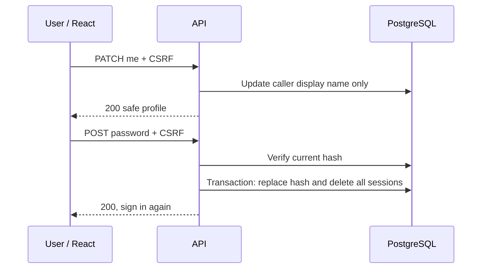

# UC-03 — Own profile, password and association access

[All use cases](../use-case-catalog.md) · [API](../api-catalog.md) · [Security rules](../shared-patterns.md)

## Story and scope

**Delivery:** Phase 1 password lifecycle for #62/#64; profile editing in Sprint 2.

**Actor:** Authenticated user.

As a resident, I want to edit my own profile and password and access only my memberships so my account remains private.

## Preconditions

Full session for profile/association access. Full or password-change restricted session for changing password.

## Main flow

1. User opens profile; API derives identity from session and returns safe profile and active memberships.
2. User changes display name; React validates and submits only displayName with CSRF.
3. API updates only the caller and returns profile; UI announces save success.
4. User submits current/new/confirmation password; API verifies current credential and new policy.
5. API transaction changes hash, clears must-change flag and deletes all user sessions.
6. UI clears secrets and goes to login. Association switching changes the requested route scope, never the caller identity or authoritative role.

## Alternatives and failures

- Extra identity/email/role fields: 400, nothing changes.
- Wrong current password: 401; rate/lockout controls apply.
- Invalid confirmation/new password: 400 with exact field message.
- Resident calling admin route: 403 even by direct HTTP.
- Inaccessible association or other resident's scoped object: 404.
- Lost password: supervised operator recovery, not an unimplemented “Forgot password” button.

## Postconditions and data

Only the caller display name/password changes. Password change invalidates every existing session. Role and current association access always come from memberships.

`users`, `memberships`, `sessions`; GET/PATCH me, POST password. S1-62-10–11 for first-login password change; S2-PRO-01–04 for profile/password management.

## UI and acceptance

Apply the shared [focus, validation and pending-state criteria](../sprint-1.md#ui-acceptance-shared-across-these-stories). For phase 2 forms, focus the first field on create, first invalid field on validation error, and the safe error banner for non-field failures. Keep controls disabled only during pending work or a documented resolved/rate-limited state. Render all domain text literally.

- Store script-like name and verify literal rendering in both profile and admin list.
- Dual-membership user remains resident in A and admin in B.
- Two old sessions both fail after password change.
- Rapidly switch associations during a slow request: old content must not render under new association.

## Sequence

