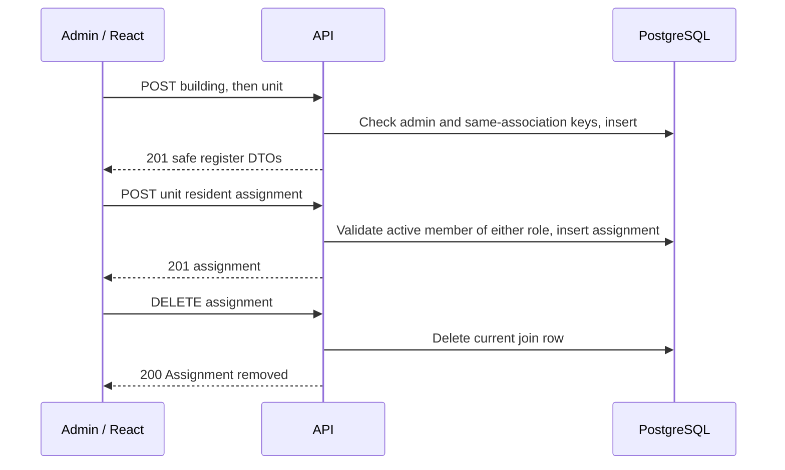

# UC-04 — Maintain buildings, units and current residents

[All use cases](../use-case-catalog.md) · [API](../api-catalog.md) · [Security rules](../shared-patterns.md)

## Story and scope

**Delivery:** Phase 2; tracker ID unassigned.

**Actor:** Association admin manages assignments; either role reads their own assigned units.

As an admin, I want a small building/apartment register and current resident assignments so residents can report issues for the correct unit.

## Preconditions

UC-01/02/03 pass; active membership and full session. Admin authority is required for writes and resident assignment lists.

## Main flow

1. Admin creates a building with name/address; API attaches association from verified route.
2. Admin creates a unit using a building in the same association, number and nullable floor.
3. Admin may edit building text or unit number/floor; building/association identity cannot be moved.
4. Admin selects a globally active user with an active membership in the same association and assigns them to the unit. The picker includes both roles and the admin’s own account. The assignment leaves their role unchanged.
5. A user of either role opens My units with `assignedToMe=true` and receives only their assigned unit/building information. Admins can separately view the complete register; residents cannot view other occupants.
6. On move-out admin removes assignment. No date ranges or historical ownership records are created.

## Alternatives and failures

- Duplicate unit number in same building: 409 UNIT_EXISTS; numbers in different buildings allowed.
- Duplicate assignment: 409 ASSIGNMENT_EXISTS.
- Building/unit/user from another association: 404; composite FK additionally rejects an inconsistent relationship.
- Target has an inactive global account, inactive membership or no membership in the association: 404 for assignment. Active admin-role memberships are eligible.
- Resident writes/register-admin reads: 403; unassigned unit detail: 404.
- Missing assignment removal: 404; there is no hard delete of buildings/units.

## Postconditions and data

All references stay in one association. Removed assignment blocks future ticket creation for that unit; reporter still sees past tickets while association membership is active.

`buildings`, `units`, `unit_memberships`, `memberships`; register routes in [API](../api-catalog.md).

## UI and acceptance

Apply the shared [focus, validation and pending-state criteria](../sprint-1.md#ui-acceptance-shared-across-these-stories). For phase 2 forms, focus the first field on create, first invalid field on validation error, and the safe error banner for non-field failures. Keep controls disabled only during pending work or a documented resolved/rate-limited state. Render all domain text literally.

- P2-04-01: create/edit building and unit; validate floor/text boundaries and duplicate number.
- P2-04-02: assign two residents to one unit and one resident to multiple units. Assign an active admin, including the caller, and expect 201 with the role unchanged; repeat the same assignment and expect 409 ASSIGNMENT_EXISTS. A resident caller still receives 403 when attempting self-assignment.
- P2-04-03: cross-association or inactive-user/membership assignment returns 404 without writes, including admin targets. A mismatched foreign key fails in PostgreSQL.
- P2-04-04: My units and the ticket picker return only caller assignments for both roles. An admin can separately list all association units; a resident cannot bypass assignment filtering with `assignedToMe=false`. Removing an assignment removes it from My units but preserves admin register access.

## Sequence

