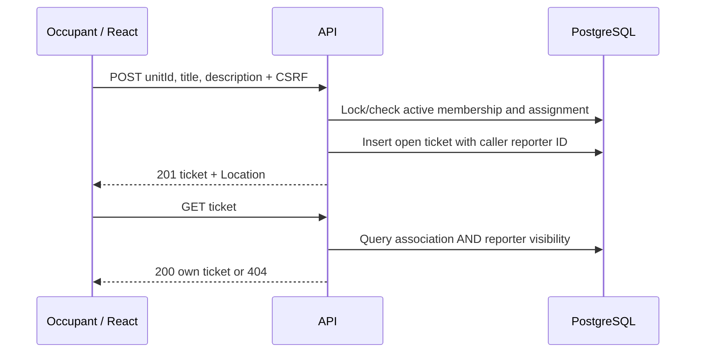

# UC-05 — Report and read private tickets

[All use cases](../use-case-catalog.md) · [API](../api-catalog.md) · [Security rules](../shared-patterns.md)

## Story and scope

**Delivery:** Phase 2; tracker ID unassigned.

**Actor:** Any active association member with a current unit assignment, including an admin who lives in the building.

As a building occupant, I want to report a problem for my assigned unit and read its progress so I can follow up without exposing it to neighbors.

## Preconditions

Full session, active association membership, assigned unit for creation. UC-04 provides register data.

## Main flow

1. User selects an assigned unit from My units and opens Report issue. The ticket picker uses `assignedToMe=true` for both roles.
2. User enters title/description; React applies documented length rules and submits unitId/title/description with CSRF.
3. API locks/checks membership and assignment, derives reporter from session, inserts ticket with open status.
4. API returns 201/Location; UI opens ticket detail and announces creation.
5. Resident ticket list includes only their reports; admin list includes all association reports.
6. Detail displays ticket text/status with paged comments through UC-06.

## Alternatives and failures

- Missing/foreign/unassigned unit: 404; no insertion.
- Forged reporter/status/association properties: 400 INVALID_REQUEST.
- Another resident's ticket, even same apartment: 404.
- Assignment removed after creation: old report remains visible to reporter; new report rejected.
- Association membership disabled: all its ticket routes 404.
- Connection loss after create: show failure and invite user to check own list before retry; no background retry/deduplication engine.

## Postconditions and data

One open ticket belongs to the caller and its unit association. No notification, attachment, emergency dispatch or repair-time guarantee is implied.

`tickets`, `units`, `unit_memberships`, `memberships`; GET/POST tickets and GET ticket detail.

## UI and acceptance

Apply the shared [focus, validation and pending-state criteria](../sprint-1.md#ui-acceptance-shared-across-these-stories). For phase 2 forms, focus the first field on create, first invalid field on validation error, and the safe error banner for non-field failures. Keep controls disabled only during pending work or a documented resolved/rate-limited state. Render all domain text literally.

- P2-05-01: valid creation returns 201 with caller reporter ID and open status.
- P2-05-02: reporter/admin can read; neighbor and other association cannot; totals contain only visible tickets.
- P2-05-03: an assigned admin can create a ticket and receives 201 with their own reporter ID. The same admin receives 404 for an unassigned unit, including after removing their own assignment. Admin register/ticket read permissions remain intact. Missing assignments and forged fields fail without writes for both roles.
- P2-05-04: titles/descriptions render literal HTML; multiline input and length boundaries agree client/server.

## Sequence

