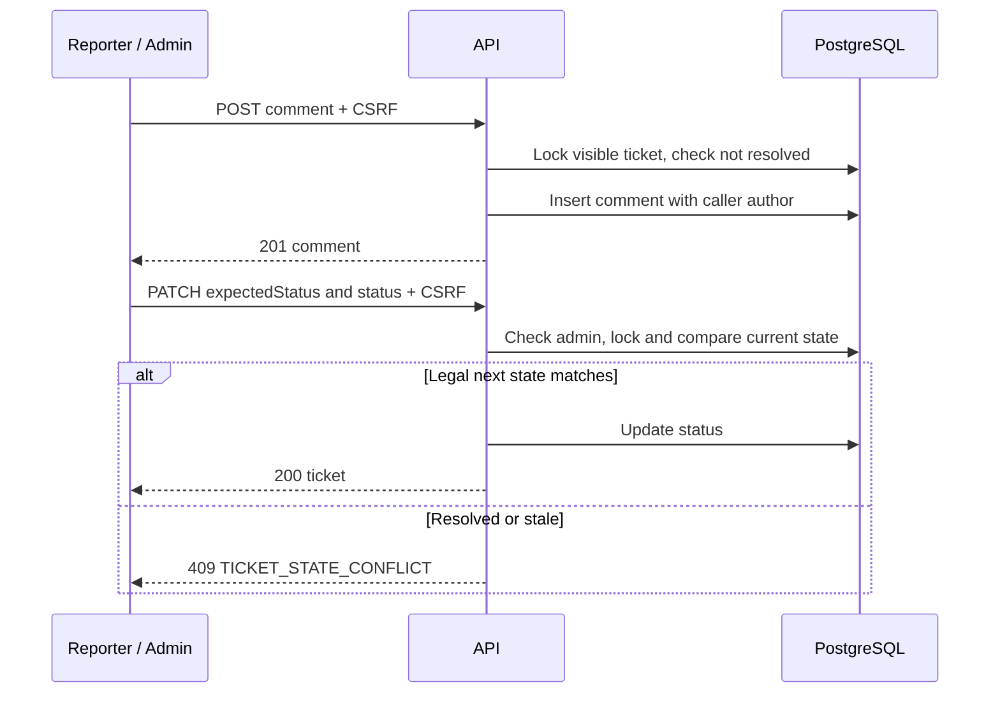

# UC-06 — Discuss and resolve tickets

[All use cases](../use-case-catalog.md) · [API](../api-catalog.md) · [Security rules](../shared-patterns.md)

## Story and scope

**Delivery:** Phase 2; tracker ID unassigned.

**Actor:** Ticket reporter and association admin.

As a reporter, I want to discuss my ticket with the admin; as an admin, I want to mark work started and resolved so progress is visible.

## Preconditions

UC-05 ticket exists; caller is its reporter or association admin, with active membership/full session.

## Main flow

1. Reporter/admin opens ticket and paged plain-text comments.
2. Reporter/admin enters a comment; API verifies ticket visibility and unresolved status while locking ticket.
3. API inserts comment with caller author ID; returns 201; UI appends/refetches the relevant page and clears input.
4. Admin changes open to in_progress with expectedStatus=open.
5. Admin comments on outcome if useful, then changes in_progress to resolved with matching expectedStatus.
6. UI shows final status and disables comment/status controls for resolved ticket; previous conversation stays readable.

## Alternatives and failures

- Resident status change: 403; guessed foreign ticket: 404.
- Empty/oversized/control-character comment: 400 field validation.
- Comment after resolved, stale expectedStatus or skipped/reverse transition: 409 TICKET_STATE_CONFLICT; UI refetches ticket and shows exact message.
- If comment and resolution race, ticket lock serializes them; a comment that obtains lock after resolution is rejected.
- No reopen, comment edits/deletes, internal comments, assignment, email or notifications.

## Postconditions and data

Comment authors remain attributable within their association. Resolved ticket is read-only. No separate status-history table or resolution engine exists.

`tickets`, `comments`, `memberships`; comment list/create and PATCH ticket status.

## UI and acceptance

Apply the shared [focus, validation and pending-state criteria](../sprint-1.md#ui-acceptance-shared-across-these-stories). For phase 2 forms, focus the first field on create, first invalid field on validation error, and the safe error banner for non-field failures. Keep controls disabled only during pending work or a documented resolved/rate-limited state. Render all domain text literally.

- P2-06-01: reporter/admin comment, neighbor denied; status transitions succeed only for admin.
- P2-06-02: resolved comments and stale/illegal transitions return 409; invalid enum returns 400.
- P2-06-03: race comment/resolution; no comment commits after a resolution that already acquired the lock.
- P2-06-04: XSS text stays inert, comment order/paging stable, submit pending prevents duplicate clicks.

## Sequence

