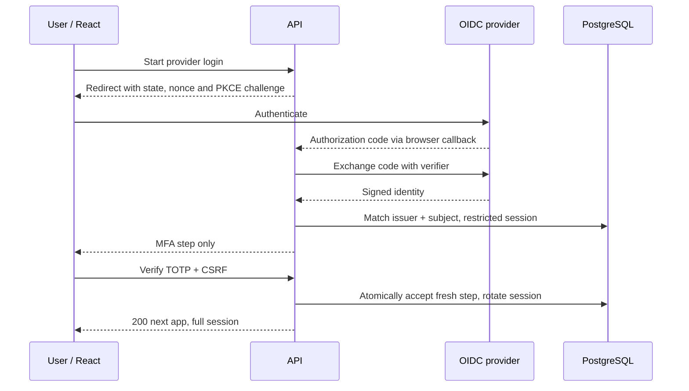

# UC-07 — Complete MFA and provider sign-in

[All use cases](../use-case-catalog.md) · [API](../api-catalog.md) · [Security rules](../shared-patterns.md)

## Story and scope

**Delivery:** Phase 2; tracker ID unassigned.

**Actor:** Existing user; operator for verified recovery/linking.

As a user, I want a second factor and a trusted provider login option so a stolen first-factor credential alone cannot access my association.

## Preconditions

Phase 1 auth works; one OIDC provider is configured for code+PKCE; provider identity is pre-linked by trusted operator. MFA enrollment does not require an external identity.

## Main flow

1. User chooses local login or configured provider. Local credentials are verified per UC-01; OIDC middleware validates returned identity without auto-linking email.
2. If temporary-password flag is set, require UC-03 password change and fresh authentication before MFA.
3. First-factor success issues only mfa_setup or mfa_challenge session for five minutes, not business access.
4. New MFA user views setup secret/QR, enters six-digit TOTP and confirms. API enables encrypted seed only after valid confirmation.
5. Enrolled user enters TOTP; API atomically checks step replay, rotates restricted token into full session and returns next=app.
6. React clears setup secret/code from memory, refreshes CSRF and loads profile/association selector.

## Alternatives and failures

- Wrong/expired/replayed MFA: 401; malformed code: 400; attempt budget exceeded: 429.
- Restricted session used for tickets/users: 403 MFA_REQUIRED.
- Changed state/nonce, invalid PKCE/code/signature/issuer/audience or unknown subject: fail sign-in with generic 401; no full session.
- Enrollment/challenge expiry requires first-factor sign-in again.
- Lost factor: supervised recovery documented in operations; no UI bypass. Provider outage leaves local+MFA login usable.
- Logged-out app cookie replay fails even if provider's own session remains active.

## Postconditions and data

Only validated first factor plus fresh local MFA issues full app session. Provider roles never grant association access. Secrets remain encrypted and absent from logs.

`users` MFA/OIDC fields, `sessions`; authentication additions in [API](../api-catalog.md); no extra business tables.

## UI and acceptance

Apply the shared [focus, validation and pending-state criteria](../sprint-1.md#ui-acceptance-shared-across-these-stories). For phase 2 forms, focus the first field on create, first invalid field on validation error, and the safe error banner for non-field failures. Keep controls disabled only during pending work or a documented resolved/rate-limited state. Render all domain text literally.

- P2-07-01: no business access before MFA, including OIDC path; required password-change stage cannot be skipped.
- P2-07-02: first setup, invalid code, timeout, rate budget, parallel/replayed step and old restricted-token replay.
- P2-07-03: capture actual code+PKCE round trip and reject tampering/unknown subject; no tokens in React storage.
- P2-07-04: supervised lost-factor recovery deletes sessions, forces password change and re-enrollment; record residual operator risk.

## Sequence

