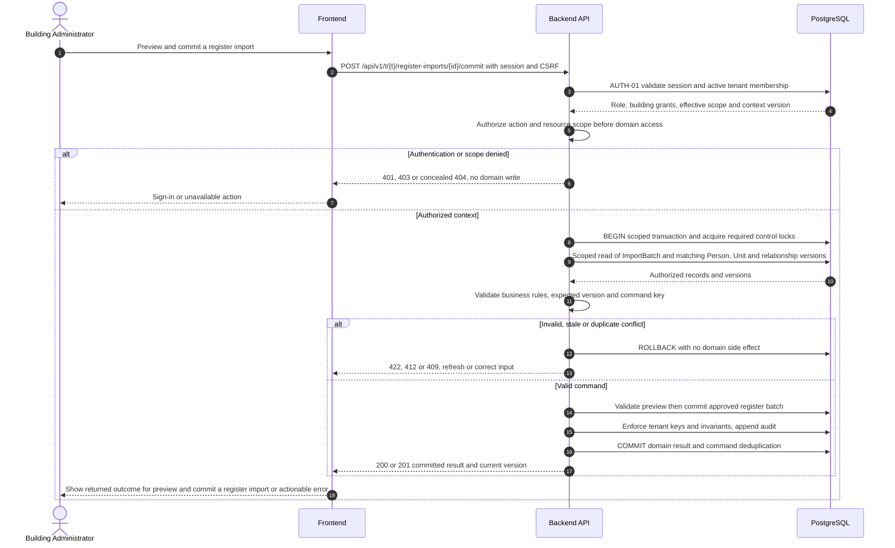
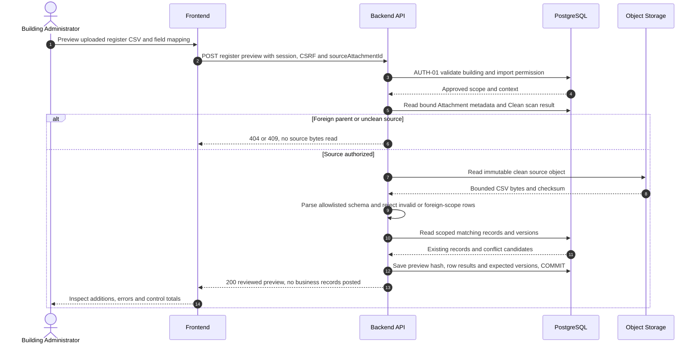

# UC-BLD-003 — Preview and commit a register import

[Catalogue](../use-case-catalog.md) · [Architecture](../solution-design.md) · [Shared contracts](../shared-patterns.md)

## 1. Identity and references

**ID:** UC-BLD-003. **Module:** Building register. **Release:** MVP2. **Requirement references:** BR-03, BR-12. **API family:** API-BLD-003. **Screen:** S-09. **Status:** proposed implementation contract; business rules require the listed stakeholder validation.

## 2. Business objective and user story

As a building administrator, I want to migrate a controlled resident register without bulk access mistakes, so the organization can complete this goal with a traceable result. This release implements the stated goal only; future module dependencies are not implied.

## 3. Actors

**Primary:** Building Administrator. **Supporting:** Frontend and Backend API; PostgreSQL persists or retrieves the authorized business state.  

## 4. Trigger and preconditions

**Trigger:** The primary actor initiates the named action from S-09. Dependencies/capabilities: [UC-BLD-002](UC-BLD-002.md); [UC-ISS-006](UC-ISS-006.md). Required referenced records must exist in the authorized scope; the target state must permit this action. Ordinary tenant activity requires Active tenant and effective membership; authorized export/offboarding exceptions follow the narrow operational procedures.

## 5. Authorization

Steward or administrator with import permission for all selected buildings; import contains tenant-local person data only. Apply **AUTH-01**, effective dates and server-side resource checks from [shared-patterns.md](../shared-patterns.md). UI visibility is a convenience only. Any cached/delayed action is reauthorized before use.

## 6. Inputs, validation and business rules

**Inputs:** Scan-clean sourceAttachmentId for UTF-8 CSV up to 2000 rows and 5 MiB, mapping, source batch ID, dry-run hash and explicit commit.

**Rules:** Staging validates labels, dates, duplicates, scope and formula-like values. No automatic invitations or access grants from a CSV. User reviews additions and conflicts; commit requires unchanged input hash and versions. Reject whole batch if any row fails.

Text is treated as data; enforce lengths and allowlists server-side. IDs are opaque and must resolve through authorized relationships. No client-supplied role, tenant label or object key establishes permission.

## 7. Main success flow

1. **User:** opens S-09 and initiates “Preview and commit a register import” with the inputs above.
2. **Frontend:** collects only relevant fields, validates shape, shows the active tenant and submits the listed API operation; protected writes carry session, CSRF, context version and applicable request/ETag values.
3. **Backend:** applies AUTH-01; Steward or administrator with import permission for all selected buildings; import contains tenant-local person data only.
4. **Backend → Database:** reads ImportBatch and matching Person, Unit and relationship versions through the authorized scope; evaluates the workflow-specific rules in section 6.
5. **Backend:** Validate preview then commit approved register batch. Persistence enforces invariants and records the result and audit; any event is committed through REL-01.
6. **Integration:** None; the committed outcome is visible in the application. No other external provider call is required for the synchronous business result.
7. **Backend → Frontend → User:** Committed batch with counts and row-level result; invitations remain a separate reviewed action. Preserve safe user input on a recoverable error and show the returned state/version.

## 8. Alternatives and exceptions

Stale preview or changed source requires new preview. Duplicate source ID returns prior result. Malformed CSV fails without partial register. Preserve original source only for 7 days in private storage.

ERR-01 applies: malformed input is 400/422; missing authentication is 401; disallowed role is 403; invisible resource is 404. Never reveal another tenant through constraint names, counts or error details. Stale edits require reload/review; identical successful command replay returns its earlier result after fresh authorization. Database failure rolls back the domain write and its outbox; the UI must query the command outcome before resubmitting an uncertain operation.

## 9. Postconditions and failure guarantees

**Success:** Committed batch with counts and row-level result; invitations remain a separate reviewed action. **Failure:** rejected authorization or validation does not change domain records. Only committed state is authoritative; audit and outbox do not announce a rolled-back change. External side effects can fail after commit and are reconciled under REL-01.

## 10. Data, APIs and events

**Entities:** `ImportBatch`; `Person`; `Unit`; `OwnershipInterval`; `OccupancyInterval`; definitions in [data-model.md](../data-model.md). **API operations:** POST /api/v1/t/{t}/register-imports/preview; POST /api/v1/t/{t}/register-imports/{id}/commit; GET /api/v1/t/{t}/register-imports/{id}. Contracts and errors: [API-BLD-003](../api-catalog.md#api-bld-003). **Business event:** `None`. No business event is emitted by this read/authentication operation; security auditing is separate.

## 11. Transaction, consistency and retries

Use CON-01: authorize first, validate current state inside the transaction, apply tenant-aware constraints, and commit the business change with its audit and any outbox records. State updates require If-Match; append/create commands use durable business uniqueness plus a request key. Same-key same-payload replay returns the stored outcome; different payload returns 409. Never retry a state change with a new key after an uncertain response.

## 12. Audit and notifications

Record action, actor/service identity, tenant where applicable, resource ID, safe transition fields, reason reference, timestamp and correlation ID. None; the committed outcome is visible in the application. Never log tokens, raw emails, phone numbers, issue/comment bodies, financial narrative, ballot choices or file bytes. Sensitive business evidence remains in authorized records, not telemetry. Finance audit includes posting IDs and control totals, never editable history.

## 13. Acceptance criteria

- **AT-UC-BLD-003-01 — Outcome:** Given the stated actor, scope and valid inputs, when this workflow succeeds, then committed batch with counts and row-level result; invitations remain a separate reviewed action.
- **AT-UC-BLD-003-02 — Business boundary:** Given one row points to another tenant, when this workflow is exercised, then dry-run and commit both reject that row and commit makes no changes.
- **AT-UC-BLD-003-03 — Authorization:** Given the caller lacks the required tenant/building/unit or resource scope, when a known ID is substituted in this workflow, then the API denies access with no protected content, domain mutation or notification.
- **AT-UC-BLD-003-04 — Failure:** Given validation fails or the database transaction aborts, when the client checks the outcome, then no partial domain change or queued external side effect is reported as successful.

The cross-scope test applies both to a second independent tenant and to a denied building/unit within the same tenant where that resource exists. Execution evidence belongs in the release gate; the design itself is not a test result.

## 14. End-to-end sequence

### Read and preview a scanned CSV source

Upload source evidence through FILE-01 first. The preview command accepts the scan-clean source attachment ID; commit uses the reviewed preview digest. The separate commit/close action is shown above.

