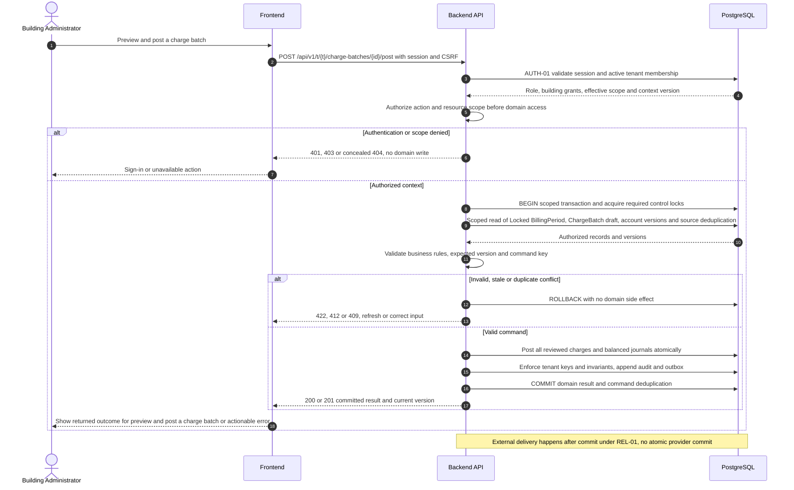
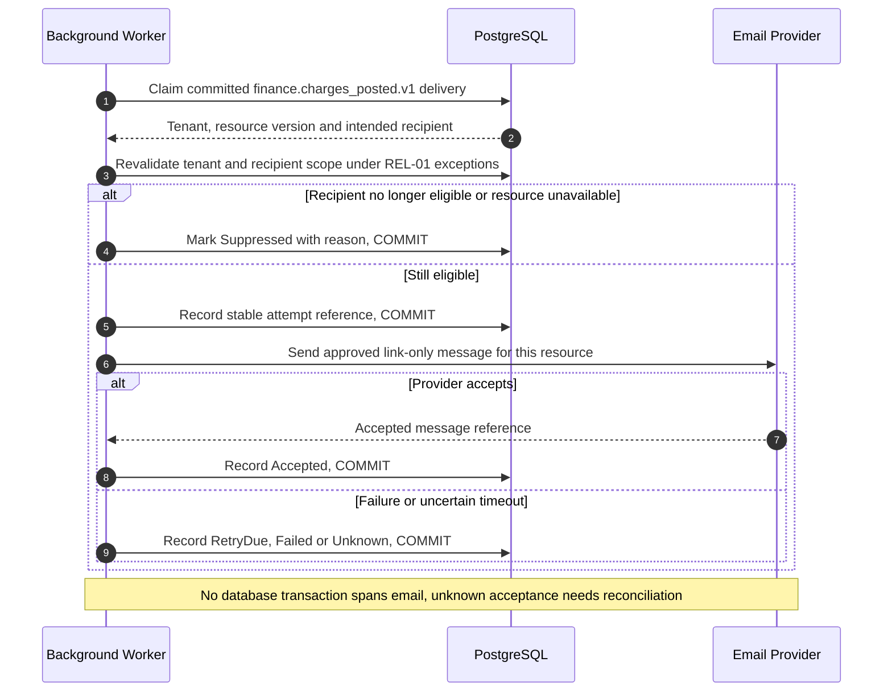
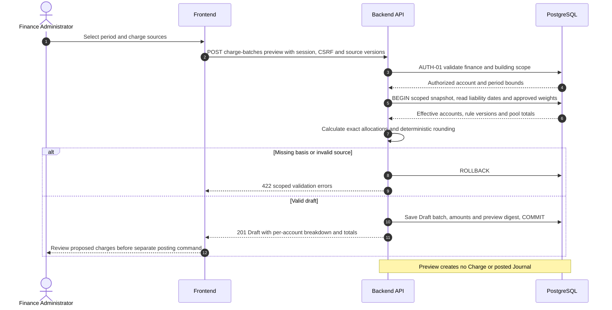

# UC-FIN-003 — Preview and post a charge batch

[Catalogue](../use-case-catalog.md) · [Architecture](../solution-design.md) · [Shared contracts](../shared-patterns.md)

## 1. Identity and references

**ID:** UC-FIN-003. **Module:** Finance. **Release:** MVP3. **Requirement references:** BR-07. **API family:** API-FIN-003. **Screen:** S-21. **Status:** proposed implementation contract; business rules require the listed stakeholder validation.

## 2. Business objective and user story

As a building administrator, I want to issue reproducible charges with no partial billing, so the organization can complete this goal with a traceable result. This release implements the stated goal only; future module dependencies are not implied.

## 3. Actors

**Primary:** Building Administrator. **Supporting:** Frontend and Backend API; PostgreSQL persists or retrieves the authorized business state.  Email Provider is an asynchronous supporting system under REL-01.

## 4. Trigger and preconditions

**Trigger:** The primary actor initiates the named action from S-21. Dependencies/capabilities: [UC-FIN-002](UC-FIN-002.md). Required referenced records must exist in the authorized scope; the target state must permit this action. Ordinary tenant activity requires Active tenant and effective membership; authorized export/offboarding exceptions follow the narrow operational procedures.

## 5. Authorization

Finance-enabled administrator over every account/building in the batch; posting requires recent MFA and reviewed preview digest. Apply **AUTH-01**, effective dates and server-side resource checks from [shared-patterns.md](../shared-patterns.md). UI visibility is a convenience only. Any cached/delayed action is reauthorized before use.

## 6. Inputs, validation and business rules

**Inputs:** Period, rule versions/source pools, effective account set, preview digest, ETags and posting key.

**Rules:** Preview freezes liability, weights, dates, source amounts and rounding version. Post only unchanged preview in open period. Unique charge source/account/period prevents double billing. Each posted charge debits receivable and credits dues-control; total journal debits equal credits.

Text is treated as data; enforce lengths and allowlists server-side. IDs are opaque and must resolve through authorized relationships. No client-supplied role, tenant label or object key establishes permission.

## 7. Main success flow

1. **User:** opens S-21 and initiates “Preview and post a charge batch” with the inputs above.
2. **Frontend:** collects only relevant fields, validates shape, shows the active tenant and submits the listed API operation; protected writes carry session, CSRF, context version and applicable request/ETag values.
3. **Backend:** applies AUTH-01; Finance-enabled administrator over every account/building in the batch; posting requires recent MFA and reviewed preview digest.
4. **Backend → Database:** reads Locked BillingPeriod, ChargeBatch draft, account versions and source deduplication through the authorized scope; evaluates the workflow-specific rules in section 6.
5. **Backend:** Post all reviewed charges and balanced journals atomically. Persistence enforces invariants and records the result and audit; any event is committed through REL-01.
6. **Integration:** Link-only statement-available notices after posting commit; debtor eligibility checked at dispatch. No other external provider call is required for the synchronous business result.
7. **Backend → Frontend → User:** Posted batch with per-account amounts and statement-ready balances; notification queued. Preserve safe user input on a recoverable error and show the returned state/version.

## 8. Alternatives and exceptions

Stale preview returns 409 and new preview required. Any invalid account aborts whole batch. Network timeout uses posting key/status lookup, never a fresh blind posting. Batch size capped at 2000 accounts; larger organizations use reviewed building batches.

ERR-01 applies: malformed input is 400/422; missing authentication is 401; disallowed role is 403; invisible resource is 404. Never reveal another tenant through constraint names, counts or error details. Stale edits require reload/review; identical successful command replay returns its earlier result after fresh authorization. Database failure rolls back the domain write and its outbox; the UI must query the command outcome before resubmitting an uncertain operation.

## 9. Postconditions and failure guarantees

**Success:** Posted batch with per-account amounts and statement-ready balances; notification queued. **Failure:** rejected authorization or validation does not change domain records. Only committed state is authoritative; audit and outbox do not announce a rolled-back change. External side effects can fail after commit and are reconciled under REL-01.

## 10. Data, APIs and events

**Entities:** `ChargeBatch`; `Charge`; `Journal`; `JournalLine`; `BillingPeriod`; definitions in [data-model.md](../data-model.md). **API operations:** POST /api/v1/t/{t}/charge-batches/preview; GET /api/v1/t/{t}/charge-batches/{id}; POST /api/v1/t/{t}/charge-batches/{id}/post. Contracts and errors: [API-FIN-003](../api-catalog.md#api-fin-003). **Business event:** `finance.charges_posted.v1`. Envelope, payload whitelist, deduplication and dispatch follow REL-01; the event name does not itself require an external message broker.

## 11. Transaction, consistency and retries

Use CON-01: authorize first, validate current state inside the transaction, apply tenant-aware constraints, and commit the business change with its audit and any outbox records. State updates require If-Match; append/create commands use durable business uniqueness plus a request key. Same-key same-payload replay returns the stored outcome; different payload returns 409. Never retry a state change with a new key after an uncertain response.

## 12. Audit and notifications

Record action, actor/service identity, tenant where applicable, resource ID, safe transition fields, reason reference, timestamp and correlation ID. Link-only statement-available notices after posting commit; debtor eligibility checked at dispatch. Never log tokens, raw emails, phone numbers, issue/comment bodies, financial narrative, ballot choices or file bytes. Sensitive business evidence remains in authorized records, not telemetry. Finance audit includes posting IDs and control totals, never editable history.

## 13. Acceptance criteria

- **AT-UC-FIN-003-01 — Outcome:** Given the stated actor, scope and valid inputs, when this workflow succeeds, then posted batch with per-account amounts and statement-ready balances; notification queued.
- **AT-UC-FIN-003-02 — Business boundary:** Given a failure occurs on the last charge write, when this workflow is exercised, then no charge or journal from that batch commits.
- **AT-UC-FIN-003-03 — Authorization:** Given the caller lacks the required tenant/building/unit or resource scope, when a known ID is substituted in this workflow, then the API denies access with no protected content, domain mutation or notification.
- **AT-UC-FIN-003-04 — Failure:** Given validation fails or the database transaction aborts, when the client checks the outcome, then no partial domain change or queued external side effect is reported as successful.

The cross-scope test applies both to a second independent tenant and to a denied building/unit within the same tenant where that resource exists. Execution evidence belongs in the release gate; the design itself is not a test result.

## 14. End-to-end sequence

### Notification continuation for UC-FIN-003

The business result above is already committed. This continuation is initiated by the hosted worker and uses the original event/recipient plan. Link-only statement-available notices after posting commit; debtor eligibility checked at dispatch.

### Review a non-posting charge preview

Preview calculates and stores a reviewable draft only. The posting endpoint in the main diagram consumes its approved digest after the administrator reviews account amounts.

