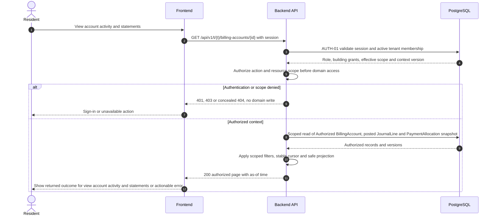

# UC-FIN-004 — View account activity and statements

[Catalogue](../use-case-catalog.md) · [Architecture](../solution-design.md) · [Shared contracts](../shared-patterns.md)

## 1. Identity and references

**ID:** UC-FIN-004. **Module:** Finance. **Release:** MVP3. **Requirement references:** BR-07. **API family:** API-FIN-004. **Screen:** S-22. **Status:** proposed implementation contract; business rules require the listed stakeholder validation.

## 2. Business objective and user story

As a resident, I want to understand exactly what is owed, paid and still open, so the organization can complete this goal with a traceable result. This release implements the stated goal only; future module dependencies are not implied.

## 3. Actors

**Primary:** Resident. **Supporting:** Frontend and Backend API; PostgreSQL persists or retrieves the authorized business state.  

## 4. Trigger and preconditions

**Trigger:** The primary actor initiates the named action from S-22. Dependencies/capabilities: [UC-FIN-003](UC-FIN-003.md); [UC-FIN-005](UC-FIN-005.md). Required referenced records must exist in the authorized scope; the target state must permit this action. Ordinary tenant activity requires Active tenant and effective membership; authorized export/offboarding exceptions follow the narrow operational procedures.

## 5. Authorization

Resident with effective explicit AccountAccessGrant for this liability account; administrator with finance permission and building scope. No visibility of other residents arrears. Apply **AUTH-01**, effective dates and server-side resource checks from [shared-patterns.md](../shared-patterns.md). UI visibility is a convenience only. Any cached/delayed action is reauthorized before use.

## 6. Inputs, validation and business rules

**Inputs:** Account ID, period/as-of timestamp and cursor; optional statement download.

**Rules:** Display posted entries, allocations, unapplied credit and account balance separately. Draft charges excluded. Closed-period statements are frozen by FIN-009; GET does not persist a new statement or post money. Snapshot statement has as-of time and journal cutoff; late adjustments appear in later statement, not rewritten in old statement. Portal access ends with account grant; former debtor requests personal history via PRV workflow.

Text is treated as data; enforce lengths and allowlists server-side. IDs are opaque and must resolve through authorized relationships. No client-supplied role, tenant label or object key establishes permission.

## 7. Main success flow

1. **User:** opens S-22 and initiates “View account activity and statements” with the inputs above.
2. **Frontend:** collects only relevant fields, validates shape, shows the active tenant and submits the listed API operation; protected writes carry session, CSRF, context version and applicable request/ETag values.
3. **Backend:** applies AUTH-01; Resident with effective explicit AccountAccessGrant for this liability account; administrator with finance permission and building scope. No visibility of other residents arrears.
4. **Backend → Database:** reads Authorized BillingAccount, posted JournalLine and PaymentAllocation snapshot through the authorized scope; evaluates the workflow-specific rules in section 6.
5. **Backend:** Return account activity and immutable statement snapshot. Return only authorized projections; append any required download/export audit.
6. **Integration:** None; the committed outcome is visible in the application. No other external provider call is required for the synchronous business result.
7. **Backend → Frontend → User:** Accessible activity page or versioned statement document with reconciled balance. Preserve safe user input on a recoverable error and show the returned state/version.

## 8. Alternatives and exceptions

Unknown/unauthorized account returns 404. Data disagreement blocks statement issuance and alerts finance owner; no guessed balance. Download rechecks authorization.

ERR-01 applies: malformed input is 400/422; missing authentication is 401; disallowed role is 403; invisible resource is 404. Never reveal another tenant through constraint names, counts or error details. Read failure returns a correlation ID and no fabricated partial business result. Concurrency/version conflict is inapplicable to read-only data access; snapshots and fresh authorization govern consistency.

## 9. Postconditions and failure guarantees

**Success:** Accessible activity page or versioned statement document with reconciled balance. **Failure:** rejected authorization or validation does not change domain records. An attempted-download audit can remain after a failed stream; it is not proof that delivery completed.

## 10. Data, APIs and events

**Entities:** `BillingAccount`; `AccountAccessGrant`; `Statement`; `JournalLine`; `PaymentAllocation`; definitions in [data-model.md](../data-model.md). **API operations:** GET /api/v1/t/{t}/billing-accounts/{id}; GET /api/v1/t/{t}/billing-accounts/{id}/activity; GET /api/v1/t/{t}/billing-accounts/{id}/statements; GET /api/v1/t/{t}/statements/{id}/content. Contracts and errors: [API-FIN-004](../api-catalog.md#api-fin-004). **Business event:** `None`. No business event is emitted by this read/authentication operation; security auditing is separate.

## 11. Transaction, consistency and retries

Read-only business operation; no idempotency key or optimistic write version is needed. Audit append is independent of a streamed download. All reads still require a transaction-local tenant context. Incomplete streams are not valid deliverables.

## 12. Audit and notifications

Record action, actor/service identity, tenant where applicable, resource ID, safe transition fields, reason reference, timestamp and correlation ID. None; the committed outcome is visible in the application. Never log tokens, raw emails, phone numbers, issue/comment bodies, financial narrative, ballot choices or file bytes. Sensitive business evidence remains in authorized records, not telemetry. Finance audit includes posting IDs and control totals, never editable history.

## 13. Acceptance criteria

- **AT-UC-FIN-004-01 — Outcome:** Given the stated actor, scope and valid inputs, when this workflow succeeds, then accessible activity page or versioned statement document with reconciled balance.
- **AT-UC-FIN-004-02 — Business boundary:** Given a resident has access to two units but one debtor account, when this workflow is exercised, then only that account is listed and retrievable.
- **AT-UC-FIN-004-03 — Authorization:** Given the caller lacks the required tenant/building/unit or resource scope, when a known ID is substituted in this workflow, then the API denies access with no protected content, domain mutation or notification.
- **AT-UC-FIN-004-04 — Failure:** Given the database or content read fails, when the request is retried after fresh authorization, then it returns a valid authorized result or a clear unavailable status, never leaked or fabricated data.

The cross-scope test applies both to a second independent tenant and to a denied building/unit within the same tenant where that resource exists. Execution evidence belongs in the release gate; the design itself is not a test result.

## 14. End-to-end sequence

