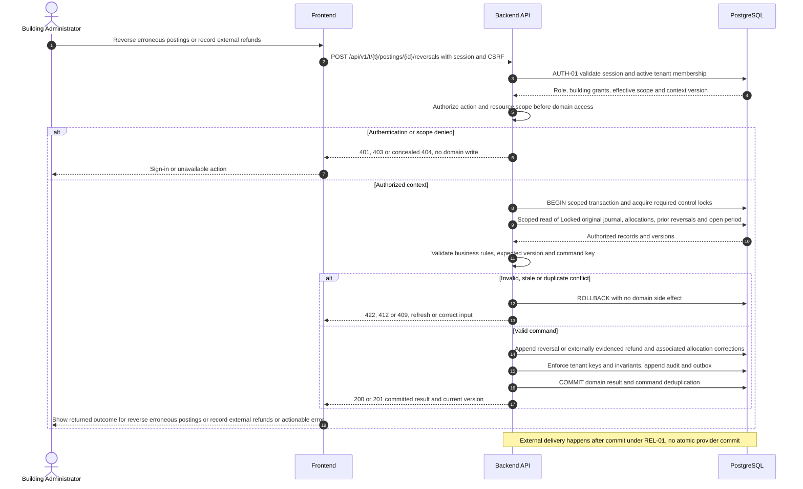

# UC-FIN-008 — Reverse erroneous postings or record external refunds

[Catalogue](../use-case-catalog.md) · [Architecture](../solution-design.md) · [Shared contracts](../shared-patterns.md)

## 1. Identity and references

**ID:** UC-FIN-008. **Module:** Finance. **Release:** MVP3. **Requirement references:** BR-07. **API family:** API-FIN-008. **Screen:** S-24. **Status:** proposed implementation contract; business rules require the listed stakeholder validation.

## 2. Business objective and user story

As a building administrator, I want to correct errors without erasing the accounting trail, so the organization can complete this goal with a traceable result. This release implements the stated goal only; future module dependencies are not implied.

## 3. Actors

**Primary:** Building Administrator. **Supporting:** Frontend and Backend API; PostgreSQL persists or retrieves the authorized business state.  

## 4. Trigger and preconditions

**Trigger:** The primary actor initiates the named action from S-24. Dependencies/capabilities: [UC-FIN-006](UC-FIN-006.md); [UC-FIN-007](UC-FIN-007.md). Required referenced records must exist in the authorized scope; the target state must permit this action. Ordinary tenant activity requires Active tenant and effective membership; authorized export/offboarding exceptions follow the narrow operational procedures.

## 5. Authorization

Finance-enabled administrator over all affected accounts, recent MFA, approved reason and second review where policy requires. Apply **AUTH-01**, effective dates and server-side resource checks from [shared-patterns.md](../shared-patterns.md). UI visibility is a convenience only. Any cached/delayed action is reauthorized before use.

## 6. Inputs, validation and business rules

**Inputs:** Original posting/payment, full or supported partial amount, reason, replacement reference or external refund evidence, posting period.

**Rules:** Balanced compensating journal references original. Reverse dependent allocations first in same transaction where possible. Refund represents money already returned externally, never provider initiation; debit receivable or suspense and credit cash-control. Cumulative reversals/refunds may not exceed reversible amount. Closed period remains closed; correction posts in current period.

Text is treated as data; enforce lengths and allowlists server-side. IDs are opaque and must resolve through authorized relationships. No client-supplied role, tenant label or object key establishes permission.

## 7. Main success flow

1. **User:** opens S-24 and initiates “Reverse erroneous postings or record external refunds” with the inputs above.
2. **Frontend:** collects only relevant fields, validates shape, shows the active tenant and submits the listed API operation; protected writes carry session, CSRF, context version and applicable request/ETag values.
3. **Backend:** applies AUTH-01; Finance-enabled administrator over all affected accounts, recent MFA, approved reason and second review where policy requires.
4. **Backend → Database:** reads Locked original journal, allocations, prior reversals and open period through the authorized scope; evaluates the workflow-specific rules in section 6.
5. **Backend:** Append reversal or externally evidenced refund and associated allocation corrections. Persistence enforces invariants and records the result and audit; any event is committed through REL-01.
6. **Integration:** None; the committed outcome is visible in the application. No other external provider call is required for the synchronous business result.
7. **Backend → Frontend → User:** Original immutable posting plus linked compensation; outstanding balance recalculated from ledger. Preserve safe user input on a recoverable error and show the returned state/version.

## 8. Alternatives and exceptions

Insufficient reversible amount returns 409. Already fully reversed returns existing result for same key. Attempt to delete original is unsupported. Uncertain external refund must stay unposted pending evidence.

ERR-01 applies: malformed input is 400/422; missing authentication is 401; disallowed role is 403; invisible resource is 404. Never reveal another tenant through constraint names, counts or error details. Stale edits require reload/review; identical successful command replay returns its earlier result after fresh authorization. Database failure rolls back the domain write and its outbox; the UI must query the command outcome before resubmitting an uncertain operation.

## 9. Postconditions and failure guarantees

**Success:** Original immutable posting plus linked compensation; outstanding balance recalculated from ledger. **Failure:** rejected authorization or validation does not change domain records. Only committed state is authoritative; audit and outbox do not announce a rolled-back change. External side effects can fail after commit and are reconciled under REL-01.

## 10. Data, APIs and events

**Entities:** `Reversal`; `RefundRecord`; `Journal`; `JournalLine`; `AllocationReversal`; definitions in [data-model.md](../data-model.md). **API operations:** POST /api/v1/t/{t}/postings/{id}/reversals; POST /api/v1/t/{t}/payments/{id}/refund-records. Contracts and errors: [API-FIN-008](../api-catalog.md#api-fin-008). **Business event:** `finance.posting_reversed.v1`. Envelope, payload whitelist, deduplication and dispatch follow REL-01; the event name does not itself require an external message broker.

## 11. Transaction, consistency and retries

Use CON-01: authorize first, validate current state inside the transaction, apply tenant-aware constraints, and commit the business change with its audit and any outbox records. State updates require If-Match; append/create commands use durable business uniqueness plus a request key. Same-key same-payload replay returns the stored outcome; different payload returns 409. Never retry a state change with a new key after an uncertain response.

## 12. Audit and notifications

Record action, actor/service identity, tenant where applicable, resource ID, safe transition fields, reason reference, timestamp and correlation ID. None; the committed outcome is visible in the application. Never log tokens, raw emails, phone numbers, issue/comment bodies, financial narrative, ballot choices or file bytes. Sensitive business evidence remains in authorized records, not telemetry. Finance audit includes posting IDs and control totals, never editable history.

## 13. Acceptance criteria

- **AT-UC-FIN-008-01 — Outcome:** Given the stated actor, scope and valid inputs, when this workflow succeeds, then original immutable posting plus linked compensation; outstanding balance recalculated from ledger.
- **AT-UC-FIN-008-02 — Business boundary:** Given a payment already allocated to charges is reversed, when this workflow is exercised, then allocation reversals and compensating journal commit together.
- **AT-UC-FIN-008-03 — Authorization:** Given the caller lacks the required tenant/building/unit or resource scope, when a known ID is substituted in this workflow, then the API denies access with no protected content, domain mutation or notification.
- **AT-UC-FIN-008-04 — Failure:** Given validation fails or the database transaction aborts, when the client checks the outcome, then no partial domain change or queued external side effect is reported as successful.

The cross-scope test applies both to a second independent tenant and to a denied building/unit within the same tenant where that resource exists. Execution evidence belongs in the release gate; the design itself is not a test result.

## 14. End-to-end sequence

