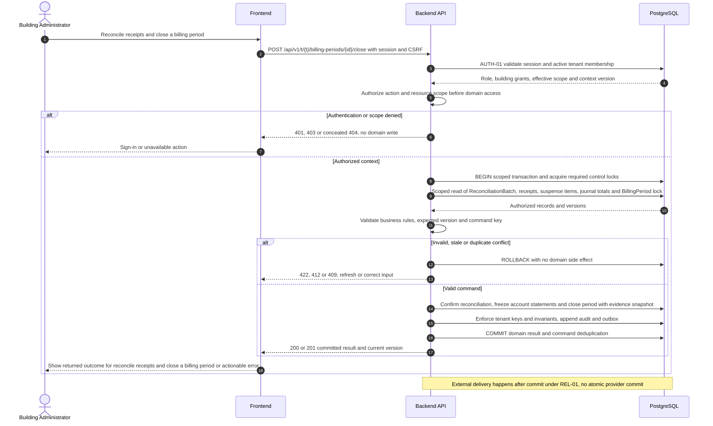
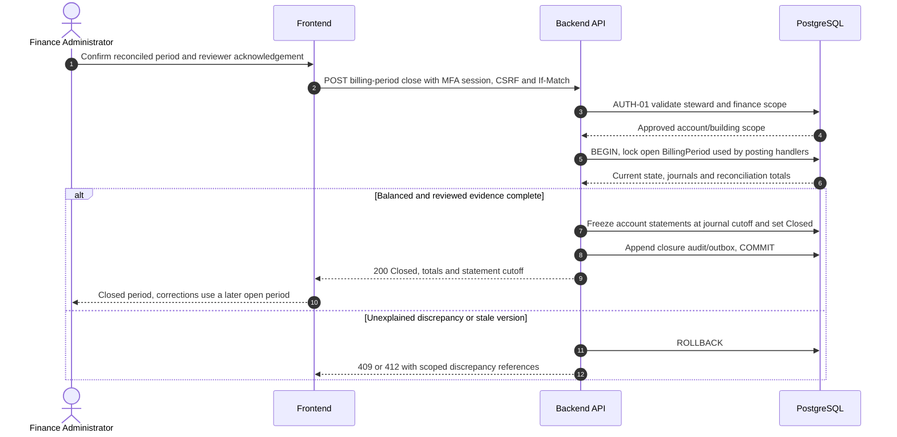
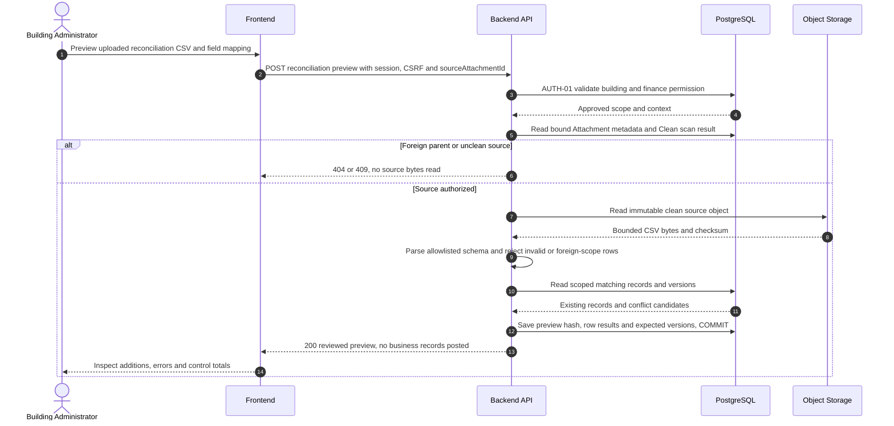

# UC-FIN-009 — Reconcile receipts and close a billing period

[Catalogue](../use-case-catalog.md) · [Architecture](../solution-design.md) · [Shared contracts](../shared-patterns.md)

## 1. Identity and references

**ID:** UC-FIN-009. **Module:** Finance. **Release:** MVP3. **Requirement references:** BR-07. **API family:** API-FIN-009. **Screen:** S-25. **Status:** proposed implementation contract; business rules require the listed stakeholder validation.

## 2. Business objective and user story

As a building administrator, I want to confirm recorded money against external evidence and freeze an agreed period, so the organization can complete this goal with a traceable result. This release implements the stated goal only; future module dependencies are not implied.

## 3. Actors

**Primary:** Building Administrator. **Supporting:** Frontend and Backend API; PostgreSQL persists or retrieves the authorized business state.  

## 4. Trigger and preconditions

**Trigger:** The primary actor initiates the named action from S-25. Dependencies/capabilities: [UC-FIN-008](UC-FIN-008.md); [UC-ISS-006](UC-ISS-006.md). Required referenced records must exist in the authorized scope; the target state must permit this action. Ordinary tenant activity requires Active tenant and effective membership; authorized export/offboarding exceptions follow the narrow operational procedures.

## 5. Authorization

Finance-enabled administrator for reconciliation building scope; tenant-period closure requires steward plus finance permission. Apply **AUTH-01**, effective dates and server-side resource checks from [shared-patterns.md](../shared-patterns.md). UI visibility is a convenience only. Any cached/delayed action is reauthorized before use.

## 6. Inputs, validation and business rules

**Inputs:** Scan-clean bank-statement sourceAttachmentId or manually entered control totals, cash control totals, date interval, discrepancy decisions, closure ETag and reviewer acknowledgement.

**Rules:** CSV is staged and reviewed, not an automatic posting integration. Reconcile references/amounts and classify unmatched items; close only when journal balances, control totals and explicitly approved exceptions agree. Lock period to serialize closure with postings. Baseline does not reopen closed periods; use later-period corrections.

Text is treated as data; enforce lengths and allowlists server-side. IDs are opaque and must resolve through authorized relationships. No client-supplied role, tenant label or object key establishes permission.

## 7. Main success flow

1. **User:** opens S-25 and initiates “Reconcile receipts and close a billing period” with the inputs above.
2. **Frontend:** collects only relevant fields, validates shape, shows the active tenant and submits the listed API operation; protected writes carry session, CSRF, context version and applicable request/ETag values.
3. **Backend:** applies AUTH-01; Finance-enabled administrator for reconciliation building scope; tenant-period closure requires steward plus finance permission.
4. **Backend → Database:** reads ReconciliationBatch, receipts, suspense items, journal totals and BillingPeriod lock through the authorized scope; evaluates the workflow-specific rules in section 6.
5. **Backend:** Confirm reconciliation, freeze account statements and close period with evidence snapshot. Persistence enforces invariants and records the result and audit; any event is committed through REL-01.
6. **Integration:** None; the committed outcome is visible in the application. No other external provider call is required for the synchronous business result.
7. **Backend → Frontend → User:** Closed period with control totals, reviewer, frozen account statement snapshots and explicit unresolved-exception register. Preserve safe user input on a recoverable error and show the returned state/version.

## 8. Alternatives and exceptions

Posting race waits on period lock then either commits before closure or is rejected. Duplicate bank rows cannot create receipts. Unexplained difference blocks closure. File scan failure prevents import.

ERR-01 applies: malformed input is 400/422; missing authentication is 401; disallowed role is 403; invisible resource is 404. Never reveal another tenant through constraint names, counts or error details. Stale edits require reload/review; identical successful command replay returns its earlier result after fresh authorization. Database failure rolls back the domain write and its outbox; the UI must query the command outcome before resubmitting an uncertain operation.

## 9. Postconditions and failure guarantees

**Success:** Closed period with control totals, reviewer, frozen account statement snapshots and explicit unresolved-exception register. **Failure:** rejected authorization or validation does not change domain records. Only committed state is authoritative; audit and outbox do not announce a rolled-back change. External side effects can fail after commit and are reconciled under REL-01.

## 10. Data, APIs and events

**Entities:** `ReconciliationBatch`; `ReconciliationItem`; `BillingPeriod`; `Journal`; definitions in [data-model.md](../data-model.md). **API operations:** POST /api/v1/t/{t}/reconciliations/preview; POST /api/v1/t/{t}/reconciliations/{id}/confirm; POST /api/v1/t/{t}/billing-periods/{id}/close. Contracts and errors: [API-FIN-009](../api-catalog.md#api-fin-009). **Business event:** `finance.period_closed.v1`. Envelope, payload whitelist, deduplication and dispatch follow REL-01; the event name does not itself require an external message broker.

## 11. Transaction, consistency and retries

Use CON-01: authorize first, validate current state inside the transaction, apply tenant-aware constraints, and commit the business change with its audit and any outbox records. State updates require If-Match; append/create commands use durable business uniqueness plus a request key. Same-key same-payload replay returns the stored outcome; different payload returns 409. Never retry a state change with a new key after an uncertain response.

## 12. Audit and notifications

Record action, actor/service identity, tenant where applicable, resource ID, safe transition fields, reason reference, timestamp and correlation ID. None; the committed outcome is visible in the application. Never log tokens, raw emails, phone numbers, issue/comment bodies, financial narrative, ballot choices or file bytes. Sensitive business evidence remains in authorized records, not telemetry. Finance audit includes posting IDs and control totals, never editable history.

## 13. Acceptance criteria

- **AT-UC-FIN-009-01 — Outcome:** Given the stated actor, scope and valid inputs, when this workflow succeeds, then closed period with control totals, reviewer, frozen account statement snapshots and explicit unresolved-exception register.
- **AT-UC-FIN-009-02 — Business boundary:** Given a charge posting races period closure, when this workflow is exercised, then exactly one order is accepted and no entry is inserted into an already closed period.
- **AT-UC-FIN-009-03 — Authorization:** Given the caller lacks the required tenant/building/unit or resource scope, when a known ID is substituted in this workflow, then the API denies access with no protected content, domain mutation or notification.
- **AT-UC-FIN-009-04 — Failure:** Given validation fails or the database transaction aborts, when the client checks the outcome, then no partial domain change or queued external side effect is reported as successful.

The cross-scope test applies both to a second independent tenant and to a denied building/unit within the same tenant where that resource exists. Execution evidence belongs in the release gate; the design itself is not a test result.

## 14. End-to-end sequence

### Close period while serializing postings

The database period lock is shared by all posting handlers; closed-period statement snapshots are created at this boundary, never through a GET request.

### Read and preview a scanned CSV source

Upload source evidence through FILE-01 first. The preview command accepts the scan-clean source attachment ID; commit uses the reviewed preview digest. The separate commit/close action is shown above.

