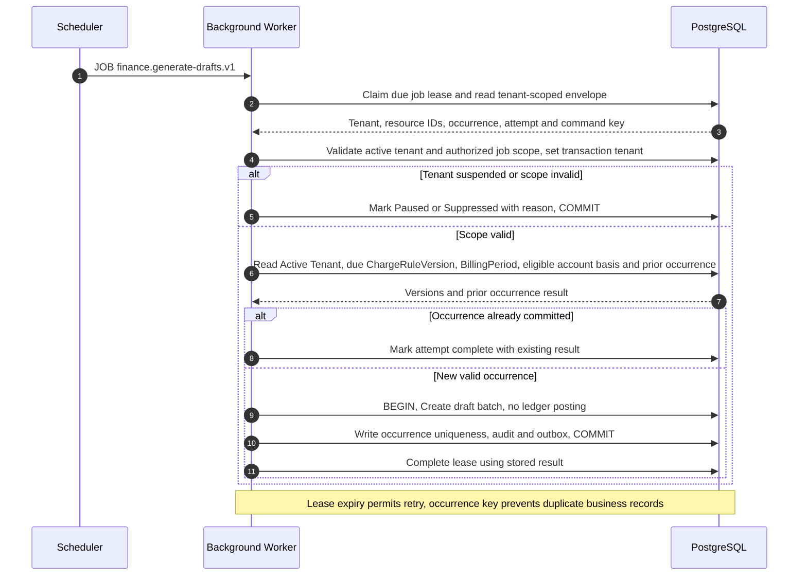
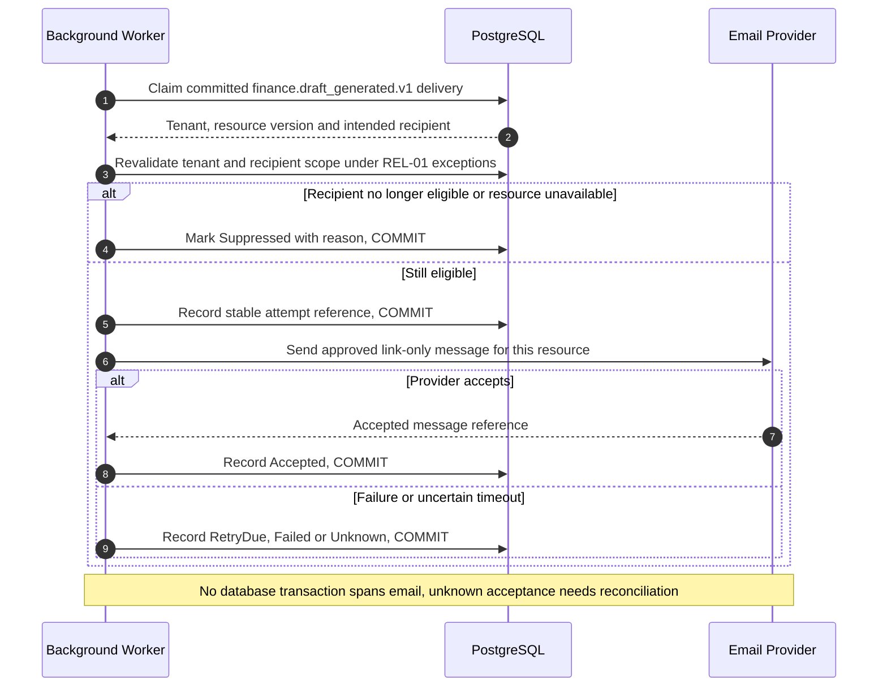

# UC-FIN-011 — Generate recurring charge drafts

[Catalogue](../use-case-catalog.md) · [Architecture](../solution-design.md) · [Shared contracts](../shared-patterns.md)

## 1. Identity and references

**ID:** UC-FIN-011. **Module:** Finance. **Release:** MVP3. **Requirement references:** BR-07. **API family:** API-FIN-011. **Screen:** S-21. **Status:** proposed implementation contract; business rules require the listed stakeholder validation.

## 2. Business objective and user story

As a scheduler, I want to prepare each due billing batch once for administrator review, so the organization can complete this goal with a traceable result. This release implements the stated goal only; future module dependencies are not implied.

## 3. Actors

**Primary:** Scheduler. **Supporting:** Background Worker and finance administrator reviewing the generated draft. Frontend is involved only in subsequent review.  Email Provider is an asynchronous supporting system under REL-01.

## 4. Trigger and preconditions

**Trigger:** A due recurrence is discovered by the scheduler. Dependencies/capabilities: [UC-FIN-002](UC-FIN-002.md); [UC-FIN-003](UC-FIN-003.md). Required referenced records must exist in the authorized scope; the target state must permit this action. Ordinary tenant activity requires Active tenant and effective membership; authorized export/offboarding exceptions follow the narrow operational procedures.

## 5. Authorization

Internal worker identity; scheduler enumerates only due job metadata then processes one authorized active tenant/rule per transaction. No human session is fabricated. Apply **AUTH-01**, effective dates and server-side resource checks from [shared-patterns.md](../shared-patterns.md). UI visibility is a convenience only. Any cached/delayed action is reauthorized before use.

## 6. Inputs, validation and business rules

**Inputs:** Job envelope with tenantId, ruleVersionId, occurrence local date, eventId and attempt.

**Rules:** Unique tenant/rule/occurrence draft. Worker creates draft preview only; administrator must review and post through FIN-003. Missing liability weights block draft and create actionable exception. Catch-up at most 3 periods; older gaps require manual approval.

Text is treated as data; enforce lengths and allowlists server-side. IDs are opaque and must resolve through authorized relationships. No client-supplied role, tenant label or object key establishes permission.

## 7. Main success flow

1. **Scheduler:** identifies due occurrence and submits the versioned internal job.
2. **Worker:** claims lease, establishes one tenant context, and validates active tenant and rule scope.
3. **Worker → Database:** reads Active Tenant, due ChargeRuleVersion, BillingPeriod, eligible account basis and prior occurrence.
4. **Worker:** applies these business rules: Unique tenant/rule/occurrence draft. Worker creates draft preview only; administrator must review and post through FIN-003. Missing liability weights block draft and create actionable exception. Catch-up at most 3 periods; older gaps require manual approval.
5. **Worker → Database:** Create recurring draft batch and record job outcome; persist occurrence uniqueness, outcome, audit and applicable outbox in one commit.
6. **Frontend → Backend:** the authorized administrator later opens S-21; the API reauthorizes and reads the draft result.
7. **Frontend:** displays Exactly one stored draft per occurrence with QueuedReview or Blocked status; no financial posting. Posting is a separate reviewed action.

## 8. Alternatives and exceptions

Duplicate delivery returns existing draft. Worker crash after commit is safe. Suspended tenant pauses. Changed rule versions apply only from explicit effective date.

ERR-01 applies: malformed input is 400/422; missing authentication is 401; disallowed role is 403; invisible resource is 404. Never reveal another tenant through constraint names, counts or error details.

## 9. Postconditions and failure guarantees

**Success:** Exactly one stored draft per occurrence with QueuedReview or Blocked status; no financial posting. **Failure:** rejected authorization or validation does not change domain records. Only committed state is authoritative; audit and outbox do not announce a rolled-back change. External side effects can fail after commit and are reconciled under REL-01.

## 10. Data, APIs and events

**Entities:** `Job`; `ChargeRuleVersion`; `ChargeBatch`; `BillingPeriod`; definitions in [data-model.md](../data-model.md). **API operations:** JOB finance.generate-drafts.v1; GET /api/v1/t/{t}/charge-batches?status=Draft. Contracts and errors: [API-FIN-011](../api-catalog.md#api-fin-011). **Business event:** `finance.draft_generated.v1`. Envelope, payload whitelist, deduplication and dispatch follow REL-01; the event name does not itself require an external message broker.

## 11. Transaction, consistency and retries

Job uses a lease, tenant-scoped transaction and unique rule/occurrence constraint. At-least-once execution is expected. A crash after commit can repeat dispatch but cannot create a second recurring draft. No browser ETag or CSRF applies; worker authorization and durable occurrence key replace them.

## 12. Audit and notifications

Record action, actor/service identity, tenant where applicable, resource ID, safe transition fields, reason reference, timestamp and correlation ID. After commit queue review-needed notification to authorized finance administrators. Never log tokens, raw emails, phone numbers, issue/comment bodies, financial narrative, ballot choices or file bytes. Sensitive business evidence remains in authorized records, not telemetry. Finance audit includes posting IDs and control totals, never editable history.

## 13. Acceptance criteria

- **AT-UC-FIN-011-01 — Outcome:** Given the stated actor, scope and valid inputs, when this workflow succeeds, then exactly one stored draft per occurrence with QueuedReview or Blocked status; no financial posting.
- **AT-UC-FIN-011-02 — Business boundary:** Given a due job is delivered twice, when this workflow is exercised, then one draft exists and ledger balance remains unchanged until reviewed posting.
- **AT-UC-FIN-011-03 — Isolation:** Given an envelope for A contains a resource ID from B, when the worker validates scope, then no B data is read and the job is rejected.
- **AT-UC-FIN-011-04 — Recovery:** Given a crash after commit but before job acknowledgement, when the lease expires and retry runs, then the unique occurrence returns its stored result.

The cross-scope test applies both to a second independent tenant and to a denied building/unit within the same tenant where that resource exists. Execution evidence belongs in the release gate; the design itself is not a test result.

## 14. End-to-end sequence

### Notification continuation for UC-FIN-011

The business result above is already committed. This continuation is initiated by the hosted worker and uses the original event/recipient plan. After commit queue review-needed notification to authorized finance administrators.

