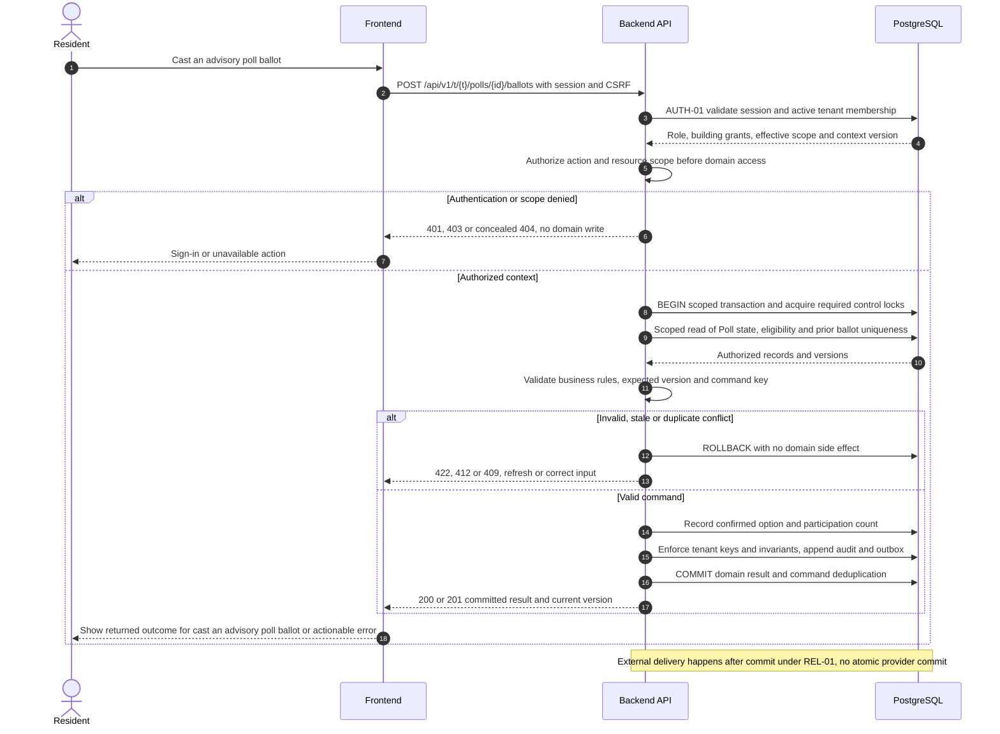

# UC-GOV-003 — Cast an advisory poll ballot

[Catalogue](../use-case-catalog.md) · [Architecture](../solution-design.md) · [Shared contracts](../shared-patterns.md)

## 1. Identity and references

**ID:** UC-GOV-003. **Module:** Community. **Release:** MVP5. **Requirement references:** BR-09. **API family:** API-GOV-003. **Screen:** S-31. **Status:** proposed implementation contract; business rules require the listed stakeholder validation.

## 2. Business objective and user story

As a resident, I want to express a community preference once under the stated eligibility rule, so the organization can complete this goal with a traceable result. This release implements the stated goal only; future module dependencies are not implied.

## 3. Actors

**Primary:** Resident. **Supporting:** Frontend and Backend API; PostgreSQL persists or retrieves the authorized business state.  

## 4. Trigger and preconditions

**Trigger:** The primary actor initiates the named action from S-31. Dependencies/capabilities: [UC-GOV-002](UC-GOV-002.md). Required referenced records must exist in the authorized scope; the target state must permit this action. Ordinary tenant activity requires Active tenant and effective membership; authorized export/offboarding exceptions follow the narrow operational procedures.

## 5. Authorization

Active membership on opening eligibility snapshot and current target-building grant. Administrator can vote only through their eligible membership. Apply **AUTH-01**, effective dates and server-side resource checks from [shared-patterns.md](../shared-patterns.md). UI visibility is a convenience only. Any cached/delayed action is reauthorized before use.

## 6. Inputs, validation and business rules

**Inputs:** Poll ID, option ID, idempotency key and displayed poll version.

**Rules:** One immutable ballot per poll/membership. No edit after submission in baseline; require confirmation. Server timestamp must be within open interval; lock/check poll state to serialize closure. Hide running totals and other ballot identities.

Text is treated as data; enforce lengths and allowlists server-side. IDs are opaque and must resolve through authorized relationships. No client-supplied role, tenant label or object key establishes permission.

## 7. Main success flow

1. **User:** opens S-31 and initiates “Cast an advisory poll ballot” with the inputs above.
2. **Frontend:** collects only relevant fields, validates shape, shows the active tenant and submits the listed API operation; protected writes carry session, CSRF, context version and applicable request/ETag values.
3. **Backend:** applies AUTH-01; Active membership on opening eligibility snapshot and current target-building grant. Administrator can vote only through their eligible membership.
4. **Backend → Database:** reads Poll state, eligibility and prior ballot uniqueness through the authorized scope; evaluates the workflow-specific rules in section 6.
5. **Backend:** Record confirmed option and participation count. Persistence enforces invariants and records the result and audit; any event is committed through REL-01.
6. **Integration:** None; the committed outcome is visible in the application. No other external provider call is required for the synchronous business result.
7. **Backend → Frontend → User:** Own ballot receipt with timestamp; aggregate results appear only after closure. Preserve safe user input on a recoverable error and show the returned state/version.

## 8. Alternatives and exceptions

Duplicate same-key vote returns receipt; different choice after vote returns 409. Closed poll or revoked grant denies. Counter updates and ballot commit together.

ERR-01 applies: malformed input is 400/422; missing authentication is 401; disallowed role is 403; invisible resource is 404. Never reveal another tenant through constraint names, counts or error details. Stale edits require reload/review; identical successful command replay returns its earlier result after fresh authorization. Database failure rolls back the domain write and its outbox; the UI must query the command outcome before resubmitting an uncertain operation.

## 9. Postconditions and failure guarantees

**Success:** Own ballot receipt with timestamp; aggregate results appear only after closure. **Failure:** rejected authorization or validation does not change domain records. Only committed state is authoritative; audit and outbox do not announce a rolled-back change. External side effects can fail after commit and are reconciled under REL-01.

## 10. Data, APIs and events

**Entities:** `Poll`; `PollEligibility`; `Ballot`; definitions in [data-model.md](../data-model.md). **API operations:** GET /api/v1/t/{t}/polls/{id}; POST /api/v1/t/{t}/polls/{id}/ballots; GET /api/v1/t/{t}/polls/{id}/ballots/me. Contracts and errors: [API-GOV-003](../api-catalog.md#api-gov-003). **Business event:** `poll.ballot_cast.v1`. Envelope, payload whitelist, deduplication and dispatch follow REL-01; the event name does not itself require an external message broker.

## 11. Transaction, consistency and retries

Use CON-01: authorize first, validate current state inside the transaction, apply tenant-aware constraints, and commit the business change with its audit and any outbox records. State updates require If-Match; append/create commands use durable business uniqueness plus a request key. Same-key same-payload replay returns the stored outcome; different payload returns 409. Never retry a state change with a new key after an uncertain response.

## 12. Audit and notifications

Record action, actor/service identity, tenant where applicable, resource ID, safe transition fields, reason reference, timestamp and correlation ID. None; the committed outcome is visible in the application. Never log tokens, raw emails, phone numbers, issue/comment bodies, financial narrative, ballot choices or file bytes. Sensitive business evidence remains in authorized records, not telemetry. Finance audit includes posting IDs and control totals, never editable history.

## 13. Acceptance criteria

- **AT-UC-GOV-003-01 — Outcome:** Given the stated actor, scope and valid inputs, when this workflow succeeds, then own ballot receipt with timestamp; aggregate results appear only after closure.
- **AT-UC-GOV-003-02 — Business boundary:** Given a vote races poll closure, when this workflow is exercised, then it is either committed before closure or rejected, never counted after results freeze.
- **AT-UC-GOV-003-03 — Authorization:** Given the caller lacks the required tenant/building/unit or resource scope, when a known ID is substituted in this workflow, then the API denies access with no protected content, domain mutation or notification.
- **AT-UC-GOV-003-04 — Failure:** Given validation fails or the database transaction aborts, when the client checks the outcome, then no partial domain change or queued external side effect is reported as successful.

The cross-scope test applies both to a second independent tenant and to a denied building/unit within the same tenant where that resource exists. Execution evidence belongs in the release gate; the design itself is not a test result.

## 14. End-to-end sequence

