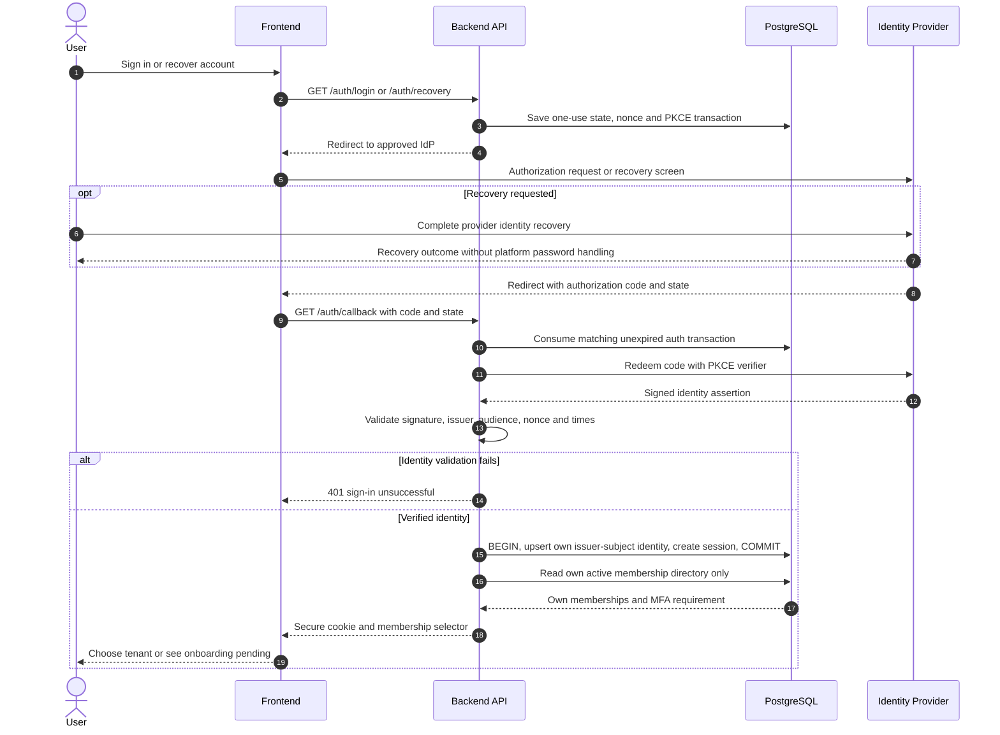

# UC-IAM-001 — Sign in or recover an account

[Catalogue](../use-case-catalog.md) · [Architecture](../solution-design.md) · [Shared contracts](../shared-patterns.md)

## 1. Identity and references

**ID:** UC-IAM-001. **Module:** Identity. **Release:** MVP1. **Requirement references:** BR-01. **API family:** API-IAM-001. **Screen:** S-01. **Status:** proposed implementation contract; business rules require the listed stakeholder validation.

## 2. Business objective and user story

As a user, I want to access the correct memberships without the platform storing passwords, so the organization can complete this goal with a traceable result. This release implements the stated goal only; future module dependencies are not implied.

## 3. Actors

**Primary:** User. **Supporting:** Frontend and Backend API; PostgreSQL persists or retrieves the authorized business state. Identity Provider handles authentication/recovery or provider logout. 

## 4. Trigger and preconditions

**Trigger:** The primary actor initiates the named action from S-01. Dependencies/capabilities: No earlier business use case; EN-001 through EN-007 supply the production foundation.. Required referenced records must exist in the authorized scope; the target state must permit this action. No active-tenant membership is assumed before sign-in, provisioning, invitation acceptance or a former-member privacy request; use the specified gateway.

## 5. Authorization

Anonymous entry; after identity verification only the current user global profile and own membership directory are readable. Administrator routes require recent MFA. Apply **AUTH-01**, effective dates and server-side resource checks from [shared-patterns.md](../shared-patterns.md). UI visibility is a convenience only. Any cached/delayed action is reauthorized before use.

## 6. Inputs, validation and business rules

**Inputs:** Return path from an allowlist; authorization code, state, nonce and PKCE verifier in the server callback.

**Rules:** Use an approved OIDC provider and verified issuer/subject. Never merge accounts by email alone. Recovery and MFA enrollment occur at the provider; account recovery must not restore removed memberships.

Text is treated as data; enforce lengths and allowlists server-side. IDs are opaque and must resolve through authorized relationships. No client-supplied role, tenant label or object key establishes permission.

## 7. Main success flow

1. **User:** opens S-01 and initiates “Sign in or recover an account” with the inputs above.
2. **Frontend:** starts the same-origin authentication operation. Credentials and recovery challenges are entered only at the Identity Provider; never collected by application fields.
3. **Backend:** validates the protocol/session ownership and CSRF rules stated above; tenant content is unavailable until an active membership is selected.
4. **Backend → Database:** reads UserIdentity by issuer and subject; active memberships and server session through the authorized scope; evaluates the workflow-specific rules in section 6.
5. **Backend:** Validate OIDC callback and create opaque server session. Persistence enforces invariants and records the result and audit; any event is committed through REL-01.
6. **Integration:** None; the committed outcome is visible in the application. Identity Provider interaction follows the dedicated diagram; tenant authorization stays in the application.
7. **Backend → Frontend → User:** Authenticated session and membership selector, or onboarding-pending page if no active memberships. Preserve safe user input on a recoverable error and show the returned state/version.

## 8. Alternatives and exceptions

Cancelled sign-in returns to sign-in. Invalid state, nonce, signature, issuer or audience rejects callback without session. Provider outage shows retry; existing valid sessions follow their normal lifetime. Recovery reveals no account-existence result in the platform.

ERR-01 applies: malformed input is 400/422; missing authentication is 401; disallowed role is 403; invisible resource is 404. Never reveal another tenant through constraint names, counts or error details.

## 9. Postconditions and failure guarantees

**Success:** Authenticated session and membership selector, or onboarding-pending page if no active memberships. **Failure:** rejected authorization or validation does not change domain records. Only committed state is authoritative; audit and outbox do not announce a rolled-back change. External side effects can fail after commit and are reconciled under REL-01.

## 10. Data, APIs and events

**Entities:** `UserIdentity`; `Session`; `Membership`; definitions in [data-model.md](../data-model.md). **API operations:** GET /auth/login; GET /auth/callback; GET /api/v1/me/tenants; GET /auth/recovery. Contracts and errors: [API-IAM-001](../api-catalog.md#api-iam-001). **Business event:** `None`. No business event is emitted by this read/authentication operation; security auditing is separate.

## 11. Transaction, consistency and retries

Authentication transaction state is single-use and expires after 10 minutes. Code redemption is external and not atomic with session persistence. Failed or uncertain redemption restarts sign-in; it never creates an unverified session. Session creation and own-identity mapping commit together. No client idempotency header is required for protocol callbacks.

## 12. Audit and notifications

Record action, actor/service identity, tenant where applicable, resource ID, safe transition fields, reason reference, timestamp and correlation ID. None; the committed outcome is visible in the application. Never log tokens, raw emails, phone numbers, issue/comment bodies, financial narrative, ballot choices or file bytes. Sensitive business evidence remains in authorized records, not telemetry. Finance audit includes posting IDs and control totals, never editable history.

## 13. Acceptance criteria

- **AT-UC-IAM-001-01 — Outcome:** Given the stated actor, scope and valid inputs, when this workflow succeeds, then authenticated session and membership selector, or onboarding-pending page if no active memberships.
- **AT-UC-IAM-001-02 — Business boundary:** Given a recovered identity with a revoked membership signs in, when this workflow is exercised, then it sees no data from that tenant.
- **AT-UC-IAM-001-03 — Isolation:** Given a valid identity belongs only to tenant A, when sign-in finishes, then no tenant B directory entry or business data is returned.
- **AT-UC-IAM-001-04 — Failure:** Given a callback with incorrect state or issuer, when it is processed, then no application session is issued.

The cross-scope test applies both to a second independent tenant and to a denied building/unit within the same tenant where that resource exists. Execution evidence belongs in the release gate; the design itself is not a test result.

## 14. End-to-end sequence

