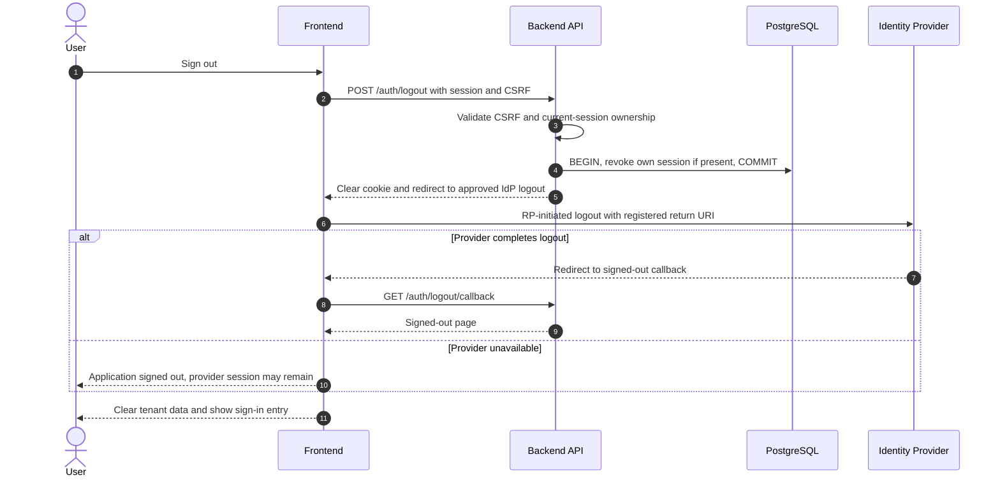

# UC-IAM-002 — Sign out and end application access

[Catalogue](../use-case-catalog.md) · [Architecture](../solution-design.md) · [Shared contracts](../shared-patterns.md)

## 1. Identity and references

**ID:** UC-IAM-002. **Module:** Identity. **Release:** MVP1. **Requirement references:** BR-01. **API family:** API-IAM-002. **Screen:** S-01. **Status:** proposed implementation contract; business rules require the listed stakeholder validation.

## 2. Business objective and user story

As a user, I want to end the current application session on a shared device, so the organization can complete this goal with a traceable result. This release implements the stated goal only; future module dependencies are not implied.

## 3. Actors

**Primary:** User. **Supporting:** Frontend and Backend API; PostgreSQL persists or retrieves the authorized business state. Identity Provider handles authentication/recovery or provider logout. 

## 4. Trigger and preconditions

**Trigger:** The primary actor initiates the named action from S-01. Dependencies/capabilities: [UC-IAM-001](UC-IAM-001.md). Required referenced records must exist in the authorized scope; the target state must permit this action. Ordinary tenant activity requires Active tenant and effective membership; authorized export/offboarding exceptions follow the narrow operational procedures.

## 5. Authorization

Current session only; no tenant selection required. Logout cannot revoke another user session. Apply **AUTH-01**, effective dates and server-side resource checks from [shared-patterns.md](../shared-patterns.md). UI visibility is a convenience only. Any cached/delayed action is reauthorized before use.

## 6. Inputs, validation and business rules

**Inputs:** CSRF token and optional allowlisted post-logout destination.

**Rules:** Revoke local session first; clear cookie and client state. Request provider logout using its supported RP-initiated mechanism. Do not promise logout from unrelated applications.

Text is treated as data; enforce lengths and allowlists server-side. IDs are opaque and must resolve through authorized relationships. No client-supplied role, tenant label or object key establishes permission.

## 7. Main success flow

1. **User:** opens S-01 and initiates “Sign out and end application access” with the inputs above.
2. **Frontend:** starts the same-origin authentication operation. Credentials and recovery challenges are entered only at the Identity Provider; never collected by application fields.
3. **Backend:** validates the protocol/session ownership and CSRF rules stated above; tenant content is unavailable until an active membership is selected.
4. **Backend → Database:** reads Current Session by hashed cookie identifier through the authorized scope; evaluates the workflow-specific rules in section 6.
5. **Backend:** Revoke session and initiate provider sign-out. Persistence enforces invariants and records the result and audit; any event is committed through REL-01.
6. **Integration:** None; the committed outcome is visible in the application. Identity Provider interaction follows the dedicated diagram; tenant authorization stays in the application.
7. **Backend → Frontend → User:** Signed-out page; application session remains invalid even if provider logout fails. Preserve safe user input on a recoverable error and show the returned state/version.

## 8. Alternatives and exceptions

Expired session still returns signed-out result. Missing CSRF rejects POST. Provider timeout displays local sign-out success and provider-session uncertainty.

ERR-01 applies: malformed input is 400/422; missing authentication is 401; disallowed role is 403; invisible resource is 404. Never reveal another tenant through constraint names, counts or error details.

## 9. Postconditions and failure guarantees

**Success:** Signed-out page; application session remains invalid even if provider logout fails. **Failure:** rejected authorization or validation does not change domain records. Only committed state is authoritative; audit and outbox do not announce a rolled-back change. External side effects can fail after commit and are reconciled under REL-01.

## 10. Data, APIs and events

**Entities:** `Session`; definitions in [data-model.md](../data-model.md). **API operations:** POST /auth/logout; GET /auth/logout/callback. Contracts and errors: [API-IAM-002](../api-catalog.md#api-iam-002). **Business event:** `None`. No business event is emitted by this read/authentication operation; security auditing is separate.

## 11. Transaction, consistency and retries

Local revocation is idempotent and commits before provider logout. An already revoked or missing session yields the same signed-out result. CSRF remains required on browser POST. Provider failure cannot restore the local session. No optimistic version is needed for revocation.

## 12. Audit and notifications

Record action, actor/service identity, tenant where applicable, resource ID, safe transition fields, reason reference, timestamp and correlation ID. None; the committed outcome is visible in the application. Never log tokens, raw emails, phone numbers, issue/comment bodies, financial narrative, ballot choices or file bytes. Sensitive business evidence remains in authorized records, not telemetry. Finance audit includes posting IDs and control totals, never editable history.

## 13. Acceptance criteria

- **AT-UC-IAM-002-01 — Outcome:** Given the stated actor, scope and valid inputs, when this workflow succeeds, then signed-out page; application session remains invalid even if provider logout fails.
- **AT-UC-IAM-002-02 — Business boundary:** Given the old cookie is replayed after local logout, when this workflow is exercised, then protected API access returns 401 even during a provider outage.
- **AT-UC-IAM-002-03 — Ownership:** Given user A is signed in, when a logout payload names user B, then only the session owned by A can be revoked.
- **AT-UC-IAM-002-04 — Failure:** Given provider logout is unavailable, when local logout commits, then replay of the old application cookie fails.

The cross-scope test applies both to a second independent tenant and to a denied building/unit within the same tenant where that resource exists. Execution evidence belongs in the release gate; the design itself is not a test result.

## 14. End-to-end sequence

