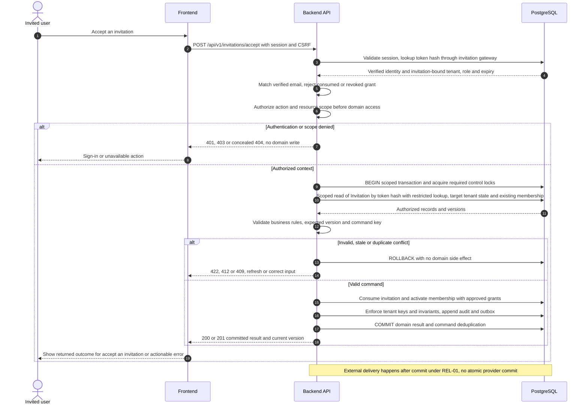

# UC-IAM-003 — Accept an invitation

[Catalogue](../use-case-catalog.md) · [Architecture](../solution-design.md) · [Shared contracts](../shared-patterns.md)

## 1. Identity and references

**ID:** UC-IAM-003. **Module:** Identity. **Release:** MVP1. **Requirement references:** BR-01, BR-03. **API family:** API-IAM-003. **Screen:** S-02. **Status:** proposed implementation contract; business rules require the listed stakeholder validation.

## 2. Business objective and user story

As a invited user, I want to activate the precise membership and access grants intended by the administrator, so the organization can complete this goal with a traceable result. This release implements the stated goal only; future module dependencies are not implied.

## 3. Actors

**Primary:** Invited user. **Supporting:** Frontend and Backend API; PostgreSQL persists or retrieves the authorized business state.  

## 4. Trigger and preconditions

**Trigger:** The primary actor initiates the named action from S-02. Dependencies/capabilities: [UC-IAM-001](UC-IAM-001.md); [UC-IAM-006](UC-IAM-006.md). Required referenced records must exist in the authorized scope; the target state must permit this action. No active-tenant membership is assumed before sign-in, provisioning, invitation acceptance or a former-member privacy request; use the specified gateway.

## 5. Authorization

Authenticated identity with verified email matching the invitation; token grants access only to its invitation record, not to tenant data before acceptance. Apply **AUTH-03 (invitation)**, effective dates and server-side resource checks from [shared-patterns.md](../shared-patterns.md). UI visibility is a convenience only. Any cached/delayed action is reauthorized before use.

## 6. Inputs, validation and business rules

**Inputs:** One-use opaque invitation token; signed-in identity; explicit acceptance.

**Rules:** Invitation expires after 7 days; store only token hash. Bind intended tenant, role, building/unit grants and effective dates. Verified email match is required but identity remains issuer/subject. Future-dated grants do not authorize early access.

Text is treated as data; enforce lengths and allowlists server-side. IDs are opaque and must resolve through authorized relationships. No client-supplied role, tenant label or object key establishes permission.

## 7. Main success flow

1. **User:** opens S-02 and initiates “Accept an invitation” with the inputs above.
2. **Frontend:** asks the user to sign in if necessary, then POSTs the one-use token and explicit acceptance with CSRF; invitation-bound context replaces any active-tenant selection.
3. **Backend:** applies AUTH-03 (invitation); Authenticated identity with verified email matching the invitation; token grants access only to its invitation record, not to tenant data before acceptance.
4. **Backend → Database:** reads Invitation by token hash with restricted lookup; target tenant state and existing membership through the authorized scope; evaluates the workflow-specific rules in section 6.
5. **Backend:** Consume invitation and activate membership with approved grants. Persistence enforces invariants and records the result and audit; any event is committed through REL-01.
6. **Integration:** None; the committed outcome is visible in the application. No other external provider call is required for the synchronous business result.
7. **Backend → Frontend → User:** Accepted invitation and membership; frontend shows accessible buildings or effective-start date. Preserve safe user input on a recoverable error and show the returned state/version.

## 8. Alternatives and exceptions

Wrong identity, expired/revoked invitation or suspended tenant denies activation. Concurrent acceptance has one winner; same identity replay returns existing accepted result. Removed memberships require a newly authorized invitation.

ERR-01 applies: malformed input is 400/422; missing authentication is 401; disallowed role is 403; invisible resource is 404. Never reveal another tenant through constraint names, counts or error details. Stale edits require reload/review; identical successful command replay returns its earlier result after fresh authorization. Database failure rolls back the domain write and its outbox; the UI must query the command outcome before resubmitting an uncertain operation.

## 9. Postconditions and failure guarantees

**Success:** Accepted invitation and membership; frontend shows accessible buildings or effective-start date. **Failure:** rejected authorization or validation does not change domain records. Only committed state is authoritative; audit and outbox do not announce a rolled-back change. External side effects can fail after commit and are reconciled under REL-01.

## 10. Data, APIs and events

**Entities:** `Invitation`; `Membership`; `BuildingGrant`; `UnitAccessGrant`; definitions in [data-model.md](../data-model.md). **API operations:** POST /api/v1/invitations/accept. Contracts and errors: [API-IAM-003](../api-catalog.md#api-iam-003). **Business event:** `membership.activated.v1`. Envelope, payload whitelist, deduplication and dispatch follow REL-01; the event name does not itself require an external message broker.

## 11. Transaction, consistency and retries

Use CON-01: authorize first, validate current state inside the transaction, apply tenant-aware constraints, and commit the business change with its audit and any outbox records. State updates require If-Match; append/create commands use durable business uniqueness plus a request key. Same-key same-payload replay returns the stored outcome; different payload returns 409. Never retry a state change with a new key after an uncertain response.

## 12. Audit and notifications

Record action, actor/service identity, tenant where applicable, resource ID, safe transition fields, reason reference, timestamp and correlation ID. None; the committed outcome is visible in the application. Never log tokens, raw emails, phone numbers, issue/comment bodies, financial narrative, ballot choices or file bytes. Sensitive business evidence remains in authorized records, not telemetry. Finance audit includes posting IDs and control totals, never editable history.

## 13. Acceptance criteria

- **AT-UC-IAM-003-01 — Outcome:** Given the stated actor, scope and valid inputs, when this workflow succeeds, then accepted invitation and membership; frontend shows accessible buildings or effective-start date.
- **AT-UC-IAM-003-02 — Business boundary:** Given an invitation for tenant A is submitted while tenant B is selected, when this workflow is exercised, then only the invitation-bound tenant can be activated.
- **AT-UC-IAM-003-03 — Authorization:** Given the caller lacks the required tenant/building/unit or resource scope, when a known ID is substituted in this workflow, then the API denies access with no protected content, domain mutation or notification.
- **AT-UC-IAM-003-04 — Failure:** Given validation fails or the database transaction aborts, when the client checks the outcome, then no partial domain change or queued external side effect is reported as successful.

The cross-scope test applies both to a second independent tenant and to a denied building/unit within the same tenant where that resource exists. Execution evidence belongs in the release gate; the design itself is not a test result.

## 14. End-to-end sequence

