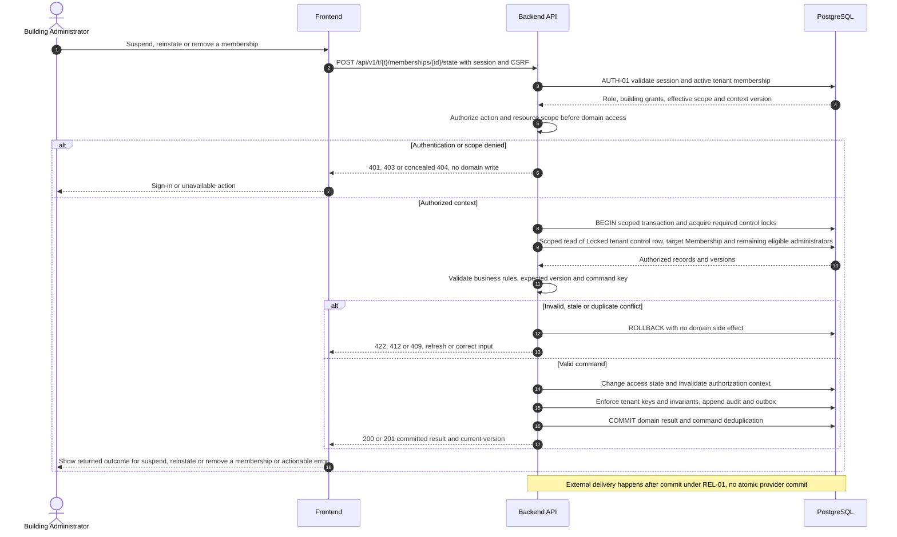
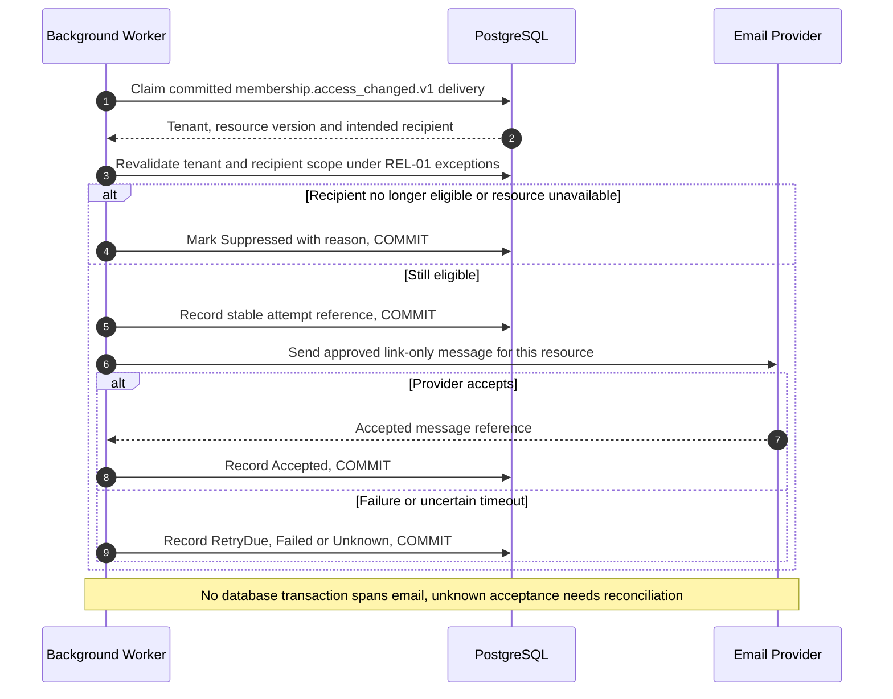

# UC-IAM-007 — Suspend, reinstate or remove a membership

[Catalogue](../use-case-catalog.md) · [Architecture](../solution-design.md) · [Shared contracts](../shared-patterns.md)

## 1. Identity and references

**ID:** UC-IAM-007. **Module:** Identity. **Release:** MVP1. **Requirement references:** BR-02, BR-03. **API family:** API-IAM-007. **Screen:** S-05. **Status:** proposed implementation contract; business rules require the listed stakeholder validation.

## 2. Business objective and user story

As a building administrator, I want to end inappropriate access while retaining historical accountability, so the organization can complete this goal with a traceable result. This release implements the stated goal only; future module dependencies are not implied.

## 3. Actors

**Primary:** Building Administrator. **Supporting:** Frontend and Backend API; PostgreSQL persists or retrieves the authorized business state.  Email Provider is an asynchronous supporting system under REL-01.

## 4. Trigger and preconditions

**Trigger:** The primary actor initiates the named action from S-05. Dependencies/capabilities: [UC-IAM-008](UC-IAM-008.md). Required referenced records must exist in the authorized scope; the target state must permit this action. Ordinary tenant activity requires Active tenant and effective membership; authorized export/offboarding exceptions follow the narrow operational procedures.

## 5. Authorization

Tenant steward may change tenant memberships; building administrator can end only unit/building grants they manage. No resident can revoke another user. Apply **AUTH-01**, effective dates and server-side resource checks from [shared-patterns.md](../shared-patterns.md). UI visibility is a convenience only. Any cached/delayed action is reauthorized before use.

## 6. Inputs, validation and business rules

**Inputs:** Target membership or grant, action, effective timestamp, reason and ETag.

**Rules:** Suspension blocks access immediately; reinstatement restores only unexpired approved grants. Removal is terminal and retains actor references. Tenant-wide changes require tenant-steward permission. Prevent removal/suspension of the last active tenant steward and last building administrator.

Text is treated as data; enforce lengths and allowlists server-side. IDs are opaque and must resolve through authorized relationships. No client-supplied role, tenant label or object key establishes permission.

## 7. Main success flow

1. **User:** opens S-05 and initiates “Suspend, reinstate or remove a membership” with the inputs above.
2. **Frontend:** collects only relevant fields, validates shape, shows the active tenant and submits the listed API operation; protected writes carry session, CSRF, context version and applicable request/ETag values.
3. **Backend:** applies AUTH-01; Tenant steward may change tenant memberships; building administrator can end only unit/building grants they manage. No resident can revoke another user.
4. **Backend → Database:** reads Locked tenant control row, target Membership and remaining eligible administrators through the authorized scope; evaluates the workflow-specific rules in section 6.
5. **Backend:** Change access state and invalidate authorization context. Persistence enforces invariants and records the result and audit; any event is committed through REL-01.
6. **Integration:** Notify affected user of access change after commit, without any current building content. No other external provider call is required for the synchronous business result.
7. **Backend → Frontend → User:** Access denied on subsequent protected requests; other-tenant memberships remain active. Preserve safe user input on a recoverable error and show the returned state/version.

## 8. Alternatives and exceptions

Last-administrator conflict returns 409 with replacement action. Stale version returns 412. Future end time is evaluated per request even if scheduler is down.

ERR-01 applies: malformed input is 400/422; missing authentication is 401; disallowed role is 403; invisible resource is 404. Never reveal another tenant through constraint names, counts or error details. Stale edits require reload/review; identical successful command replay returns its earlier result after fresh authorization. Database failure rolls back the domain write and its outbox; the UI must query the command outcome before resubmitting an uncertain operation.

## 9. Postconditions and failure guarantees

**Success:** Access denied on subsequent protected requests; other-tenant memberships remain active. **Failure:** rejected authorization or validation does not change domain records. Only committed state is authoritative; audit and outbox do not announce a rolled-back change. External side effects can fail after commit and are reconciled under REL-01.

## 10. Data, APIs and events

**Entities:** `Membership`; `BuildingGrant`; `UnitAccessGrant`; `AuditRecord`; definitions in [data-model.md](../data-model.md). **API operations:** POST /api/v1/t/{t}/memberships/{id}/state; POST /api/v1/t/{t}/access-grants/{id}/end. Contracts and errors: [API-IAM-007](../api-catalog.md#api-iam-007). **Business event:** `membership.access_changed.v1`. Envelope, payload whitelist, deduplication and dispatch follow REL-01; the event name does not itself require an external message broker.

## 11. Transaction, consistency and retries

Use CON-01: authorize first, validate current state inside the transaction, apply tenant-aware constraints, and commit the business change with its audit and any outbox records. State updates require If-Match; append/create commands use durable business uniqueness plus a request key. Same-key same-payload replay returns the stored outcome; different payload returns 409. Never retry a state change with a new key after an uncertain response.

## 12. Audit and notifications

Record action, actor/service identity, tenant where applicable, resource ID, safe transition fields, reason reference, timestamp and correlation ID. Notify affected user of access change after commit, without any current building content. Never log tokens, raw emails, phone numbers, issue/comment bodies, financial narrative, ballot choices or file bytes. Sensitive business evidence remains in authorized records, not telemetry. Finance audit includes posting IDs and control totals, never editable history.

## 13. Acceptance criteria

- **AT-UC-IAM-007-01 — Outcome:** Given the stated actor, scope and valid inputs, when this workflow succeeds, then access denied on subsequent protected requests; other-tenant memberships remain active.
- **AT-UC-IAM-007-02 — Business boundary:** Given a resident has memberships in A and B and A is removed, when this workflow is exercised, then old A downloads fail while B still works.
- **AT-UC-IAM-007-03 — Authorization:** Given the caller lacks the required tenant/building/unit or resource scope, when a known ID is substituted in this workflow, then the API denies access with no protected content, domain mutation or notification.
- **AT-UC-IAM-007-04 — Failure:** Given validation fails or the database transaction aborts, when the client checks the outcome, then no partial domain change or queued external side effect is reported as successful.

The cross-scope test applies both to a second independent tenant and to a denied building/unit within the same tenant where that resource exists. Execution evidence belongs in the release gate; the design itself is not a test result.

## 14. End-to-end sequence

### Notification continuation for UC-IAM-007

The business result above is already committed. This continuation is initiated by the hosted worker and uses the original event/recipient plan. Notify affected user of access change after commit, without any current building content.

