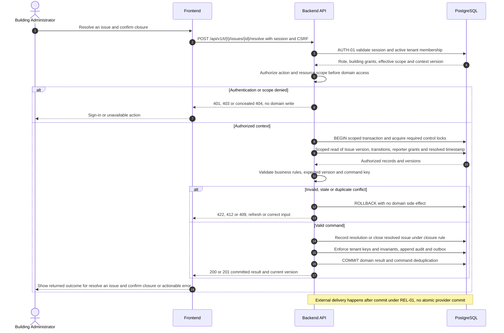
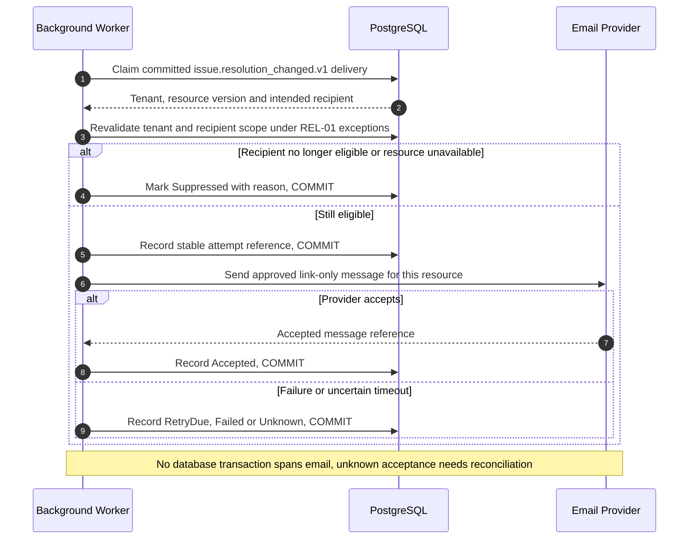
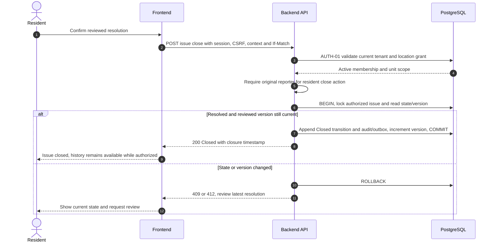

# UC-ISS-004 — Resolve an issue and confirm closure

[Catalogue](../use-case-catalog.md) · [Architecture](../solution-design.md) · [Shared contracts](../shared-patterns.md)

## 1. Identity and references

**ID:** UC-ISS-004. **Module:** Issues. **Release:** MVP1. **Requirement references:** BR-05. **API family:** API-ISS-004. **Screen:** S-14. **Status:** proposed implementation contract; business rules require the listed stakeholder validation.

## 2. Business objective and user story

As a building administrator, I want to communicate a concrete resolution and close the request with accountability, so the organization can complete this goal with a traceable result. This release implements the stated goal only; future module dependencies are not implied.

## 3. Actors

**Primary:** Building Administrator. **Supporting:** Frontend and Backend API; PostgreSQL persists or retrieves the authorized business state.  Email Provider is an asynchronous supporting system under REL-01.

## 4. Trigger and preconditions

**Trigger:** The primary actor initiates the named action from S-14. Dependencies/capabilities: [UC-ISS-002](UC-ISS-002.md); [UC-ISS-003](UC-ISS-003.md). Required referenced records must exist in the authorized scope; the target state must permit this action. Ordinary tenant activity requires Active tenant and effective membership; authorized export/offboarding exceptions follow the narrow operational procedures.

## 5. Authorization

Building administrator records resolution; original reporter with current location access confirms closure. Administrator may close after 7 days without reporter response, with explicit reason. Apply **AUTH-01**, effective dates and server-side resource checks from [shared-patterns.md](../shared-patterns.md). UI visibility is a convenience only. Any cached/delayed action is reauthorized before use.

## 6. Inputs, validation and business rules

**Inputs:** Resolution summary, issue ETag; optional reporter closure acknowledgement or administrator closure reason.

**Rules:** Open/InProgress/Waiting to Resolved requires nonempty resolution. Resolved to Closed requires reporter confirmation or administrator timeout action based on resolved_at. No scheduled auto-close in MVP1. Resolution is not proof of contractor payment or resident consent.

Text is treated as data; enforce lengths and allowlists server-side. IDs are opaque and must resolve through authorized relationships. No client-supplied role, tenant label or object key establishes permission.

## 7. Main success flow

1. **User:** opens S-14 and initiates “Resolve an issue and confirm closure” with the inputs above.
2. **Frontend:** collects only relevant fields, validates shape, shows the active tenant and submits the listed API operation; protected writes carry session, CSRF, context version and applicable request/ETag values.
3. **Backend:** applies AUTH-01; Building administrator records resolution; original reporter with current location access confirms closure. Administrator may close after 7 days without reporter response, with explicit reason.
4. **Backend → Database:** reads Issue version, transitions, reporter grants and resolved timestamp through the authorized scope; evaluates the workflow-specific rules in section 6.
5. **Backend:** Record resolution or close resolved issue under closure rule. Persistence enforces invariants and records the result and audit; any event is committed through REL-01.
6. **Integration:** Resolution or closure notice is queued after commit; resident can always see current status when authorized. No other external provider call is required for the synchronous business result.
7. **Backend → Frontend → User:** Resolved state and summary, or Closed state with actor and closure reason. Preserve safe user input on a recoverable error and show the returned state/version.

## 8. Alternatives and exceptions

Resolution from stale state returns 412/409. Administrator premature timeout closure is rejected. Failed email leaves Resolved committed and visible in portal.

ERR-01 applies: malformed input is 400/422; missing authentication is 401; disallowed role is 403; invisible resource is 404. Never reveal another tenant through constraint names, counts or error details. Stale edits require reload/review; identical successful command replay returns its earlier result after fresh authorization. Database failure rolls back the domain write and its outbox; the UI must query the command outcome before resubmitting an uncertain operation.

## 9. Postconditions and failure guarantees

**Success:** Resolved state and summary, or Closed state with actor and closure reason. **Failure:** rejected authorization or validation does not change domain records. Only committed state is authoritative; audit and outbox do not announce a rolled-back change. External side effects can fail after commit and are reconciled under REL-01.

## 10. Data, APIs and events

**Entities:** `Issue`; `IssueTransition`; `OutboxMessage`; definitions in [data-model.md](../data-model.md). **API operations:** POST /api/v1/t/{t}/issues/{id}/resolve; POST /api/v1/t/{t}/issues/{id}/close. Contracts and errors: [API-ISS-004](../api-catalog.md#api-iss-004). **Business event:** `issue.resolution_changed.v1`. Envelope, payload whitelist, deduplication and dispatch follow REL-01; the event name does not itself require an external message broker.

## 11. Transaction, consistency and retries

Use CON-01: authorize first, validate current state inside the transaction, apply tenant-aware constraints, and commit the business change with its audit and any outbox records. State updates require If-Match; append/create commands use durable business uniqueness plus a request key. Same-key same-payload replay returns the stored outcome; different payload returns 409. Never retry a state change with a new key after an uncertain response.

## 12. Audit and notifications

Record action, actor/service identity, tenant where applicable, resource ID, safe transition fields, reason reference, timestamp and correlation ID. Resolution or closure notice is queued after commit; resident can always see current status when authorized. Never log tokens, raw emails, phone numbers, issue/comment bodies, financial narrative, ballot choices or file bytes. Sensitive business evidence remains in authorized records, not telemetry. Finance audit includes posting IDs and control totals, never editable history.

## 13. Acceptance criteria

- **AT-UC-ISS-004-01 — Outcome:** Given the stated actor, scope and valid inputs, when this workflow succeeds, then resolved state and summary, or Closed state with actor and closure reason.
- **AT-UC-ISS-004-02 — Business boundary:** Given a reporter confirms closure using a stale version after an administrator changed the resolution, when this workflow is exercised, then confirmation requires review of the new version.
- **AT-UC-ISS-004-03 — Authorization:** Given the caller lacks the required tenant/building/unit or resource scope, when a known ID is substituted in this workflow, then the API denies access with no protected content, domain mutation or notification.
- **AT-UC-ISS-004-04 — Failure:** Given validation fails or the database transaction aborts, when the client checks the outcome, then no partial domain change or queued external side effect is reported as successful.

The cross-scope test applies both to a second independent tenant and to a denied building/unit within the same tenant where that resource exists. Execution evidence belongs in the release gate; the design itself is not a test result.

## 14. End-to-end sequence

### Notification continuation for UC-ISS-004

The business result above is already committed. This continuation is initiated by the hosted worker and uses the original event/recipient plan. Resolution or closure notice is queued after commit; resident can always see current status when authorized.

### Resident confirmation of closure

This separate action uses reporter ownership and a fresh version; administrators follow the stated seven-day timeout rule instead.

