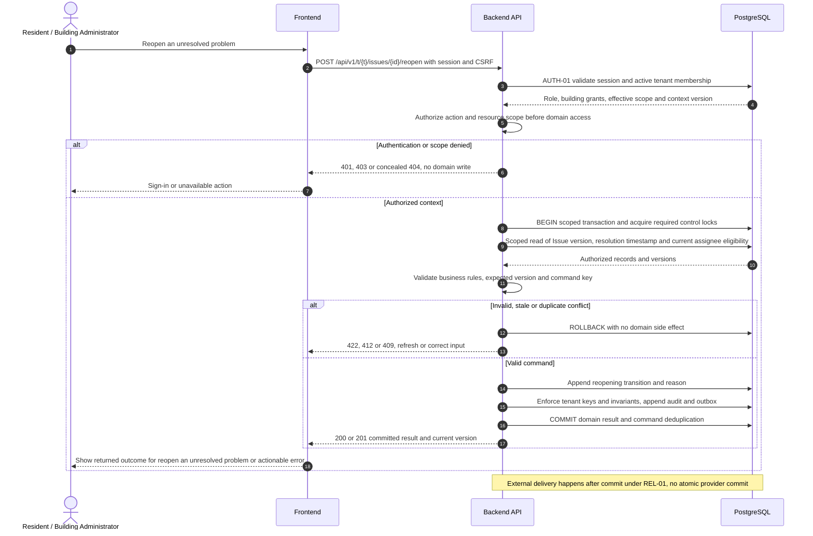
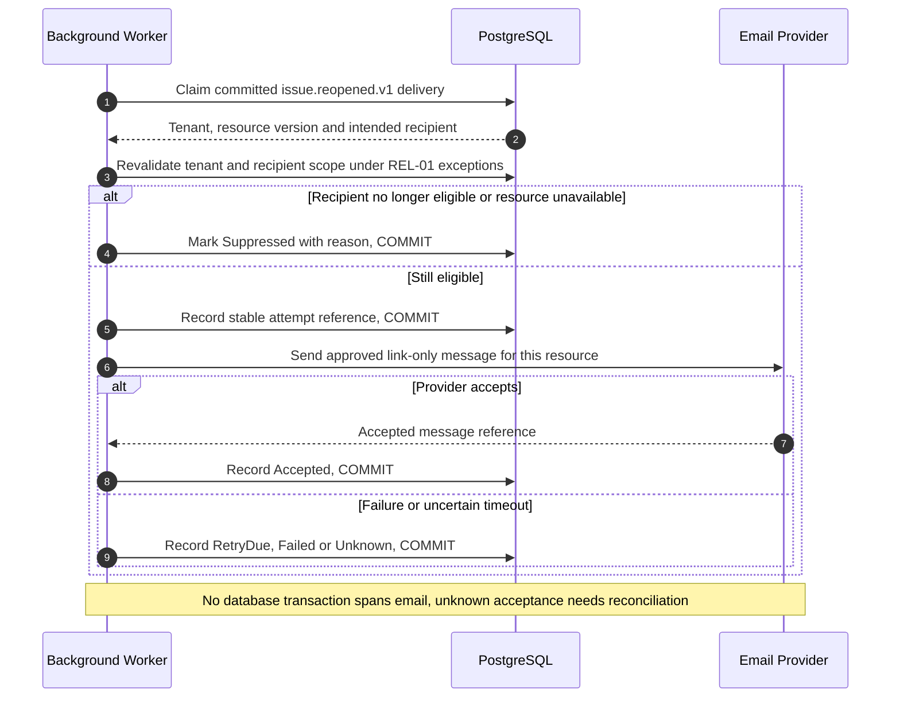

# UC-ISS-005 — Reopen an unresolved problem

[Catalogue](../use-case-catalog.md) · [Architecture](../solution-design.md) · [Shared contracts](../shared-patterns.md)

## 1. Identity and references

**ID:** UC-ISS-005. **Module:** Issues. **Release:** MVP1. **Requirement references:** BR-05. **API family:** API-ISS-005. **Screen:** S-14. **Status:** proposed implementation contract; business rules require the listed stakeholder validation.

## 2. Business objective and user story

As a resident or building administrator, I want to restore follow-up when a recorded resolution did not solve the problem, so the organization can complete this goal with a traceable result. This release implements the stated goal only; future module dependencies are not implied.

## 3. Actors

**Primary:** Resident or Building Administrator. **Supporting:** Frontend and Backend API; PostgreSQL persists or retrieves the authorized business state.  Email Provider is an asynchronous supporting system under REL-01.

## 4. Trigger and preconditions

**Trigger:** The primary actor initiates the named action from S-14. Dependencies/capabilities: [UC-ISS-004](UC-ISS-004.md). Required referenced records must exist in the authorized scope; the target state must permit this action. Ordinary tenant activity requires Active tenant and effective membership; authorized export/offboarding exceptions follow the narrow operational procedures.

## 5. Authorization

Original reporter with current location grant or administrator of issue building. Apply **AUTH-01**, effective dates and server-side resource checks from [shared-patterns.md](../shared-patterns.md). UI visibility is a convenience only. Any cached/delayed action is reauthorized before use.

## 6. Inputs, validation and business rules

**Inputs:** Issue ID, reason up to 2000 characters, ETag and idempotency key.

**Rules:** Resolved or Closed may reopen within 30 days of resolution; later problems create a new linked issue. Reopen returns Open, preserves resolution history and retains eligible assignee only. No destructive rollback of prior comments.

Text is treated as data; enforce lengths and allowlists server-side. IDs are opaque and must resolve through authorized relationships. No client-supplied role, tenant label or object key establishes permission.

## 7. Main success flow

1. **User:** opens S-14 and initiates “Reopen an unresolved problem” with the inputs above.
2. **Frontend:** collects only relevant fields, validates shape, shows the active tenant and submits the listed API operation; protected writes carry session, CSRF, context version and applicable request/ETag values.
3. **Backend:** applies AUTH-01; Original reporter with current location grant or administrator of issue building.
4. **Backend → Database:** reads Issue version, resolution timestamp and current assignee eligibility through the authorized scope; evaluates the workflow-specific rules in section 6.
5. **Backend:** Append reopening transition and reason. Persistence enforces invariants and records the result and audit; any event is committed through REL-01.
6. **Integration:** Notify current assigned administrator or building queue after commit. No other external provider call is required for the synchronous business result.
7. **Backend → Frontend → User:** Open issue with incremented version and complete earlier resolution history. Preserve safe user input on a recoverable error and show the returned state/version.

## 8. Alternatives and exceptions

Already open returns 409 unless same request replay. Outside window returns 422 with new-issue path. Removed resident cannot reopen after moving out.

ERR-01 applies: malformed input is 400/422; missing authentication is 401; disallowed role is 403; invisible resource is 404. Never reveal another tenant through constraint names, counts or error details. Stale edits require reload/review; identical successful command replay returns its earlier result after fresh authorization. Database failure rolls back the domain write and its outbox; the UI must query the command outcome before resubmitting an uncertain operation.

## 9. Postconditions and failure guarantees

**Success:** Open issue with incremented version and complete earlier resolution history. **Failure:** rejected authorization or validation does not change domain records. Only committed state is authoritative; audit and outbox do not announce a rolled-back change. External side effects can fail after commit and are reconciled under REL-01.

## 10. Data, APIs and events

**Entities:** `Issue`; `IssueTransition`; `IssueComment`; definitions in [data-model.md](../data-model.md). **API operations:** POST /api/v1/t/{t}/issues/{id}/reopen. Contracts and errors: [API-ISS-005](../api-catalog.md#api-iss-005). **Business event:** `issue.reopened.v1`. Envelope, payload whitelist, deduplication and dispatch follow REL-01; the event name does not itself require an external message broker.

## 11. Transaction, consistency and retries

Use CON-01: authorize first, validate current state inside the transaction, apply tenant-aware constraints, and commit the business change with its audit and any outbox records. State updates require If-Match; append/create commands use durable business uniqueness plus a request key. Same-key same-payload replay returns the stored outcome; different payload returns 409. Never retry a state change with a new key after an uncertain response.

## 12. Audit and notifications

Record action, actor/service identity, tenant where applicable, resource ID, safe transition fields, reason reference, timestamp and correlation ID. Notify current assigned administrator or building queue after commit. Never log tokens, raw emails, phone numbers, issue/comment bodies, financial narrative, ballot choices or file bytes. Sensitive business evidence remains in authorized records, not telemetry. Finance audit includes posting IDs and control totals, never editable history.

## 13. Acceptance criteria

- **AT-UC-ISS-005-01 — Outcome:** Given the stated actor, scope and valid inputs, when this workflow succeeds, then open issue with incremented version and complete earlier resolution history.
- **AT-UC-ISS-005-02 — Business boundary:** Given a reporter reopens after administrator closure within the allowed interval, when this workflow is exercised, then history retains the earlier closure and resolution.
- **AT-UC-ISS-005-03 — Authorization:** Given the caller lacks the required tenant/building/unit or resource scope, when a known ID is substituted in this workflow, then the API denies access with no protected content, domain mutation or notification.
- **AT-UC-ISS-005-04 — Failure:** Given validation fails or the database transaction aborts, when the client checks the outcome, then no partial domain change or queued external side effect is reported as successful.

The cross-scope test applies both to a second independent tenant and to a denied building/unit within the same tenant where that resource exists. Execution evidence belongs in the release gate; the design itself is not a test result.

## 14. End-to-end sequence

### Notification continuation for UC-ISS-005

The business result above is already committed. This continuation is initiated by the hosted worker and uses the original event/recipient plan. Notify current assigned administrator or building queue after commit.

