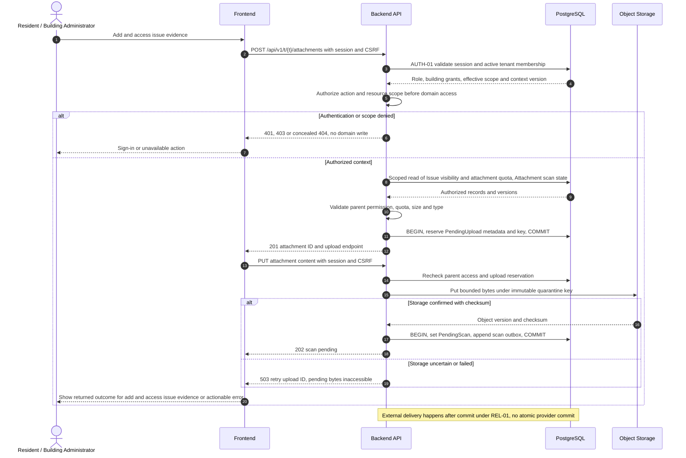
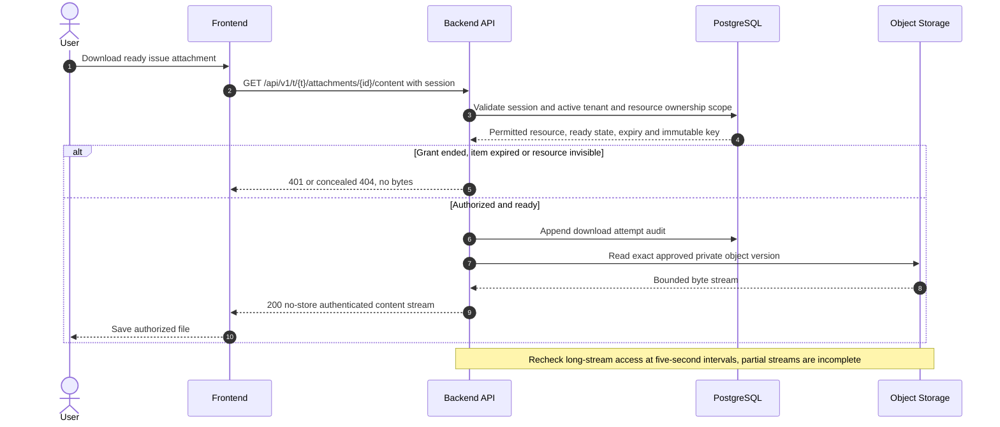

# UC-ISS-006 — Add and access issue evidence

[Catalogue](../use-case-catalog.md) · [Architecture](../solution-design.md) · [Shared contracts](../shared-patterns.md)

## 1. Identity and references

**ID:** UC-ISS-006. **Module:** Issues. **Release:** MVP2. **Requirement references:** BR-05, BR-04. **API family:** API-ISS-006. **Screen:** S-14. **Status:** proposed implementation contract; business rules require the listed stakeholder validation.

## 2. Business objective and user story

As a resident or building administrator, I want to provide photos or documents that clarify an authorized issue, so the organization can complete this goal with a traceable result. This release implements the stated goal only; future module dependencies are not implied.

## 3. Actors

**Primary:** Resident or Building Administrator. **Supporting:** Frontend and Backend API; PostgreSQL persists or retrieves the authorized business state. Object Storage and Background Worker support private file handling. 

## 4. Trigger and preconditions

**Trigger:** The primary actor initiates the named action from S-14. Dependencies/capabilities: [UC-ISS-002](UC-ISS-002.md). Required referenced records must exist in the authorized scope; the target state must permit this action. Ordinary tenant activity requires Active tenant and effective membership; authorized export/offboarding exceptions follow the narrow operational procedures.

## 5. Authorization

Issue reporter with current grant or scoped administrator may attach; viewers need current parent-resource authorization. Uploader alone does not authorize access after move-out. Apply **AUTH-01**, effective dates and server-side resource checks from [shared-patterns.md](../shared-patterns.md). UI visibility is a convenience only. Any cached/delayed action is reauthorized before use.

## 6. Inputs, validation and business rules

**Inputs:** Parent issue, file bytes, declared type, length, checksum; attachment ID for download or removal.

**Rules:** Allow JPEG/PNG/PDF only, 10 MiB each, 5 files per issue; inspect signatures and scan in quarantine. Server generates immutable tenant/attachment/version object key. Clean is required before download; remove detaches and schedules policy-based deletion. Shared attachment protocol also serves documents, meeting minutes and import sources with parent-specific limits.

Text is treated as data; enforce lengths and allowlists server-side. IDs are opaque and must resolve through authorized relationships. No client-supplied role, tenant label or object key establishes permission.

## 7. Main success flow

1. **User:** opens S-14 and initiates “Add and access issue evidence” with the inputs above.
2. **Frontend:** collects only relevant fields, validates shape, shows the active tenant and submits the listed API operation; protected writes carry session, CSRF, context version and applicable request/ETag values.
3. **Backend:** applies AUTH-01; Issue reporter with current grant or scoped administrator may attach; viewers need current parent-resource authorization. Uploader alone does not authorize access after move-out.
4. **Backend → Database:** reads Issue visibility and attachment quota; Attachment scan state through the authorized scope; evaluates the workflow-specific rules in section 6.
5. **Backend:** Register quarantine upload, store bytes and enqueue scanning. Persistence enforces invariants and records the result and audit; any event is committed through REL-01.
6. **Integration:** No file content in notifications; attachment ready status is polled. Scanner worker updates status after storage checks. For attachment content, stream through the backend to/from private object storage; scanning is asynchronous.
7. **Backend → Frontend → User:** Pending attachment reference then Clean or Rejected status; authorized clean bytes downloadable through backend. Preserve safe user input on a recoverable error and show the returned state/version.

## 8. Alternatives and exceptions

Exceeded quota/type rejects before storage. Storage timeout leaves Pending and supports safe retry by upload ID/checksum; never attach unknown bytes. Scanner outage leaves inaccessible PendingScan. Metadata/byte orphan cleanup runs after 24 hours.

ERR-01 applies: malformed input is 400/422; missing authentication is 401; disallowed role is 403; invisible resource is 404. Never reveal another tenant through constraint names, counts or error details. Stale edits require reload/review; identical successful command replay returns its earlier result after fresh authorization. Database failure rolls back the domain write and its outbox; the UI must query the command outcome before resubmitting an uncertain operation.

## 9. Postconditions and failure guarantees

**Success:** Pending attachment reference then Clean or Rejected status; authorized clean bytes downloadable through backend. **Failure:** rejected authorization or validation does not change domain records. Only committed state is authoritative; audit and outbox do not announce a rolled-back change. External side effects can fail after commit and are reconciled under REL-01.

## 10. Data, APIs and events

**Entities:** `Attachment`; `Issue`; `OutboxMessage`; `AuditRecord`; definitions in [data-model.md](../data-model.md). **API operations:** POST /api/v1/t/{t}/attachments; PUT /api/v1/t/{t}/attachments/{id}/content; GET /api/v1/t/{t}/attachments/{id}; GET /api/v1/t/{t}/attachments/{id}/content; POST /api/v1/t/{t}/attachments/{id}/detach. Contracts and errors: [API-ISS-006](../api-catalog.md#api-iss-006). **Business event:** `attachment.scan_requested.v1`. Envelope, payload whitelist, deduplication and dispatch follow REL-01; the event name does not itself require an external message broker.

## 11. Transaction, consistency and retries

Use CON-01: authorize first, validate current state inside the transaction, apply tenant-aware constraints, and commit the business change with its audit and any outbox records. State updates require If-Match; append/create commands use durable business uniqueness plus a request key. Same-key same-payload replay returns the stored outcome; different payload returns 409. Never retry a state change with a new key after an uncertain response. Storage writes are outside the database transaction. Metadata reserves the immutable key first; checksum-confirmed upload advances to PendingScan. Orphans remain unreadable and are reconciled by OP-003.

## 12. Audit and notifications

Record action, actor/service identity, tenant where applicable, resource ID, safe transition fields, reason reference, timestamp and correlation ID. No file content in notifications; attachment ready status is polled. Scanner worker updates status after storage checks. Never log tokens, raw emails, phone numbers, issue/comment bodies, financial narrative, ballot choices or file bytes. Sensitive business evidence remains in authorized records, not telemetry. Finance audit includes posting IDs and control totals, never editable history.

## 13. Acceptance criteria

- **AT-UC-ISS-006-01 — Outcome:** Given the stated actor, scope and valid inputs, when this workflow succeeds, then pending attachment reference then Clean or Rejected status; authorized clean bytes downloadable through backend.
- **AT-UC-ISS-006-02 — Business boundary:** Given a guessed clean attachment ID belongs to another issue or tenant, when this workflow is exercised, then content and metadata return 404.
- **AT-UC-ISS-006-03 — Authorization:** Given the caller lacks the required tenant/building/unit or resource scope, when a known ID is substituted in this workflow, then the API denies access with no protected content, domain mutation or notification.
- **AT-UC-ISS-006-04 — Failure:** Given validation fails or the database transaction aborts, when the client checks the outcome, then no partial domain change or queued external side effect is reported as successful.

The cross-scope test applies both to a second independent tenant and to a denied building/unit within the same tenant where that resource exists. Execution evidence belongs in the release gate; the design itself is not a test result.

## 14. End-to-end sequence

### Authorized content retrieval

The user returns after issue attachment is ready. Download permission is checked now; possession of the URL is insufficient.

