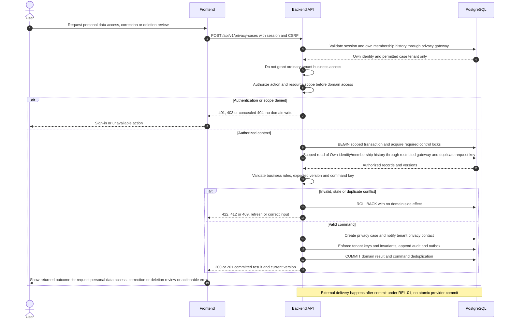
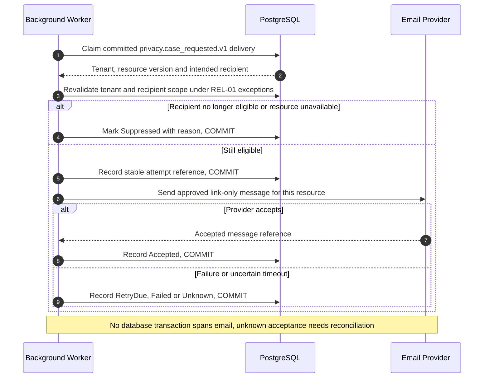

# UC-PRV-001 — Request personal data access, correction or deletion review

[Catalogue](../use-case-catalog.md) · [Architecture](../solution-design.md) · [Shared contracts](../shared-patterns.md)

## 1. Identity and references

**ID:** UC-PRV-001. **Module:** Privacy. **Release:** MVP2. **Requirement references:** BR-12. **API family:** API-PRV-001. **Screen:** S-34. **Status:** proposed implementation contract; business rules require the listed stakeholder validation.

## 2. Business objective and user story

As a user, I want to ask the responsible organization to address personal-data rights or errors, so the organization can complete this goal with a traceable result. This release implements the stated goal only; future module dependencies are not implied.

## 3. Actors

**Primary:** User. **Supporting:** Frontend and Backend API; PostgreSQL persists or retrieves the authorized business state.  Email Provider is an asynchronous supporting system under REL-01.

## 4. Trigger and preconditions

**Trigger:** The primary actor initiates the named action from S-34. Dependencies/capabilities: [UC-IAM-001](UC-IAM-001.md); [UC-TEN-004](UC-TEN-004.md). Required referenced records must exist in the authorized scope; the target state must permit this action. No active-tenant membership is assumed before sign-in, provisioning, invitation acceptance or a former-member privacy request; use the specified gateway.

## 5. Authorization

Authenticated current or former identity may submit for a former tenant through restricted own-membership directory; no ordinary tenant access is restored. Offline identity-verified support remains available. Apply **AUTH-04 (privacy)**, effective dates and server-side resource checks from [shared-patterns.md](../shared-patterns.md). UI visibility is a convenience only. Any cached/delayed action is reauthorized before use.

## 6. Inputs, validation and business rules

**Inputs:** Request type access/correction/deletion, tenant, own identity, concise description, contact preference and client key.

**Rules:** Request is not automatic erasure and cannot alter financial records. Former membership lookup exposes only own tenant name and contact, not building data. Statutory response deadline is configured after jurisdiction review; proposed service acknowledgement within 2 business days.

Text is treated as data; enforce lengths and allowlists server-side. IDs are opaque and must resolve through authorized relationships. No client-supplied role, tenant label or object key establishes permission.

## 7. Main success flow

1. **User:** opens S-34 and initiates “Request personal data access, correction or deletion review” with the inputs above.
2. **Frontend:** collects only relevant fields, validates shape, shows the active tenant and submits the listed API operation; protected writes carry session, CSRF, context version and applicable request/ETag values.
3. **Backend:** applies AUTH-04 (privacy); Authenticated current or former identity may submit for a former tenant through restricted own-membership directory; no ordinary tenant access is restored. Offline identity-verified support remains available.
4. **Backend → Database:** reads Own identity/membership history through restricted gateway and duplicate request key through the authorized scope; evaluates the workflow-specific rules in section 6.
5. **Backend:** Create privacy case and notify tenant privacy contact. Persistence enforces invariants and records the result and audit; any event is committed through REL-01.
6. **Integration:** Queue case-reference notification without request narrative; do not put identity documents in email. No other external provider call is required for the synchronous business result.
7. **Backend → Frontend → User:** Case reference and own status view; business access permissions unchanged. Preserve safe user input on a recoverable error and show the returned state/version.

## 8. Alternatives and exceptions

Unrelated tenant request returns neutral support route. Sensitive attachments use approved later secure process, not email. Duplicate submission returns same case. Tenant archived routes to retained controller contact/operator metadata queue.

ERR-01 applies: malformed input is 400/422; missing authentication is 401; disallowed role is 403; invisible resource is 404. Never reveal another tenant through constraint names, counts or error details. Stale edits require reload/review; identical successful command replay returns its earlier result after fresh authorization. Database failure rolls back the domain write and its outbox; the UI must query the command outcome before resubmitting an uncertain operation.

## 9. Postconditions and failure guarantees

**Success:** Case reference and own status view; business access permissions unchanged. **Failure:** rejected authorization or validation does not change domain records. Only committed state is authoritative; audit and outbox do not announce a rolled-back change. External side effects can fail after commit and are reconciled under REL-01.

## 10. Data, APIs and events

**Entities:** `PrivacyCase`; `Membership`; `UserIdentity`; definitions in [data-model.md](../data-model.md). **API operations:** POST /api/v1/privacy-cases; GET /api/v1/privacy-cases/me; GET /api/v1/privacy-cases/{id}. Contracts and errors: [API-PRV-001](../api-catalog.md#api-prv-001). **Business event:** `privacy.case_requested.v1`. Envelope, payload whitelist, deduplication and dispatch follow REL-01; the event name does not itself require an external message broker.

## 11. Transaction, consistency and retries

Use CON-01: authorize first, validate current state inside the transaction, apply tenant-aware constraints, and commit the business change with its audit and any outbox records. State updates require If-Match; append/create commands use durable business uniqueness plus a request key. Same-key same-payload replay returns the stored outcome; different payload returns 409. Never retry a state change with a new key after an uncertain response.

## 12. Audit and notifications

Record action, actor/service identity, tenant where applicable, resource ID, safe transition fields, reason reference, timestamp and correlation ID. Queue case-reference notification without request narrative; do not put identity documents in email. Never log tokens, raw emails, phone numbers, issue/comment bodies, financial narrative, ballot choices or file bytes. Sensitive business evidence remains in authorized records, not telemetry. Finance audit includes posting IDs and control totals, never editable history.

## 13. Acceptance criteria

- **AT-UC-PRV-001-01 — Outcome:** Given the stated actor, scope and valid inputs, when this workflow succeeds, then case reference and own status view; business access permissions unchanged.
- **AT-UC-PRV-001-02 — Business boundary:** Given a former resident requests their history, when this workflow is exercised, then they receive a case reference but still cannot read current unit issues.
- **AT-UC-PRV-001-03 — Authorization:** Given the caller lacks the required tenant/building/unit or resource scope, when a known ID is substituted in this workflow, then the API denies access with no protected content, domain mutation or notification.
- **AT-UC-PRV-001-04 — Failure:** Given validation fails or the database transaction aborts, when the client checks the outcome, then no partial domain change or queued external side effect is reported as successful.

The cross-scope test applies both to a second independent tenant and to a denied building/unit within the same tenant where that resource exists. Execution evidence belongs in the release gate; the design itself is not a test result.

## 14. End-to-end sequence

### Notification continuation for UC-PRV-001

The business result above is already committed. This continuation is initiated by the hosted worker and uses the original event/recipient plan. Queue case-reference notification without request narrative; do not put identity documents in email.

