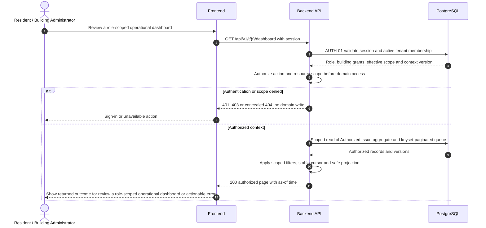

# UC-RPT-001 — Review a role-scoped operational dashboard

[Catalogue](../use-case-catalog.md) · [Architecture](../solution-design.md) · [Shared contracts](../shared-patterns.md)

## 1. Identity and references

**ID:** UC-RPT-001. **Module:** Reporting. **Release:** MVP1. **Requirement references:** BR-10, BR-05. **API family:** API-RPT-001. **Screen:** S-15. **Status:** proposed implementation contract; business rules require the listed stakeholder validation.

## 2. Business objective and user story

As a resident or building administrator, I want to know which issue needs action and whether reported problems are progressing, so the organization can complete this goal with a traceable result. This release implements the stated goal only; future module dependencies are not implied.

## 3. Actors

**Primary:** Resident or Building Administrator. **Supporting:** Frontend and Backend API; PostgreSQL persists or retrieves the authorized business state.  

## 4. Trigger and preconditions

**Trigger:** The primary actor initiates the named action from S-15. Dependencies/capabilities: [UC-ISS-001](UC-ISS-001.md). Required referenced records must exist in the authorized scope; the target state must permit this action. Ordinary tenant activity requires Active tenant and effective membership; authorized export/offboarding exceptions follow the narrow operational procedures.

## 5. Authorization

Resident sees own authorized issues only; administrator sees managed-building queues and aggregates. Tenant steward sees cross-building totals within tenant. Operator sees service metrics only. Apply **AUTH-01**, effective dates and server-side resource checks from [shared-patterns.md](../shared-patterns.md). UI visibility is a convenience only. Any cached/delayed action is reauthorized before use.

## 6. Inputs, validation and business rules

**Inputs:** Building scope, issue state, date interval, assigned-to-me filter and opaque cursor.

**Rules:** MVP1 dashboard is database queries over issues, not separate analytics infrastructure. Counters and rows use identical visibility predicate. Later released modules add finance and maintenance tiles only after respective permissions and data exist.

Text is treated as data; enforce lengths and allowlists server-side. IDs are opaque and must resolve through authorized relationships. No client-supplied role, tenant label or object key establishes permission.

## 7. Main success flow

1. **User:** opens S-15 and initiates “Review a role-scoped operational dashboard” with the inputs above.
2. **Frontend:** collects only relevant fields, validates shape, shows the active tenant and submits the listed API operation; protected writes carry session, CSRF, context version and applicable request/ETag values.
3. **Backend:** applies AUTH-01; Resident sees own authorized issues only; administrator sees managed-building queues and aggregates. Tenant steward sees cross-building totals within tenant. Operator sees service metrics only.
4. **Backend → Database:** reads Authorized Issue aggregate and keyset-paginated queue through the authorized scope; evaluates the workflow-specific rules in section 6.
5. **Backend:** Return scoped action queue and operational counts. Return only authorized projections; append any required download/export audit.
6. **Integration:** None; the committed outcome is visible in the application. No other external provider call is required for the synchronous business result.
7. **Backend → Frontend → User:** Consistent dashboard with empty/loading/error states and authorized deep links. Preserve safe user input on a recoverable error and show the returned state/version.

## 8. Alternatives and exceptions

Unsupported filter returns 422. Stale count is labeled as-of if paginated separately. No leakage through total counts, search suggestions or guessed tenant names. Read retries safe.

ERR-01 applies: malformed input is 400/422; missing authentication is 401; disallowed role is 403; invisible resource is 404. Never reveal another tenant through constraint names, counts or error details. Read failure returns a correlation ID and no fabricated partial business result. Concurrency/version conflict is inapplicable to read-only data access; snapshots and fresh authorization govern consistency.

## 9. Postconditions and failure guarantees

**Success:** Consistent dashboard with empty/loading/error states and authorized deep links. **Failure:** rejected authorization or validation does not change domain records. An attempted-download audit can remain after a failed stream; it is not proof that delivery completed.

## 10. Data, APIs and events

**Entities:** `Issue`; `Membership`; `BuildingGrant`; `UnitAccessGrant`; definitions in [data-model.md](../data-model.md). **API operations:** GET /api/v1/t/{t}/dashboard; GET /api/v1/t/{t}/issues. Contracts and errors: [API-RPT-001](../api-catalog.md#api-rpt-001). **Business event:** `None`. No business event is emitted by this read/authentication operation; security auditing is separate.

## 11. Transaction, consistency and retries

Read-only business operation; no idempotency key or optimistic write version is needed. Audit append is independent of a streamed download. All reads still require a transaction-local tenant context. Incomplete streams are not valid deliverables.

## 12. Audit and notifications

Record action, actor/service identity, tenant where applicable, resource ID, safe transition fields, reason reference, timestamp and correlation ID. None; the committed outcome is visible in the application. Never log tokens, raw emails, phone numbers, issue/comment bodies, financial narrative, ballot choices or file bytes. Sensitive business evidence remains in authorized records, not telemetry. Finance audit includes posting IDs and control totals, never editable history.

## 13. Acceptance criteria

- **AT-UC-RPT-001-01 — Outcome:** Given the stated actor, scope and valid inputs, when this workflow succeeds, then consistent dashboard with empty/loading/error states and authorized deep links.
- **AT-UC-RPT-001-02 — Business boundary:** Given an administrator manages one of three buildings, when this workflow is exercised, then counts and queue contain only that building issues.
- **AT-UC-RPT-001-03 — Authorization:** Given the caller lacks the required tenant/building/unit or resource scope, when a known ID is substituted in this workflow, then the API denies access with no protected content, domain mutation or notification.
- **AT-UC-RPT-001-04 — Failure:** Given the database or content read fails, when the request is retried after fresh authorization, then it returns a valid authorized result or a clear unavailable status, never leaked or fabricated data.

The cross-scope test applies both to a second independent tenant and to a denied building/unit within the same tenant where that resource exists. Execution evidence belongs in the release gate; the design itself is not a test result.

## 14. End-to-end sequence

