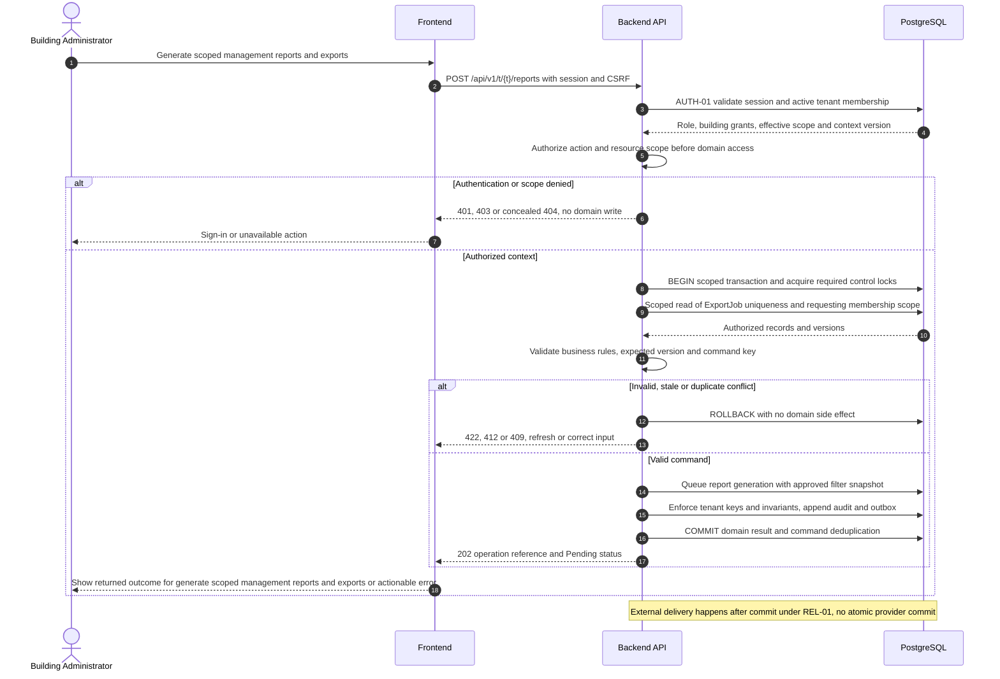
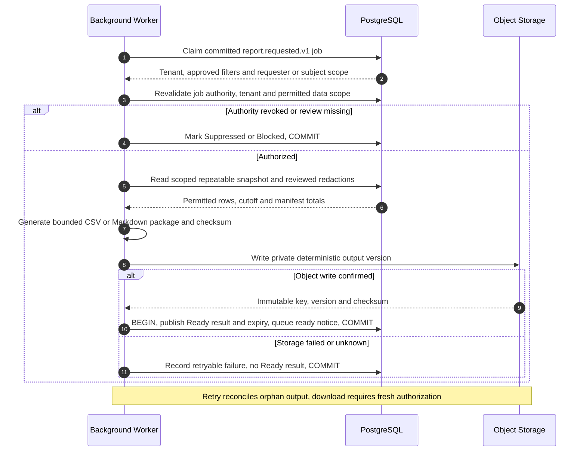
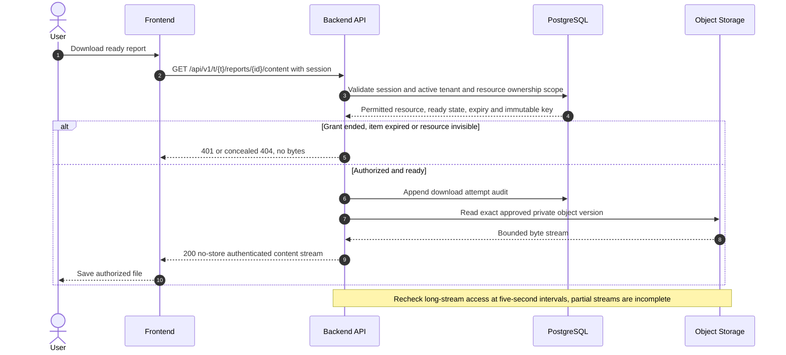

# UC-RPT-002 — Generate scoped management reports and exports

[Catalogue](../use-case-catalog.md) · [Architecture](../solution-design.md) · [Shared contracts](../shared-patterns.md)

## 1. Identity and references

**ID:** UC-RPT-002. **Module:** Reporting. **Release:** MVP3. **Requirement references:** BR-10, BR-12. **API family:** API-RPT-002. **Screen:** S-33. **Status:** proposed implementation contract; business rules require the listed stakeholder validation.

## 2. Business objective and user story

As a building administrator, I want to produce auditable operational and financial reports for authorized review, so the organization can complete this goal with a traceable result. This release implements the stated goal only; future module dependencies are not implied.

## 3. Actors

**Primary:** Building Administrator. **Supporting:** Frontend and Backend API; PostgreSQL persists or retrieves the authorized business state. Object Storage and Background Worker support private file handling. Email Provider is an asynchronous supporting system under REL-01.

## 4. Trigger and preconditions

**Trigger:** The primary actor initiates the named action from S-33. Dependencies/capabilities: [UC-TEN-003](UC-TEN-003.md); [UC-FIN-009](UC-FIN-009.md); [UC-ISS-006](UC-ISS-006.md). Required referenced records must exist in the authorized scope; the target state must permit this action. Ordinary tenant activity requires Active tenant and effective membership; authorized export/offboarding exceptions follow the narrow operational procedures.

## 5. Authorization

Administrator building scope; finance data additionally requires finance permission. Export requester must retain scope at generation and download. Personal residents use own statements, not management export. Apply **AUTH-01**, effective dates and server-side resource checks from [shared-patterns.md](../shared-patterns.md). UI visibility is a convenience only. Any cached/delayed action is reauthorized before use.

## 6. Inputs, validation and business rules

**Inputs:** Report type issues/receivables/receipts/reconciliation, building/date filters, format CSV/Markdown and client key.

**Rules:** Asynchronous ExportJob records immutable requested scope and as-of snapshot. Store encrypted private output for 24 hours; recheck requester eligibility before worker reads and before download. CSV neutralizes formula prefixes. No cross-tenant portfolio reports in baseline.

Text is treated as data; enforce lengths and allowlists server-side. IDs are opaque and must resolve through authorized relationships. No client-supplied role, tenant label or object key establishes permission.

## 7. Main success flow

1. **User:** opens S-33 and initiates “Generate scoped management reports and exports” with the inputs above.
2. **Frontend:** collects only relevant fields, validates shape, shows the active tenant and submits the listed API operation; protected writes carry session, CSRF, context version and applicable request/ETag values.
3. **Backend:** applies AUTH-01; Administrator building scope; finance data additionally requires finance permission. Export requester must retain scope at generation and download. Personal residents use own statements, not management export.
4. **Backend → Database:** reads ExportJob uniqueness and requesting membership scope through the authorized scope; evaluates the workflow-specific rules in section 6.
5. **Backend:** Queue report generation with approved filter snapshot. Persistence enforces invariants and records the result and audit; any event is committed through REL-01.
6. **Integration:** After generation commit send ready link only to still-authorized requester; delivery does not expose export bytes. No other external provider call is required for the synchronous business result.
7. **Backend → Frontend → User:** 202 job URL then Ready/Failed/Suppressed status and authorized download when ready. Show Pending until the operation status reports completion.

## 8. Alternatives and exceptions

Revocation before execution suppresses report; revocation after generation denies download and schedules deletion. Worker retry writes deterministic version key and avoids duplicate published outputs. Snapshot failure retries whole report, not mixed snapshots.

ERR-01 applies: malformed input is 400/422; missing authentication is 401; disallowed role is 403; invisible resource is 404. Never reveal another tenant through constraint names, counts or error details. Stale edits require reload/review; identical successful command replay returns its earlier result after fresh authorization. Database failure rolls back the domain write and its outbox; the UI must query the command outcome before resubmitting an uncertain operation.

## 9. Postconditions and failure guarantees

**Success:** 202 job URL then Ready/Failed/Suppressed status and authorized download when ready. **Failure:** rejected authorization or validation does not change domain records. Only committed state is authoritative; audit and outbox do not announce a rolled-back change. External side effects can fail after commit and are reconciled under REL-01.

## 10. Data, APIs and events

**Entities:** `ExportJob`; `Attachment`; `Issue`; `Journal`; `AuditRecord`; definitions in [data-model.md](../data-model.md). **API operations:** POST /api/v1/t/{t}/reports; GET /api/v1/t/{t}/reports/{id}; GET /api/v1/t/{t}/reports/{id}/content. Contracts and errors: [API-RPT-002](../api-catalog.md#api-rpt-002). **Business event:** `report.requested.v1`. Envelope, payload whitelist, deduplication and dispatch follow REL-01; the event name does not itself require an external message broker.

## 11. Transaction, consistency and retries

Use CON-01: authorize first, validate current state inside the transaction, apply tenant-aware constraints, and commit the business change with its audit and any outbox records. State updates require If-Match; append/create commands use durable business uniqueness plus a request key. Same-key same-payload replay returns the stored outcome; different payload returns 409. Never retry a state change with a new key after an uncertain response. The synchronous command commits only a request/decision and returns 202; completion is an independently retried job, with requester scope rechecked. No distributed transaction with object storage.

## 12. Audit and notifications

Record action, actor/service identity, tenant where applicable, resource ID, safe transition fields, reason reference, timestamp and correlation ID. After generation commit send ready link only to still-authorized requester; delivery does not expose export bytes. Never log tokens, raw emails, phone numbers, issue/comment bodies, financial narrative, ballot choices or file bytes. Sensitive business evidence remains in authorized records, not telemetry. Finance audit includes posting IDs and control totals, never editable history.

## 13. Acceptance criteria

- **AT-UC-RPT-002-01 — Outcome:** Given the stated actor, scope and valid inputs, when this workflow succeeds, then 202 job URL then Ready/Failed/Suppressed status and authorized download when ready.
- **AT-UC-RPT-002-02 — Business boundary:** Given a job submitted as administrator is executed after role removal, when this workflow is exercised, then no report content is generated or emailed.
- **AT-UC-RPT-002-03 — Authorization:** Given the caller lacks the required tenant/building/unit or resource scope, when a known ID is substituted in this workflow, then the API denies access with no protected content, domain mutation or notification.
- **AT-UC-RPT-002-04 — Failure:** Given validation fails or the database transaction aborts, when the client checks the outcome, then no partial domain change or queued external side effect is reported as successful.

The cross-scope test applies both to a second independent tenant and to a denied building/unit within the same tenant where that resource exists. Execution evidence belongs in the release gate; the design itself is not a test result.

## 14. End-to-end sequence

### Authorized background completion for UC-RPT-002

The worker operates on the committed report request and requesting administrator scope. A user session is not fabricated. The subsequent status/download endpoint rechecks current requester membership and report scope.

### Authorized content retrieval

The user returns after report is ready. Download permission is checked now; possession of the URL is insufficient.

