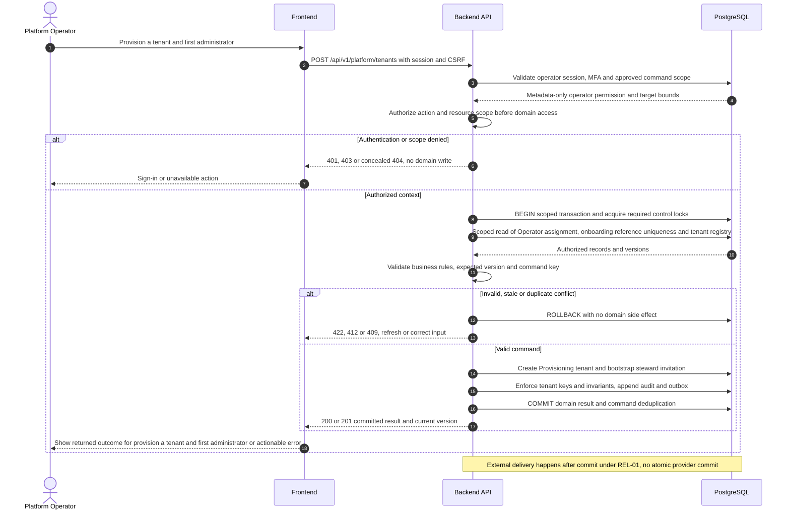
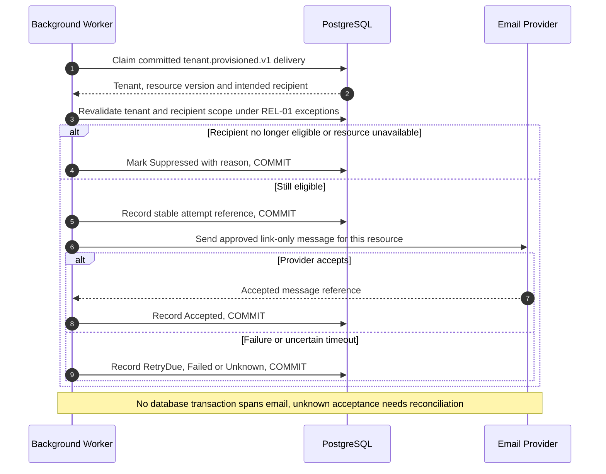

# UC-TEN-001 — Provision a tenant and first administrator

[Catalogue](../use-case-catalog.md) · [Architecture](../solution-design.md) · [Shared contracts](../shared-patterns.md)

## 1. Identity and references

**ID:** UC-TEN-001. **Module:** Tenant lifecycle. **Release:** MVP1. **Requirement references:** BR-02, BR-11. **API family:** API-TEN-001. **Screen:** S-OP. **Status:** proposed implementation contract; business rules require the listed stakeholder validation.

## 2. Business objective and user story

As a platform operator, I want to onboard an authorized organization with an accountable initial administrator, so the organization can complete this goal with a traceable result. This release implements the stated goal only; future module dependencies are not implied.

## 3. Actors

**Primary:** Platform Operator. **Supporting:** Frontend and Backend API; PostgreSQL persists or retrieves the authorized business state.  Email Provider is an asynchronous supporting system under REL-01.

## 4. Trigger and preconditions

**Trigger:** The primary actor initiates the named action from S-OP. Dependencies/capabilities: No earlier business use case; EN-001 through EN-007 supply the production foundation.. Required referenced records must exist in the authorized scope; the target state must permit this action. No active-tenant membership is assumed before sign-in, provisioning, invitation acceptance or a former-member privacy request; use the specified gateway.

## 5. Authorization

MFA-protected operator console, provision permission, approved onboarding reference; may set tenant metadata and invite initial steward, not inspect residents. Apply **AUTH-02 (operator)**, effective dates and server-side resource checks from [shared-patterns.md](../shared-patterns.md). UI visibility is a convenience only. Any cached/delayed action is reauthorized before use.

## 6. Inputs, validation and business rules

**Inputs:** Organization display/legal names, approved contact email, jurisdiction placeholder, IANA time zone, locale and onboarding reference.

**Rules:** One organization is one tenant. Start Provisioning; bootstrap invitation is tenant-bound and one-use. Activation requires accepted steward, MFA and documented controller/contact verification. No preexisting enterprise identity directory is assumed.

Text is treated as data; enforce lengths and allowlists server-side. IDs are opaque and must resolve through authorized relationships. No client-supplied role, tenant label or object key establishes permission.

## 7. Main success flow

1. **User:** opens S-OP and initiates “Provision a tenant and first administrator” with the inputs above.
2. **Frontend:** collects only relevant fields, validates shape, shows the active tenant and submits the listed API operation; protected writes carry session, CSRF, context version and applicable request/ETag values.
3. **Backend:** applies AUTH-02 (operator); MFA-protected operator console, provision permission, approved onboarding reference; may set tenant metadata and invite initial steward, not inspect residents.
4. **Backend → Database:** reads Operator assignment, onboarding reference uniqueness and tenant registry through the authorized scope; evaluates the workflow-specific rules in section 6.
5. **Backend:** Create Provisioning tenant and bootstrap steward invitation. Persistence enforces invariants and records the result and audit; any event is committed through REL-01.
6. **Integration:** Queue bootstrap email after commit using the single approved recipient. No other external provider call is required for the synchronous business result.
7. **Backend → Frontend → User:** Tenant ID and invitation delivery state; acceptance transitions tenant to Active once activation conditions hold. Preserve safe user input on a recoverable error and show the returned state/version.

## 8. Alternatives and exceptions

Duplicate onboarding reference returns existing tenant. Failed email leaves provisioning resumable. Rejected/expired invite never exposes a tenant. Bootstrap acceptance uses UC-IAM-003 with bootstrap-specific checks.

ERR-01 applies: malformed input is 400/422; missing authentication is 401; disallowed role is 403; invisible resource is 404. Never reveal another tenant through constraint names, counts or error details. Stale edits require reload/review; identical successful command replay returns its earlier result after fresh authorization. Database failure rolls back the domain write and its outbox; the UI must query the command outcome before resubmitting an uncertain operation.

## 9. Postconditions and failure guarantees

**Success:** Tenant ID and invitation delivery state; acceptance transitions tenant to Active once activation conditions hold. **Failure:** rejected authorization or validation does not change domain records. Only committed state is authoritative; audit and outbox do not announce a rolled-back change. External side effects can fail after commit and are reconciled under REL-01.

## 10. Data, APIs and events

**Entities:** `Tenant`; `Invitation`; `OperatorAssignment`; `OutboxMessage`; definitions in [data-model.md](../data-model.md). **API operations:** POST /api/v1/platform/tenants; GET /api/v1/platform/tenants/{t}. Contracts and errors: [API-TEN-001](../api-catalog.md#api-ten-001). **Business event:** `tenant.provisioned.v1`. Envelope, payload whitelist, deduplication and dispatch follow REL-01; the event name does not itself require an external message broker.

## 11. Transaction, consistency and retries

Use CON-01: authorize first, validate current state inside the transaction, apply tenant-aware constraints, and commit the business change with its audit and any outbox records. State updates require If-Match; append/create commands use durable business uniqueness plus a request key. Same-key same-payload replay returns the stored outcome; different payload returns 409. Never retry a state change with a new key after an uncertain response.

## 12. Audit and notifications

Record action, actor/service identity, tenant where applicable, resource ID, safe transition fields, reason reference, timestamp and correlation ID. Queue bootstrap email after commit using the single approved recipient. Never log tokens, raw emails, phone numbers, issue/comment bodies, financial narrative, ballot choices or file bytes. Sensitive business evidence remains in authorized records, not telemetry. Finance audit includes posting IDs and control totals, never editable history.

## 13. Acceptance criteria

- **AT-UC-TEN-001-01 — Outcome:** Given the stated actor, scope and valid inputs, when this workflow succeeds, then tenant ID and invitation delivery state; acceptance transitions tenant to Active once activation conditions hold.
- **AT-UC-TEN-001-02 — Business boundary:** Given an operator provisions a tenant, when this workflow is exercised, then it has no ability to query issue text or resident profiles via tenant business APIs.
- **AT-UC-TEN-001-03 — Authorization:** Given the caller lacks the required tenant/building/unit or resource scope, when a known ID is substituted in this workflow, then the API denies access with no protected content, domain mutation or notification.
- **AT-UC-TEN-001-04 — Failure:** Given validation fails or the database transaction aborts, when the client checks the outcome, then no partial domain change or queued external side effect is reported as successful.

The cross-scope test applies both to a second independent tenant and to a denied building/unit within the same tenant where that resource exists. Execution evidence belongs in the release gate; the design itself is not a test result.

## 14. End-to-end sequence

### Notification continuation for UC-TEN-001

The business result above is already committed. This continuation is initiated by the hosted worker and uses the original event/recipient plan. Queue bootstrap email after commit using the single approved recipient.

