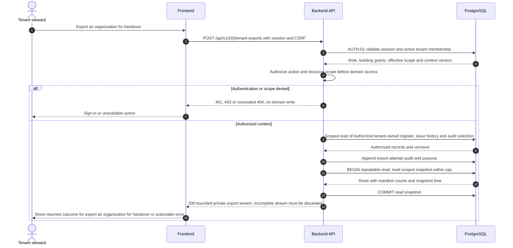

# UC-TEN-003 — Export an organization for handover

[Catalogue](../use-case-catalog.md) · [Architecture](../solution-design.md) · [Shared contracts](../shared-patterns.md)

## 1. Identity and references

**ID:** UC-TEN-003. **Module:** Tenant lifecycle. **Release:** MVP1. **Requirement references:** BR-11, BR-12. **API family:** API-TEN-003. **Screen:** S-06. **Status:** proposed implementation contract; business rules require the listed stakeholder validation.

## 2. Business objective and user story

As a tenant steward, I want to obtain a portable record set for administrator handover or exit, so the organization can complete this goal with a traceable result. This release implements the stated goal only; future module dependencies are not implied.

## 3. Actors

**Primary:** Tenant steward. **Supporting:** Frontend and Backend API; PostgreSQL persists or retrieves the authorized business state.  

## 4. Trigger and preconditions

**Trigger:** The primary actor initiates the named action from S-06. Dependencies/capabilities: [UC-TEN-001](UC-TEN-001.md). Required referenced records must exist in the authorized scope; the target state must permit this action. Ordinary tenant activity requires Active tenant and effective membership; authorized export/offboarding exceptions follow the narrow operational procedures.

## 5. Authorization

Steward with recent MFA; export restricted to their tenant. Suspended tenants require explicitly approved export-only grant via OP-004; operators do not download the content. Apply **AUTH-01**, effective dates and server-side resource checks from [shared-patterns.md](../shared-patterns.md). UI visibility is a convenience only. Any cached/delayed action is reauthorized before use.

## 6. Inputs, validation and business rules

**Inputs:** Export purpose, selected record groups and optional as-of filter.

**Rules:** MVP1 streams bounded CSV/Markdown ZIP from one repeatable-read snapshot, maximum 100000 rows and 50 MiB; excludes identity secrets, invitation tokens and internal operator records. Neutralize spreadsheet formula prefixes. Above cap, split by period under the same recorded snapshot procedure; asynchronous full packaging added with RPT-002.

Text is treated as data; enforce lengths and allowlists server-side. IDs are opaque and must resolve through authorized relationships. No client-supplied role, tenant label or object key establishes permission.

## 7. Main success flow

1. **User:** opens S-06 and initiates “Export an organization for handover” with the inputs above.
2. **Frontend:** collects only relevant fields, validates shape, shows the active tenant and submits the listed API operation; protected writes carry session, CSRF, context version and applicable request/ETag values.
3. **Backend:** applies AUTH-01; Steward with recent MFA; export restricted to their tenant. Suspended tenants require explicitly approved export-only grant via OP-004; operators do not download the content.
4. **Backend → Database:** reads Authorized tenant-owned register, issue history and audit selection through the authorized scope; evaluates the workflow-specific rules in section 6.
5. **Backend:** Record export purpose and stream tenant snapshot. Return only authorized projections; append any required download/export audit.
6. **Integration:** None; the committed outcome is visible in the application. No other external provider call is required for the synchronous business result.
7. **Backend → Frontend → User:** Authorized download with manifest, schema version, row counts and snapshot timestamp; no reusable public URL. Preserve safe user input on a recoverable error and show the returned state/version.

## 8. Alternatives and exceptions

Mid-stream failure discards incomplete client file; export attempt audit remains. Revocation before stream start denies access; terminate long streams on periodic revocation checks. No cross-tenant identity directory in export.

ERR-01 applies: malformed input is 400/422; missing authentication is 401; disallowed role is 403; invisible resource is 404. Never reveal another tenant through constraint names, counts or error details. Read failure returns a correlation ID and no fabricated partial business result. Concurrency/version conflict is inapplicable to read-only data access; snapshots and fresh authorization govern consistency.

## 9. Postconditions and failure guarantees

**Success:** Authorized download with manifest, schema version, row counts and snapshot timestamp; no reusable public URL. **Failure:** rejected authorization or validation does not change domain records. An attempted-download audit can remain after a failed stream; it is not proof that delivery completed.

## 10. Data, APIs and events

**Entities:** `Tenant`; `Person`; `Membership`; `Issue`; `IssueComment`; `AuditRecord`; definitions in [data-model.md](../data-model.md). **API operations:** POST /api/v1/t/{t}/tenant-exports. Contracts and errors: [API-TEN-003](../api-catalog.md#api-ten-003). **Business event:** `None`. No business event is emitted by this read/authentication operation; security auditing is separate.

## 11. Transaction, consistency and retries

Read-only business operation; no idempotency key or optimistic write version is needed. Audit append is independent of a streamed download. All reads still require a transaction-local tenant context. Incomplete streams are not valid deliverables.

## 12. Audit and notifications

Record action, actor/service identity, tenant where applicable, resource ID, safe transition fields, reason reference, timestamp and correlation ID. None; the committed outcome is visible in the application. Never log tokens, raw emails, phone numbers, issue/comment bodies, financial narrative, ballot choices or file bytes. Sensitive business evidence remains in authorized records, not telemetry. Finance audit includes posting IDs and control totals, never editable history.

## 13. Acceptance criteria

- **AT-UC-TEN-003-01 — Outcome:** Given the stated actor, scope and valid inputs, when this workflow succeeds, then authorized download with manifest, schema version, row counts and snapshot timestamp; no reusable public URL.
- **AT-UC-TEN-003-02 — Business boundary:** Given a tenant A export includes an author who belongs to B, when this workflow is exercised, then only A-context author display and records are exported.
- **AT-UC-TEN-003-03 — Authorization:** Given the caller lacks the required tenant/building/unit or resource scope, when a known ID is substituted in this workflow, then the API denies access with no protected content, domain mutation or notification.
- **AT-UC-TEN-003-04 — Failure:** Given the database or content read fails, when the request is retried after fresh authorization, then it returns a valid authorized result or a clear unavailable status, never leaked or fabricated data.

The cross-scope test applies both to a second independent tenant and to a denied building/unit within the same tenant where that resource exists. Execution evidence belongs in the release gate; the design itself is not a test result.

## 14. End-to-end sequence

