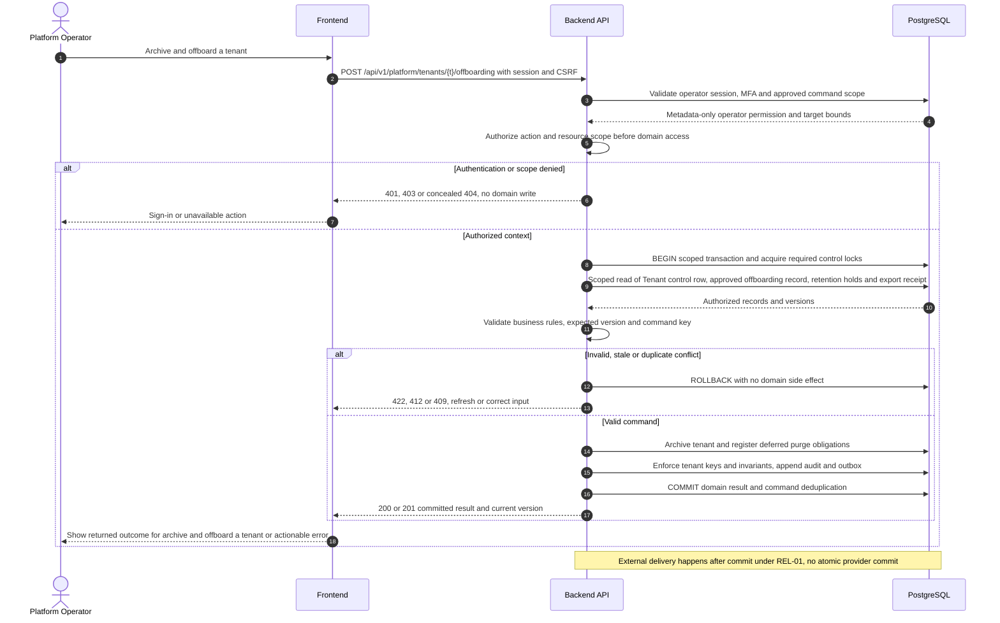

# UC-TEN-004 — Archive and offboard a tenant

[Catalogue](../use-case-catalog.md) · [Architecture](../solution-design.md) · [Shared contracts](../shared-patterns.md)

## 1. Identity and references

**ID:** UC-TEN-004. **Module:** Tenant lifecycle. **Release:** MVP1. **Requirement references:** BR-11, BR-12. **API family:** API-TEN-004. **Screen:** S-OP. **Status:** proposed implementation contract; business rules require the listed stakeholder validation.

## 2. Business objective and user story

As a platform operator, I want to end service predictably while preserving approved retention obligations, so the organization can complete this goal with a traceable result. This release implements the stated goal only; future module dependencies are not implied.

## 3. Actors

**Primary:** Platform Operator. **Supporting:** Frontend and Backend API; PostgreSQL persists or retrieves the authorized business state.  

## 4. Trigger and preconditions

**Trigger:** The primary actor initiates the named action from S-OP. Dependencies/capabilities: [UC-TEN-002](UC-TEN-002.md); [UC-TEN-003](UC-TEN-003.md). Required referenced records must exist in the authorized scope; the target state must permit this action. No active-tenant membership is assumed before sign-in, provisioning, invitation acceptance or a former-member privacy request; use the specified gateway.

## 5. Authorization

Operator offboard permission, MFA and steward request verified through OP-006; two-person approval for purge. No unrestricted business-data access. Apply **AUTH-02 (operator)**, effective dates and server-side resource checks from [shared-patterns.md](../shared-patterns.md). UI visibility is a convenience only. Any cached/delayed action is reauthorized before use.

## 6. Inputs, validation and business rules

**Inputs:** Tenant ID, approved exit request, export acknowledgement, retention schedule, legal-hold reference, effective date and ETag.

**Rules:** Suspend, record completed export or explicit waiver, archive as read-denied, then purge only after retention/holds and second approval. Tenant deletion never deletes a global identity still used elsewhere. Backups expire under schedule; restored systems replay deletion tombstones before access.

Text is treated as data; enforce lengths and allowlists server-side. IDs are opaque and must resolve through authorized relationships. No client-supplied role, tenant label or object key establishes permission.

## 7. Main success flow

1. **User:** opens S-OP and initiates “Archive and offboard a tenant” with the inputs above.
2. **Frontend:** collects only relevant fields, validates shape, shows the active tenant and submits the listed API operation; protected writes carry session, CSRF, context version and applicable request/ETag values.
3. **Backend:** applies AUTH-02 (operator); Operator offboard permission, MFA and steward request verified through OP-006; two-person approval for purge. No unrestricted business-data access.
4. **Backend → Database:** reads Tenant control row, approved offboarding record, retention holds and export receipt through the authorized scope; evaluates the workflow-specific rules in section 6.
5. **Backend:** Archive tenant and register deferred purge obligations. Persistence enforces invariants and records the result and audit; any event is committed through REL-01.
6. **Integration:** None; the committed outcome is visible in the application. No other external provider call is required for the synchronous business result.
7. **Backend → Frontend → User:** Archived tenant and revocations; purge job is separately authorized and records aggregate counts. Preserve safe user input on a recoverable error and show the returned state/version.

## 8. Alternatives and exceptions

Hold or missing approval blocks purge. Partial object cleanup in later releases remains retryable and never reactivates tenant. Scheduled purge failure alerts operator; no silent deletion.

ERR-01 applies: malformed input is 400/422; missing authentication is 401; disallowed role is 403; invisible resource is 404. Never reveal another tenant through constraint names, counts or error details. Stale edits require reload/review; identical successful command replay returns its earlier result after fresh authorization. Database failure rolls back the domain write and its outbox; the UI must query the command outcome before resubmitting an uncertain operation.

## 9. Postconditions and failure guarantees

**Success:** Archived tenant and revocations; purge job is separately authorized and records aggregate counts. **Failure:** rejected authorization or validation does not change domain records. Only committed state is authoritative; audit and outbox do not announce a rolled-back change. External side effects can fail after commit and are reconciled under REL-01.

## 10. Data, APIs and events

**Entities:** `Tenant`; `RetentionHold`; `DeletionTombstone`; `AuditRecord`; definitions in [data-model.md](../data-model.md). **API operations:** POST /api/v1/platform/tenants/{t}/offboarding; POST /api/v1/platform/tenants/{t}/purge-approvals. Contracts and errors: [API-TEN-004](../api-catalog.md#api-ten-004). **Business event:** `tenant.archived.v1`. Envelope, payload whitelist, deduplication and dispatch follow REL-01; the event name does not itself require an external message broker.

## 11. Transaction, consistency and retries

Use CON-01: authorize first, validate current state inside the transaction, apply tenant-aware constraints, and commit the business change with its audit and any outbox records. State updates require If-Match; append/create commands use durable business uniqueness plus a request key. Same-key same-payload replay returns the stored outcome; different payload returns 409. Never retry a state change with a new key after an uncertain response.

## 12. Audit and notifications

Record action, actor/service identity, tenant where applicable, resource ID, safe transition fields, reason reference, timestamp and correlation ID. None; the committed outcome is visible in the application. Never log tokens, raw emails, phone numbers, issue/comment bodies, financial narrative, ballot choices or file bytes. Sensitive business evidence remains in authorized records, not telemetry. Finance audit includes posting IDs and control totals, never editable history.

## 13. Acceptance criteria

- **AT-UC-TEN-004-01 — Outcome:** Given the stated actor, scope and valid inputs, when this workflow succeeds, then archived tenant and revocations; purge job is separately authorized and records aggregate counts.
- **AT-UC-TEN-004-02 — Business boundary:** Given an archived tenant has a legal hold, when this workflow is exercised, then scheduled cleanup retains held records and records a blocked outcome.
- **AT-UC-TEN-004-03 — Authorization:** Given the caller lacks the required tenant/building/unit or resource scope, when a known ID is substituted in this workflow, then the API denies access with no protected content, domain mutation or notification.
- **AT-UC-TEN-004-04 — Failure:** Given validation fails or the database transaction aborts, when the client checks the outcome, then no partial domain change or queued external side effect is reported as successful.

The cross-scope test applies both to a second independent tenant and to a denied building/unit within the same tenant where that resource exists. Execution evidence belongs in the release gate; the design itself is not a test result.

## 14. End-to-end sequence

